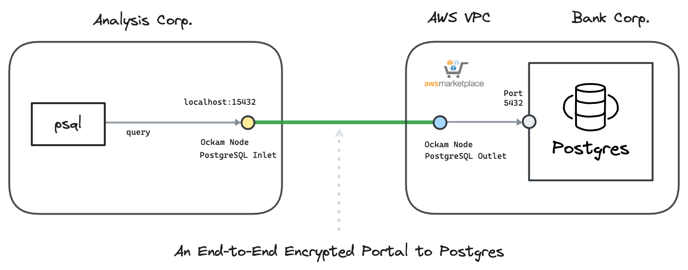

# Ockam Node for Amazon RDS Postgres

This guide contains instructions to launch within AWS environment, an&#x20;

* An Ockam Postgres Outlet Node within an AWS environment
* An Ockam Postgres Inlet Node:
  * Within an AWS environment, or
  * Using Docker in any environment

The walkthrough demonstrates:

1. Running an Ockam Postgres Outlet node in your AWS environment that contains a private Amazon RDS for PostgreSQL Database&#x20;
2. Setting up Ockam Postgres inlet nodes using either AWS or Docker from any location.
3. Verifying secure communication between Postgres clients and Amazon RDS for Postgres Database.

Read: “[How does Ockam work?](https://docs.ockam.io/how-does-ockam-work)” to learn about end-to-end trust establishment.

<figure><figcaption></figcaption></figure>

### PreRequisite

* A private Amazon RDS Postgres Database is created and accessible from the VPC and Subnet where the Ockam Node will be launched.
* Security Group associated with the Amazon RDS Postgres Database allows inbound traffic on the required port (5432) from the subnet where the Ockam Outlet Node will reside.
* You have permission to subscribe and launch Cloudformation stack from AWS Marketplace on the AWS Account running RDS Postgres Database.

### Create an Orchestrator Project

1. [Sign up for Ockam](https://www.ockam.io/download) and pick a subscription plan through the guided workflow on Ockam.io.
2. Run the following commands to install Ockam Command and enroll with the Ockam Orchestrator.

```bash
curl --proto '=https' --tlsv1.2 -sSfL https://install.command.ockam.io | bash
source "$HOME/.ockam/env"

ockam enroll
```

Completing this step creates a Project in Ockam Orchestrator

3. Control which identities are allowed to enroll themselves into your project by issuing unique one-time use enrollment tickets. Generate two enrollment tickets, one for the Outlet and one for the Inlet.

```bash
# Enrollment ticket for Ockam Outlet Node
ockam project ticket --expires-in 10h --usage-count 1 \
  --attribute amazon-rds-postgresql-outlet \
  --relay postgresql \
    > "outlet.ticket"

# Enrollment ticket for Ockam Inlet Node
ockam project ticket --expires-in 10h --usage-count 1 \
  --attribute amazon-rds-postgresql-inlet \
    > "inlet.ticket"
```

### Setup Ockam Postgres Outlet Node

* Login to AWS Account you would like to use
* Subscribe to "[Ockam - Node for Amazon RDS Postgres](https://aws.amazon.com/marketplace/pp/prodview-zjugwdx5hp2le)"  in AWS Marketplace&#x20;
* Navigate to `AWS Marketplace -> Manage subscriptions`. Select `Ockam - Node for Amazon RDS Postgres` from the list of subscriptions. Select `Actions-> Launch Cloudformation stack`&#x20;
* Select the Region you want to deploy and click `Continue to Launch`. Under Actions, select `Launch Cloudformation`
* Create stack with the following details
  * **Stack name**: `postgres-ockam-outlet` or any name you prefer
  * Network Configuration
    * **VPC ID:** Choose a VPC ID where the EC2 instance will be deployed.
    * **Subnet ID:** Select a suitable Subnet ID within the chosen VPC that has access to Amazon RDS PostgreSQL Database.
    * **EC2 Instance Type**: Default instance type is `m6a.8xlarge` because of the predictable network bandwidth of 12.5 Gbps. Adjust to a small instance type depending on your use case. Eg: `m6a.large`
  * Ockam Node Configuration
    * **Enrollment ticket**: Copy and paste the content of the `outlet.ticket` generated above
    * **RDS Postgres Database Endpoint:** To configure the Ockam postgres Outlet Node, you'll need to specify the Amazon RDS Postgres Endpoint. This configuration allows the Ockam Postgres Outlet Node to connect to the database.
    * **JSON Node Configuration**: Copy and paste the below configuration. Note that the configuration values match with the enrollment tickets created in the previous step. $`POSTGRES_ENDPOINT` will be replaced during runtime.

```json
{
    "relay": "postgresql",
    "tcp-outlet": {
        "to": "$POSTGRES_ENDPOINT:5432",
        "allow": "amazon-rds-postgresql-inlet"
    }
}
    
```

* Click Next to launch the CloudFormation run.
* A successful CloudFormation stack run configures the Ockam Postgres Outlet node on an EC2 machine.
  * EC2 machine mounts an EFS volume created in the same subnet. Ockam state is stored in the EFS volume.
  * A security group with egress access to the internet will be attached to the EC2 machine.
* Connect to the EC2 machine via AWS Session Manager.&#x20;
  * To view the log file, run `sudo cat /var/log/cloud-init-output.log`.
    * Successful run will show `Ockam node setup completed successfully` in the logs
  * To view the status of Ockam node run `curl http://localhost:23345/show | jq`
* View the Ockam node status in CloudWatch.
  * Navigate to `Cloudwatch -> Log Group` and select `postgres-ockam-outlet-status-logs`. Select the Logstream for the EC2 instance.&#x20;
  * The Cloudformation template creates a subscription filter that sends data to a Cloudwatch alarm `postgres-ockam-outlet-OckamNodeDownAlarm.`Alarm will turn green upon ockam node successfully running.&#x20;
* An Autoscaling group ensures atleast one EC2 instance is running at all times.

Ockam postgres outlet node setup is complete. You can now create Ockam postgres inlet nodes in any network to establish secure communication.

### Setup Ockam Inlet Node&#x20;

You can set up an Ockam Postgres Inlet Node either in AWS or locally using Docker. Here are both options:

**Option 1: Setup Inlet Node in AWS**

* Login to AWS Account you would like to use
* Subscribe to "[Ockam - Node" ](https://aws.amazon.com/marketplace/pp/prodview-gov6p3wh224ho?sr=0-1\&ref_=beagle\&applicationId=AWSMPContessa) in AWS Marketplace&#x20;
* Navigate to `AWS Marketplace -> Manage subscriptions`. Select `Ockam - Node` from the list of subscriptions. Select `Actions-> Launch Cloudformation stack`&#x20;
* Select the Region you want to deploy and click `Continue to Launch`. Under Actions, select `Launch Cloudformation`
* Create stack with below details
  * Stack name: `postgres-ockam-inlet` or any name you prefer
  * Network Configuration
    * Select suitable values for `VPC ID` and `Subnet ID`
    * **EC2 Instance Type**: Default instance type is `m6a.8xlarge` because of the predictable network bandwidth of 12.5 Gbps. Adjust to a small instance type depending on your use case. Eg: `m6a.large`
  * Ockam Configuration
    * **`Enrollment ticket`**: Copy and paste the content of the `inlet.ticket` generated above
    * **`JSON Node Configuration`**: Copy and paste the below configuration. &#x20;

<pre class="language-json"><code class="lang-json"><strong>{
</strong>    "tcp-inlet": {
      "from": "0.0.0.0:15432",
      "via": "postgresql",
      "allow": "amazon-rds-postgresql-outlet"
    }
}
</code></pre>

* Click Next to launch the CloudFormation run.
* A successful CloudFormation stack run configures the Ockam inlet node on an EC2 machine.
* EC2 machine mounts an EFS volume created in the same subnet. Ockam state is stored in the EFS volume.
* Connect to the EC2 machine via AWS Session Manager.&#x20;
  * To view the log file, run `sudo cat /var/log/cloud-init-output.log`.
    * Successful run will show `Ockam node setup completed successfully` in the logs
  * To view the status of Ockam node run `curl http://localhost:23345/show | jq`
* View the Ockam node status in CloudWatch.
  * Navigate to `Cloudwatch -> Log Group` and select `postgres-ockam-inlet-status-logs`. Select the Logstream for the EC2 instance.&#x20;
  * Cloudformation template creates a subscription filter that sends data to a Cloudwatch alarm `postgres-ockam-inlet-OckamNodeDownAlarm.`Alarm will turn green upon ockam node successfully running.&#x20;
* An Autoscaling group ensures atleast one EC2 instance is running at all times.&#x20;

Use any `postgresql`client and connect to `localhost:15432 (`PGHOST=`localhost,` PGPORT=15432) from the  machine running the Ockam postgres Inlet node.

**Option 2: Setup Inlet Node Locally with Docker Compose**

To set up an Inlet Node locally and interact with it outside of AWS,  use Docker Compose.&#x20;

* Create a file named `docker-compose.yml` with the following content:

```yaml
services:
  ockam:
    image: ghcr.io/build-trust/ockam
    container_name: postgres-inlet
    environment:
      ENROLLMENT_TICKET: ${ENROLLMENT_TICKET:-}
      OCKAM_DEVELOPER: ${OCKAM_DEVELOPER:-false}
      OCKAM_LOGGING: true
      OCKAM_LOG_LEVEL: info
    command:
      - node
      - create
      - --foreground
      - --node-config
      - |
        ticket: ${ENROLLMENT_TICKET}
        tcp-inlet:
          from: 127.0.0.1:15432
          via: postgresql
          allow: amazon-rds-postgresql-outlet
    network_mode: host

  psql-client:
    image: postgres
    container_name: psql-client
    command: /bin/bash -c "while true; do sleep 30; done"
    depends_on:
      - ockam
    network_mode: host
```

* Run the following command from the same location as the `docker-compose.yml` and the `inlet.ticket` to create an Ockam postgres inlet that can connect to the outlet running in AWS , along with psql client container

```bash
ENROLLMENT_TICKET=$(cat inlet.ticket) docker-compose up -d
```

* Check status of Ockam inlet node. You will see `The node is UP` when ockam is configured successfully and ready to accept connection

```bash
docker exec -it postgres-inlet /ockam node show
```

* Connect to **psql-client** container and run commands

```bash
# Connect to the container
docker exec -it psql-client /bin/bash

# Update the *_REPLACE placeholder variables
export PGUSER="$PGUSER_REPLACE";
export PGPASSWORD="$PGPASSWORD_REPLACE";
export PGDATABASE="$PGDATABASE_REPLACE";
export PGHOST="localhost";
export PGPORT="15432";

# list tables
psql -c "\dt";

# Create a table
psql -c "CREATE TABLE __test__ (key VARCHAR(255), value VARCHAR(255));";

# Insert some data
psql -c "INSERT INTO __test__ (key, value) VALUES ('0', 'Hello');";

# Query the data
psql -c "SELECT * FROM __test__;";

# Drop table if it exists
psql -c "DROP TABLE IF EXISTS __test__;";
```

This setup allows you to run an Ockam Postgres Inlet Node locally and communicate securely with a private Amazon RDS Postgres database running in AWS

* Cleanup&#x20;

```bash
docker compose down --volumes --remove-orphans
```
