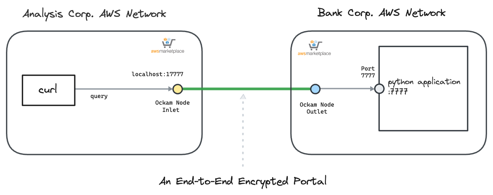

# Ockam Node

This guide contains instructions to launch within AWS environment, an&#x20;

* Ockam Outlet Node
* Ockam Inlet Node

The walkthrough demonstrates running both outlet and inlet nodes and verify communication between them.&#x20;

Read: “[How does Ockam work?](https://docs.ockam.io/how-does-ockam-work)” to learn about end-to-end trust establishment.

<figure><figcaption></figcaption></figure>

### Create an Orchestrator Project

[Sign up for Ockam](https://www.ockam.io/download) and pick a subscription plan through the guided workflow on Ockam.io.

Run the following commands to install Ockam Command and enroll with the Ockam Orchestrator.

```bash
curl --proto '=https' --tlsv1.2 -sSfL https://install.command.ockam.io | bash
source "$HOME/.ockam/env"

ockam enroll
```

Completing this step creates a Project in Ockam Orchestrator.

Control which identities are allowed to enroll themselves into your project by issuing unique one-time use enrollment tickets. Generate two enrollment tickets, one for the Outlet and one for the Inlet.

### Generate enrollment tickets

```sh
# Enrollment ticket for Ockam Outlet Node
ockam project ticket --expires-in 10h --usage-count 1 \
  --attribute example-outlet \
  --relay outlet \
    > "outlet.ticket"

# Enrollment ticket for Ockam Inlet Node
ockam project ticket --expires-in 10h --usage-count 1 \
  --attribute example-inlet \
    > "inlet.ticket"
    
```

### Setup Ockam Outlet Node

* Login to AWS Account you would like to use
* Subscribe to "[Ockam - Node" ](https://aws.amazon.com/marketplace/pp/prodview-gov6p3wh224ho?sr=0-1\&ref_=beagle\&applicationId=AWSMPContessa) in AWS Marketplace&#x20;
* Navigate to `AWS Marketplace -> Manage subscriptions`. Select `Ockam - Node` from the list of subscriptions. Select `Actions-> Launch Cloudformation stack`&#x20;
* Select the Region you want to deploy and click `Continue to Launch`. Under Actions, select `Launch Cloudformation`
* Create stack with below details
  * Stack name: `example-outlet` or any name you prefer
  * Network Configuration
    * Select suitable values for `VPC ID` and `Subnet ID`
      * Default instance type is `m6a.8xlarge` because of the predictable network bandwidth of 12.5 Gbps. Adjust instance type if you need to
  * Ockam Configuration
    * `Enrollment ticket`: Copy and paste the content of the `outlet.ticket` generated above
    * `JSON Node Configuration`: Copy and paste the below configuration.&#x20;

```json
{
    "relay": "outlet",
    "tcp-outlet": {
        "to": "localhost:7777",
        "allow": "example-inlet"
    }
}

```

* Click Next to launch the CloudFormation run.
* A successful CloudFormation stack run configures the Ockam outlet node on an EC2 machine.
* EC2 machine mounts an EFS volume created in the same subnet. Ockam state is stored in the EFS volume.
* Connect to the EC2 machine via AWS Session Manager. To view the log file, run `sudo cat /var/log/cloud-init-output.log`.
* View the Ockam node status in CloudWatch.
  * Navigate to `Cloudwatch -> Log Group` and select `example-outet-ockam-status-logs`. Select the Logstream for the EC2 instance.&#x20;
  * Cloudformation template creates a subscription filter that sends data to a Cloudwatch alarm `example-outlet-OckamNodeDownAlarm.`Alarm will turn green upon ockam node successfully running.&#x20;
* An Autoscaling group ensures atleast one EC2 instance is running at all times.

#### Set up a webhook on the ec2 machine to validate connectivity

* Run `python3 /opt/webhook_receiver.py` to start the webhook that will listen on port `7777`. We will send traffic to this webhook after inlet is setup, so keep the terminal window open.

### Setup Ockam Inlet Node

* Login to AWS Account you would like to use
* Subscribe to "[Ockam - Node" ](https://aws.amazon.com/marketplace/pp/prodview-gov6p3wh224ho?sr=0-1\&ref_=beagle\&applicationId=AWSMPContessa) in AWS Marketplace&#x20;
* Navigate to `AWS Marketplace -> Manage subscriptions`. Select `Ockam - Node` from the list of subscriptions. Select `Actions-> Launch Cloudformation stack`&#x20;
* Select the Region you want to deploy and click `Continue to Launch`. Under Actions, select `Launch Cloudformation`
* Create stack with below details
  * Stack name: `example-inlet` or any name you prefer
  * Network Configuration
    * Select suitable values for `VPC ID` and `Subnet ID`
      * Default instance type is `m6a.8xlarge` because of the predictable network bandwidth of 12.5 Gbps. Adjust instance type if you need to
  * Ockam Configuration
    * `Enrollment ticket`: Copy and paste the content of the `outlet.ticket` generated above
    * `JSON Node Configuration`: Copy and paste the below configuration. &#x20;

```json
{
    "tcp-inlet": {
      "from": "0.0.0.0:17777",
      "via": "outlet",
      "allow": "example-outlet"
    }
}
```

* Click Next to launch the CloudFormation run.
* A successful CloudFormation stack run configures the Ockam inlet node on an EC2 machine.
* EC2 machine mounts an EFS volume created in the same subnet. Ockam state is stored in the EFS volume.
* Connect to the EC2 machine via AWS Session Manager. To view the log file, run `sudo cat /var/log/cloud-init-output.log`.&#x20;
* View the Ockam node status in CloudWatch.
  * Navigate to `Cloudwatch -> Log Group` and select `example-inlet-ockam-status-logs`. Select the Logstream for the EC2 instance.&#x20;
  * Cloudformation template creates a subscription filter that sends data to a Cloudwatch alarm `example-inlet-OckamNodeDownAlarm.`Alarm will turn green upon ockam node successfully running.&#x20;
* An Autoscaling group ensures atleast one EC2 instance is running at all times.&#x20;

#### Validate Connectivity

* Connect to the EC2 machine via AWS Session Manager.
* Run the command below to post a request to the Inlet address. You must receive a response. Verify that the request reaches the webhook running on the Outlet machine.

```bash
curl -X POST http://localhost:17777/webhook -H "Content-Type: application/json" -d "{\"from\": \"$(hostname)\"}"
```

A Successful setup receives a response back

```bash
# Inlet EC2
sh-5.2$ curl -X POST http://localhost:17777/webhook -H "Content-Type: application/json" -d "{\"from\": \"$(hostname)\"}"
Webhook received

```

You will also see the request received in the Outlet EC2 machine

```bash
# Outlet EC2
sh-5.2$ python3 /opt/webhook_receiver.py
2024-07-24 19:56:32,984 - __main__ - INFO - Webhook server running on port 7777...
127.0.0.1 - - [24/Jul/2024 19:56:36] "POST /webhook HTTP/1.1" 200 -
2024-07-24 19:58:01,341 - __main__ - INFO - Received webhook: {"from": "REDACTED.REDACTED.compute.internal"}
```

You have now successfully created an Ockam Portal and verified secure communication 🎉.

### Cleanup

* Delete the `example-outlet`CloudFormation stack from the AWS Account.
* Delete the `example-inlet` CloudFormation stack from the AWS Account.
* Delete ockam configuration files from the machine that the administrator used to generate enrollment tickets.

```shell
ockam reset
```

