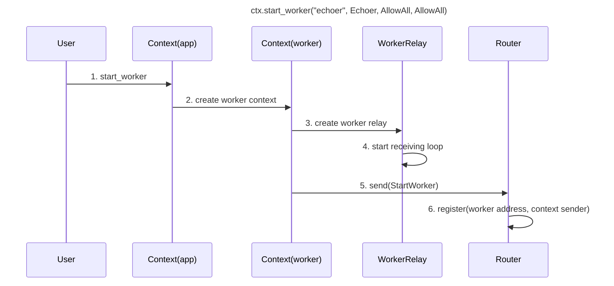
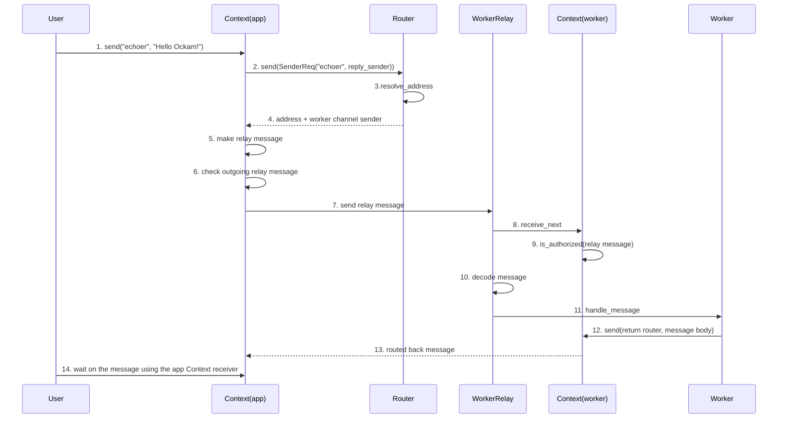

# Nodes and Workers

```mermaid
---
title: ctx.start_worker("echoer", Echoer, AllowAll, AllowAll)
---
sequenceDiagram
  User->>Context(app): 1. start_worker
  Context(app)->>Context(worker): 2. create worker context
  Context(worker)->>WorkerRelay: 3. create worker relay
  WorkerRelay->>WorkerRelay: 4. start receiving loop
  Context(worker)->>Router: 5. send(StartWorker)
  Router->>Router: 6. register(worker address, context sender)

```

```mermaid

sequenceDiagram
  User->>Context(app): 1. send("echoer", "Hello Ockam!")
  Context(app)->>Router: 2. send(SenderReq("echoer", reply_sender))
  Router->>Router: 3.resolve_address
  Router-->>Context(app): 4. address + worker channel sender
  Context(app)->>Context(app): 5. make relay message
  Context(app)->>Context(app): 6. check outgoing relay message
  Context(app)->>WorkerRelay: 7. send relay message
  WorkerRelay->>Context(worker): 8. receive_next
  Context(worker)->>Context(worker): 9. is_authorized(relay message)
  WorkerRelay->>WorkerRelay: 10. decode message
  WorkerRelay->>Worker: 11. handle_message
  Worker->>Context(worker): 12. send(return router, message body)
  Context(worker)-->>Context(app): 13. routed back message
  User->>Context(app): 14. wait on the message using the app Context receiver

```
