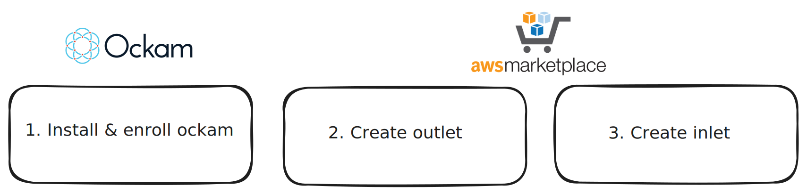
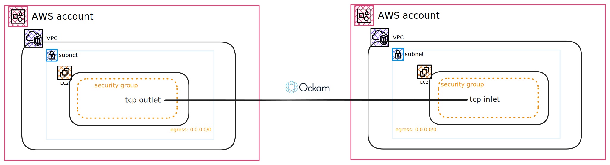

In this example we will create an Ockam portal with a tcp inlet and a tcp outlet by lauching cloudformation template from AWS Marketplace

# Overview:



1. Install ockam and create enrollment tokens for outlet and inlet
2. Use the enrollment token for outlet and launch Cloudformation template from AWS Marketplace
3. Use the enrollment token for inlet and launch Cloudformation template from AWS Marketplace

## Architecture:



## Steps:

### 1. Install Ockam

Install the [<mark style="color:blue;">Ockam
command</mark>](https://docs.ockam.io/#quick-start), if you haven't already, by following
the instructions below.


Ockam Command is our Command Line Interface (CLI) to build and orchestrate secure
distributed applications using Ockam.




If you use Homebrew, you can install Ockam using brew.

```sh
# Tap and install Ockam Command
brew install build-trust/ockam/ockam
```

This will download a precompiled binary and add it to your path. If you don’t use
Homebrew, you can also install on Linux and MacOS systems using curl. See instructions for
other systems in the next tab.



On Linux and MacOS, you can download precompiled binaries for your architecture using curl.

```shell
curl --proto '=https' --tlsv1.2 -sSf \
    https://raw.githubusercontent.com/build-trust/ockam/develop/install.sh | bash
```

This will download a precompiled binary and add it to your path. If the above instructions
don't work on your machine, please [post a
question](https://github.com/build-trust/ockam/discussions), we’d love to help.



### 2. Generate enrollment tickets

- Start by enrolling with the Orchestrator and ensuring the default project is setup to use:

```shell
ockam enroll
```

- As the administrator of the Ockam project, you're able to control what other identities are allowed to enroll themselves into your project by issuing unique one-time use enrollment tickets. Generate enrollment tickets, one for outlet and one for inlet

```shell

# Choose a name that identifies your resource. Below is a sample you can use for this demo
RESOURCE_IDENTIFIER="aws:cft:demo"

# Enrollment ticket for outlet
ockam project ticket --expires-in 24h --usage-count 1 \
  --attribute component=${RESOURCE_IDENTIFIER}:outlet \
  --relay ${RESOURCE_IDENTIFIER}:outlet \
    > "${RESOURCE_IDENTIFIER}:outlet.enrollment.ticket"

# Enrollment ticket for inlet
ockam project ticket --expires-in 24h --usage-count 1 \
  --attribute component=${RESOURCE_IDENTIFIER}:inlet \
    > "${RESOURCE_IDENTIFIER}:inlet.enrollment.ticket"

```

### 3. Setup TCP Outlet

- Open Cloudformation template from marketplace. Choose the `AWS Region` you would like to deploy to

- Stack name: `ockam-ec2-instance-outlet` or any appropriate value.

- Network Configuration
  - Select suitable values.

- Ockam Configuration
  - `Ockam TCP Outlet or Inlet`: Choose `outlet`
  - `Enrollment ticket`: Copy paste the content of `outlet` ticket generated above
  - `Resource Identifier`: Enter the value of resource identifier (RESOURCE_IDENTIFIER) used to generate enrollment tickets. If you are following this example, use `aws:cft:demo`
  - `Resource Address`: Enter `127.0.0.1:7777`. In the upcoming steps, you will setup a webhook on the same ec2 listening on port `7777`. _This could be any resource in the AWS account that the EC2 machine can access_

- Launch cloudformation template. 

- Upon successful cloudformation stack run, ockam outlet is configured on an ec2 machine.

- Connect to EC2 machine via AWS Session Manager. To view the log file, connect to the instance and open `/var/log/cloud-init-output.log`

- Connect to EC2 machine via AWS Session Manager to run a webhook. Copy below contents to file `/opt/webhook_receiver.py`

```py
from http.server import BaseHTTPRequestHandler, HTTPServer
import logging

# Setting up the basic configuration for logging
logging.basicConfig(level=logging.INFO, format='%(asctime)s - %(name)s - %(levelname)s - %(message)s')

# Creating a logger instance
logger = logging.getLogger(__name__)

class WebhookHandler(BaseHTTPRequestHandler):
    def do_POST(self):
        if self.path == '/webhook':
            content_length = int(self.headers['Content-Length'])
            post_data = self.rfile.read(content_length)

            logger.info('Received webhook: %s', post_data.decode())

            self.send_response(200)
            self.end_headers()
            self.wfile.write(b'Webhook received')

def run(server_class=HTTPServer, handler_class=WebhookHandler, port=7777):
    server_address = ('', port)
    httpd = server_class(server_address, handler_class)

    # Using logger for initial server start information
    logger.info("Webhook server running on port %s...", port)
    httpd.serve_forever()

if __name__ == '__main__':
    run()

```
- Execute `python3 /opt/webhook_receiver.py` to start the webhook that will listen on port `7777`. Note that the outlet is created to send traffic to this webhook, so keep the window open as you setup inlet to test portal

### 4. Setup TCP Inlet

- Open Cloudformation template from marketplace. Choose the `AWS Region` you would like to deploy to.

- Stack name: `ockam-ec2-instance-inlet` or any appropriate value.

- Network Configuration
  - Select suitable values.

- Ockam Configuration
  - `Ockam TCP Outlet or Inlet`: Choose `inlet`
  - `Enrollment ticket`: Copy paste the `inlet` ticket generated above
  - `Resource Identifier`: Enter the value of resource identifier (RESOURCE_IDENTIFIER) used to generate enrollment tickets. If you are following this example, use `aws:cft:demo`
  - `Resource Address`: Enter `127.0.0.1:7775`. This is the address you would want the inlet to listen to. 

- Launch cloudformation template. 

- Upon successful cloudformation run, ockam inlet is configured on an ec2 machine.

- Connect to EC2 machine via AWS Session Manager. To view the log file, connect to the instance and open `/var/log/cloud-init-output.log`

- Run below command that post a request to the inlet address. You much receive a response. Verify request reaches the webhook running on the outlet machine.

```shell
curl -X POST http://localhost:7775/webhook -H "Content-Type: application/json" -d "{\"date\": \"$(date +%Y-%m-%d)\"}"
```

You have now successfully created an ockam portal and verified secure communication.

### 4. Cleanup

- Delete cloudformation stack that created tcp outlet in AWS Account

- Delete cloudformation stack that created tcp inlet in AWS Account

- Delete ockam project from the machine that was used to enroll and generate enrollment tickets

```
ockam reset --all
```