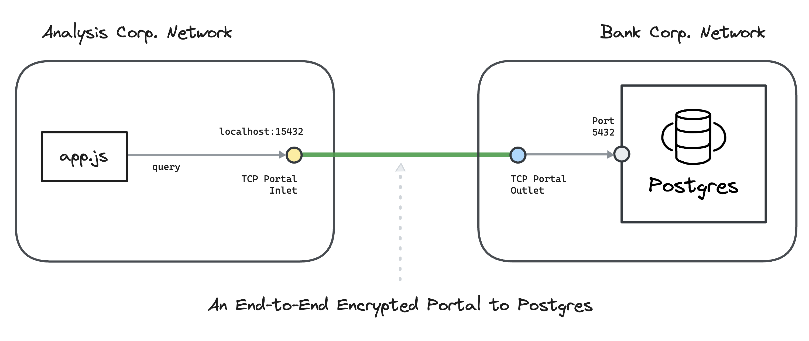

# Routing and Transports


### Routing

So far, we've created an [`"echoer"` worker](nodes.md#echoer-worker) in our node, sent it a message, and received a reply. This worker was a simple one hop away from our `"app"` worker.

Ockam's Application Layer Routing protocol allows us to send messages over any number of hops, within one node, or across many nodes. This enables us to layer other protocols that provide end-to-end security and privacy guarantees.

To achieve this, messages carry with them two meta fields: `onward_route` and `return_route`, where a route is a list of addresses.

To get a sense of how that works, let's route a message over two hops.

### Protocol

Sender:

* Needs to know the route to a destination, makes that route the onward\_route of a new message
* Makes its own address the the return\_route of the new message

Hop:

* Removes its own address from beginning of onward\_route
* Adds its own address to beginning of return\_route

Replier:

* Makes return\_route of incoming message, onward\_route of outgoing message
* Makes its own address the the return\_route of the new message


#### Hop worker

For demonstration, we'll create a simple worker, called `Hop`, that takes every incoming message and forwards it to the next address in the `onward_route` of that message.

Just before forwarding the message, `Hop`'s handle message function will:

1. Print the message
2. Remove its own address (first address) from the `onward_route`, by calling `step()`
3. Insert its own address as the first address in the `return_route` by calling `prepend()`

Create a new file at:

```
touch src/hop.rs
```

Add the following code to this file:

```rust
// src/hop.rs

use ockam::{Any, Context, Result, Routed, Worker};

pub struct Hop;

#[ockam::worker]
impl Worker for Hop {
    type Context = Context;
    type Message = Any;

    /// This handle function takes any incoming message and forwards
    /// it to the next hop in it's onward route
    async fn handle_message(&mut self, ctx: &mut Context, msg: Routed<Any>) -> Result<()> {
        println!("Address: {}, Received: {}", ctx.address(), msg);

        // Some type conversion
        let mut message = msg.into_local_message();
        let transport_message = message.transport_mut();

        // Remove my address from the onward_route
        transport_message.onward_route.step()?;

        // Insert my address at the beginning return_route
        transport_message.return_route.modify().prepend(ctx.address());

        // Send the message on its onward_route
        ctx.forward(message).await
    }
}
```

To make this `Hop` type accessible to our main program, export it from `src/lib.rs` by adding the following to it:

```rust
mod hop;
pub use hop::*;
```

#### Echoer worker

We'll also use the `Echoer` worker that we created in the [previous example](broken-reference). So make sure that it stays exported from `src/lib.rs`.

#### App worker

Next, let's create our main `"app"` worker.

In the code below we start an `Echoer` worker at address `"echoer"` and a `Hop` worker at address `"h1"`. Then, we send a message along the `h1 => echoer` route by passing `route!["h1", "echoer"]` to `send(..)`.

Create a new file at:

```
touch examples/03-routing.rs
```

Add the following code to this file:

```rust
// examples/03-routing.rs
// This node routes a message.

use hello_ockam::{Echoer, Hop};
use ockam::access_control::AllowAll;
use ockam::{route, Context, Result};

#[ockam::node]
async fn main(mut ctx: Context) -> Result<()> {
    // Start a worker, of type Echoer, at address "echoer"
    ctx.start_worker("echoer", Echoer, AllowAll, AllowAll).await?;

    // Start a worker, of type Hop, at address "h1"
    ctx.start_worker("h1", Hop, AllowAll, AllowAll).await?;

    // Send a message to the worker at address "echoer",
    // via the worker at address "h1"
    ctx.send(route!["h1", "echoer"], "Hello Ockam!".to_string()).await?;

    // Wait to receive a reply and print it.
    let reply = ctx.receive::<String>().await?;
    println!("App Received: {}", reply); // should print "Hello Ockam!"

    // Stop all workers, stop the node, cleanup and return.
    ctx.stop().await
}
```

To run this new node program:

```
cargo run --example 03-routing
```

Note the message flow and how routing information is manipulated as the message travels.

#### Routing over many hops

Routing is not limited to [one](https://github.com/build-trust/ockam/blob/develop/documentation/guides/rust/get-started/02-worker#readme) or [two hops](https://github.com/build-trust/ockam/blob/develop/documentation/guides/rust/get-started/03-routing/README.md#app-worker), we can easily create routes with many hops. Let's try that in a quick example:

This time we'll create multiple hop workers between the `"app"` and the `"echoer"` and route our message through them.

Create a new file at:

```
touch examples/03-routing-many-hops.rs
```

Add the following code to this file:

```rust
// examples/03-routing-many-hops.rs
// This node routes a message through many hops.

use hello_ockam::{Echoer, Hop};
use ockam::access_control::AllowAll;
use ockam::{route, Context, Result};

#[ockam::node]
async fn main(mut ctx: Context) -> Result<()> {
    // Start an Echoer worker at address "echoer"
    ctx.start_worker("echoer", Echoer, AllowAll, AllowAll).await?;

    // Start 3 hop workers at addresses "h1", "h2" and "h3".
    ctx.start_worker("h1", Hop, AllowAll, AllowAll).await?;
    ctx.start_worker("h2", Hop, AllowAll, AllowAll).await?;
    ctx.start_worker("h3", Hop, AllowAll, AllowAll).await?;

    // Send a message to the "echoer" worker via the "h1", "h2", and "h3" workers
    let r = route!["h1", "h2", "h3", "echoer"];
    ctx.send(r, "Hello Ockam!".to_string()).await?;

    // Wait to receive a reply and print it.
    let reply = ctx.receive::<String>().await?;
    println!("App Received: {}", reply); // should print "Hello Ockam!"

    // Stop all workers, stop the node, cleanup and return.
    ctx.stop().await
}
```

To run this new node program:

```
cargo run --example 03-routing-many-hops
```

Note the message flow.

<figure><figcaption></figcaption></figure>

### Transport

An Ockam Transport is a plugin for Ockam Routing. It moves Ockam Routing messages using a specific transport protocol like TCP, UDP, WebSockets, Bluetooth etc.

In previous examples, we routed messages locally within one node. Routing messages over transport layer connections looks very similar.

Let's try the TcpTransport, we'll need to create two nodes: a [responder](https://github.com/build-trust/ockam/tree/develop/documentation/guides/rust/get-started/04-transport#responder-node) and an [initiator](https://github.com/build-trust/ockam/tree/develop/documentation/guides/rust/get-started/04-transport#initiator-node).

Create a new file at:

```
touch examples/04-routing-over-transport-responder.rs
```

Add the following code to this file:

```rust
// examples/04-routing-over-transport-responder.rs
// This node starts a tcp listener and an echoer worker.
// It then runs forever waiting for messages.

use hello_ockam::Echoer;
use ockam::access_control::AllowAll;
use ockam::{Context, Result, TcpTransport};

#[ockam::node]
async fn main(ctx: Context) -> Result<()> {
    // Initialize the TCP Transport.
    let tcp = TcpTransport::create(&ctx).await?;

    // Create a TCP listener and wait for incoming connections.
    tcp.listen("127.0.0.1:4000").await?;

    // Create an echoer worker
    ctx.start_worker("echoer", Echoer, AllowAll, AllowAll).await?;

    // Don't call ctx.stop() here so this node runs forever.
    Ok(())
}
```

#### Initiator node

Create a new file at:

```
touch examples/04-routing-over-transport-initiator.rs
```

Add the following code to this file:

```rust
// examples/04-routing-over-transport-initiator.rs
// This node routes a message, to a worker on a different node, over the tcp transport.

use ockam::{route, Context, Result, TcpTransport, TCP};

#[ockam::node]
async fn main(mut ctx: Context) -> Result<()> {
    // Initialize the TCP Transport.
    let _tcp = TcpTransport::create(&ctx).await?;

    // Send a message to the "echoer" worker, on a different node, over a tcp transport.
    let r = route![(TCP, "localhost:4000"), "echoer"];
    ctx.send(r, "Hello Ockam!".to_string()).await?;

    // Wait to receive a reply and print it.
    let reply = ctx.receive::<String>().await?;
    println!("App Received: {}", reply); // should print "Hello Ockam!"

    // Stop all workers, stop the node, cleanup and return.
    ctx.stop().await
}
```

#### Run

Run the responder:

```
cargo run --example 04-routing-over-transport-responder
```

Run the initiator:

```
cargo run --example 04-routing-over-transport-initiator
```

Note the message flow.

<figure><figcaption></figcaption></figure>

#### Routing over two transport hops

#### Responder node

Create a new file at:

```
touch examples/04-routing-over-transport-two-hops-responder.rs
```

Add the following code to this file:

```rust
// examples/04-routing-over-transport-two-hops-responder.rs
// This node starts a tcp listener and an echoer worker.
// It then runs forever waiting for messages.

use hello_ockam::Echoer;
use ockam::access_control::AllowAll;
use ockam::{Context, Result, TcpTransport};

#[ockam::node]
async fn main(ctx: Context) -> Result<()> {
    // Initialize the TCP Transport.
    let tcp = TcpTransport::create(&ctx).await?;

    // Create a TCP listener and wait for incoming connections.
    tcp.listen("127.0.0.1:4000").await?;

    // Create an echoer worker
    ctx.start_worker("echoer", Echoer, AllowAll, AllowAll).await?;

    // Don't call ctx.stop() here so this node runs forever.
    Ok(())
}
```

#### Middle node

Create a new file at:

```
touch examples/04-routing-over-transport-two-hops-middle.rs
```

Add the following code to this file:

```rust
// examples/04-routing-over-transport-two-hops-middle.rs
// This node creates a tcp connection to a node at 127.0.0.1:4000
// Starts a tcp listener at 127.0.0.1:3000
// It then runs forever waiting to route messages.

use hello_ockam::Hop;
use ockam::access_control::AllowAll;
use ockam::{Context, Result, TcpTransport};

#[ockam::node]
async fn main(ctx: Context) -> Result<()> {
    // Initialize the TCP Transport.
    let tcp = TcpTransport::create(&ctx).await?;

    // Create a TCP listener and wait for incoming connections.
    tcp.listen("127.0.0.1:3000").await?;

    // Create a Hop worker
    ctx.start_worker("hop", Hop, AllowAll, AllowAll).await?;

    // Don't call ctx.stop() here so this node runs forever.
    Ok(())
}
```

#### Initiator node

Create a new file at:

```
touch examples/04-routing-over-transport-two-hops-initiator.rs
```

Add the following code to this file:

```rust
// examples/04-routing-over-transport-two-hops-initiator.rs
// This node routes a message, to a worker on a different node, over two tcp transport hops.

use ockam::{route, Context, Result, TcpTransport, TCP};

#[ockam::node]
async fn main(mut ctx: Context) -> Result<()> {
    // Initialize the TCP Transport.
    let _tcp = TcpTransport::create(&ctx).await?;

    // Send a message to the "echoer" worker, on a different node, over two tcp hops.
    let r = route![(TCP, "localhost:3000"), "hop", (TCP, "localhost:4000"), "echoer"];
    ctx.send(r, "Hello Ockam!".to_string()).await?;

    // Wait to receive a reply and print it.
    let reply = ctx.receive::<String>().await?;
    println!("App Received: {}", reply); // should print "Hello Ockam!"

    // Stop all workers, stop the node, cleanup and return.
    ctx.stop().await
}
```

#### Run

Run the responder:

```
cargo run --example 04-routing-over-transport-two-hops-responder
```

Run middle:

```
cargo run --example 04-routing-over-transport-two-hops-middle
```

Run the initiator:

```
cargo run --example 04-routing-over-transport-two-hops-initiator
```

Note how the message is routed.
