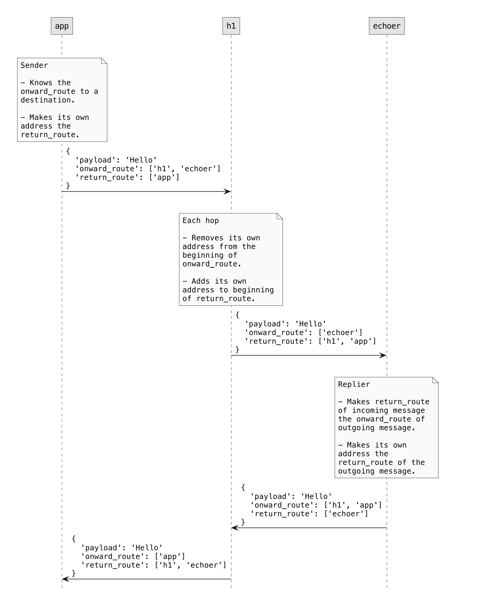

# Routing and Transports

```
» ockam message send hello --to /node/n1/service/echo
hello
```

<figure><figcaption></figcaption></figure>

<figure><figcaption></figcaption></figure>

```
» ockam message send hello --to /node/n1/service/hop/service/echo
hello
```

<figure><figcaption></figcaption></figure>

```
» ockam message send hello --to /node/n1/service/hop/service/hop/service/echo
hello
```

<figure><figcaption></figcaption></figure>
