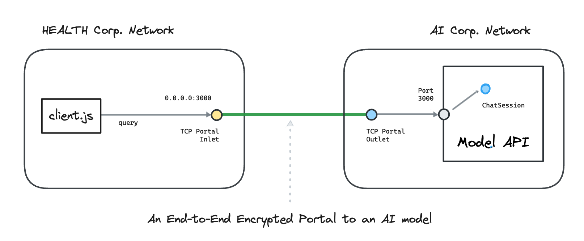

---
layout:
  title:
    visible: true
  description:
    visible: false
  tableOfContents:
    visible: true
  outline:
    visible: true
  pagination:
    visible: true
---

# AI

This section contains hands-on examples that use [<mark style="color:blue;">Ockam</mark>](../../) to create **encrypted portals** to various AI services running in various environments.

In each example, we connect a nodejs app in one private network with an AI service in another private network.
To understand how end-to-end trust is established, and how the portal works even though the two networks are isolated with no exposed ports,
please read: “[<mark style="color:blue;">How does Ockam work?</mark>](../../how-does-ockam-work.md)”

<figure><figcaption></figcaption></figure>

Please select an example to dig in:


The Amazon EC2 example uses a LLaMA model and the Amazon Bedrock model uses an Amazon Titan model.
However, the same setup works for any other AI models: _GPT, Claude, LaMDA, etc._


<table data-card-size="large" data-view="cards"><thead>
<tr><th></th><th></th></tr></thead><tbody>
<tr><td><a href="amazon_ec2"><mark style="color:blue;"><strong>Amazon EC2</strong></mark></a></td><td>We connect a nodejs app in an AWS virtual private network with a LLaMA model provisioned on an EC2 instance in another AWS virtual private network. The example uses the AWS CLI to instantiate AWS resources.</td></tr>
<tr><td><a href="amazon_bedrock"><mark style="color:blue;"><strong>Amazon Bedrock</strong></mark></a></td><td>We connect a nodejs app in an AWS virtual private network with an Amazon Bedrock API in another AWS virtual private network. The example uses the AWS CLI to instantiate AWS resources.</td></tr>
</tbody></table>
