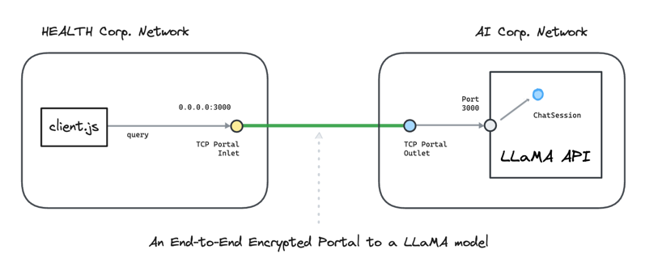

---
layout:
  title:
    visible: true
  description:
    visible: false
  tableOfContents:
    visible: true
  outline:
    visible: true
  pagination:
    visible: true
---

# Amazon EC2

This hands-on example uses [<mark style="color:blue;">Ockam</mark>](../../) to create an end-to-end **encrypted portal** to a LLaMA model.

We connect a nodejs app in one virtual private network with an application serving a LLaMa model in another virtual private network.
The example uses the AWS CLI to create these virtual networks.

To understand the details of how end-to-end trust is established, and how the portal works even though the two networks are isolated with no exposed ports, please read: “[<mark style="color:blue;">How does Ockam work?</mark>](../../how-does-ockam-work.md)”

<figure><figcaption></figcaption></figure>

## Run

This example requires Bash, Git, Curl, and the AWS CLI. Please set up these tools for your operating system.
In particular you need to [<mark style="color:blue;">login to your AWS account</mark>](https://docs.aws.amazon.com/cli/latest/userguide/sso-configure-profile-token.html) with `aws sso login`.

Then run the following commands:

```bash
# Clone the Ockam repo from Github.
git clone --depth 1 https://github.com/build-trust/ockam && cd ockam

# Navigate to this example’s directory.
cd examples/command/portals/ai/amazon_ec2/aws_cli

# Run the example, use Ctrl-C to exit at any point.
./run.sh
```

If everything runs as expected, you'll see the answer to the question: "What is Ockham's Razor?".

## Walkthrough

The [<mark style="color:blue;">run.sh script</mark>](https://github.com/build-trust/ockam/blob/develop/examples/command/portals/ai/amazon_ec2/aws_cli/run.sh) script,
that you ran above, and its [<mark style="color:blue;">accompanying files</mark>](https://github.com/build-trust/ockam/tree/develop/examples/command/portals/ai/amazon_ec2/aws_cli)
are full of comments and meant to be read. The example setup is only a few simple steps, so please take some time to read and explore.

### Administrator

- The [<mark style="color:blue;">run.sh script</mark>](https://github.com/build-trust/ockam/blob/develop/examples/command/portals/ai/amazon_ec2/aws_cli/run.sh)
  calls the [<mark style="color:blue;">run function</mark>](https://github.com/build-trust/ockam/blob/develop/examples/command/portals/ai/amazon_ec2/aws_cli/run.sh#L14)
  which invokes the [<mark style="color:blue;">enroll command</mark>](https://github.com/build-trust/ockam/blob/develop/examples/command/portals/databases/ai/amazon_ec2/aws_cli/run.sh#L27) to
  create an new identity, sign into Ockam Orchestrator, set up a new Ockam project, make you the administrator of this project, and get a project membership [<mark style="color:blue;">credential</mark>](../../reference/protocols/identities.md#credentials).
- The run function then [<mark style="color:blue;">generates two new enrollment tickets</mark>](https://github.com/build-trust/ockam/blob/develop/examples/command/portals/ai/amazon_ec2/aws_cli/run.sh#L36-L45). The tickets are valid for 10 minutes.
  Each ticket can be redeemed only once and assigns [<mark style="color:blue;">attributes</mark>](../../reference/protocols/identities.md#credentials) to its redeemer.
  The [<mark style="color:blue;">first ticket</mark>](https://github.com/build-trust/ockam/blob/develop/examples/command/portals/ai/amazon_ec2/aws_cli/run.sh#L36-L37) is meant for the Ockam node that will run in AI Corp.’s network.
  The [<mark style="color:blue;">second ticket</mark>](https://github.com/build-trust/ockam/blob/develop/examples/command/portals/ai/amazon_ec2/aws_cli/run.sh#L44-L45) is meant for the Ockam node that will run in Health Corp.’s network.
- In a typical production setup an administrator or provisioning pipeline generates enrollment tickets and gives them to nodes that are being provisioned.
  In our example, the run function is acting on your behalf as the administrator of the Ockam project.
- The run function passes the enrollment tickets as variables of the run scripts provisioning [<mark style="color:blue;">AI Corp.'s network</mark>](https://github.com/build-trust/ockam/blob/develop/examples/command/portals/ai/amazon_ec2/aws_cli/run.sh#L50C35-L50C52)
  and [<mark style="color:blue;">Health Corp.'s network</mark>](https://github.com/build-trust/ockam/blob/develop/examples/command/portals/ai/amazon_ec2/aws_cli/run.sh#L55C39-L55C60).

### AI Corp

First, the `ai_corp/run.sh` script creates a network to host the application exposing the LLaMA model API:

- We [<mark style="color:blue;">create a VPC</mark>](https://github.com/build-trust/ockam/blob/develop/examples/command/portals/ai/amazon_ec2/aws_cli/ai_corp/run.sh#L11-L12) and tag it.
- We [<mark style="color:blue;">create an Internet gateway</mark>](https://github.com/build-trust/ockam/blob/develop/examples/command/portals/ai/amazon_ec2/aws_cli/ai_corp/run.sh#L15-L16) and attach it to the VPC.
- We [<mark style="color:blue;">create a route table</mark>](https://github.com/build-trust/ockam/blob/develop/examples/command/portals/ai/amazon_ec2/aws_cli/ai_corp/run.sh#L19) and [<mark style="color:blue;">create a route</mark>](https://github.com/build-trust/ockam/blob/develop/examples/command/portals/ai/amazon_ec2/aws_cli/ai_corp/run.sh#L20) to the Internet via the gateway.
- We [<mark style="color:blue;">create a subnet</mark>](https://github.com/build-trust/ockam/blob/develop/examples/command/portals/ai/amazon_ec2/aws_cli/ai_corp/run.sh#L23-L27), with associate it to the route table.
- We finally [<mark style="color:blue;">create a security group</mark>](https://github.com/build-trust/ockam/blob/develop/examples/command/portals/ai/amazon_ec2/aws_cli/ai_corp/run.sh#L32-L35) so that there is:
  - [<mark style="color:blue;">One TCP egress to the Internet</mark>](https://github.com/build-trust/ockam/blob/develop/examples/command/portals/ai/amazon_ec2/aws_cli/ai_corp/run.sh#L34),
  - And [<mark style="color:blue;">one SSH ingress</mark>](https://github.com/build-trust/ockam/blob/develop/examples/command/portals/ai/amazon_ec2/aws_cli/ai_corp/run.sh#L35) to install the model and its application.

We are now ready to create an EC2 instance where the Ockam outlet node will run:

- We [<mark style="color:blue;">select an AMI</mark>](https://github.com/build-trust/ockam/blob/develop/examples/command/portals/ai/amazon_ec2/aws_cli/ai_corp/run.sh#L40-L42).
- We [<mark style="color:blue;">create a key pair</mark>](https://github.com/build-trust/ockam/blob/develop/examples/command/portals/ai/amazon_ec2/aws_cli/ai_corp/run.sh#L40-L42) in order to access the EC2 instance via SSH.
- Before creating the EC2 instance [<mark style="color:blue;">we check that the AWS region we are using proposes this kind of instance type</mark>](https://github.com/build-trust/ockam/blob/develop/examples/command/portals/ai/amazon_ec2/aws_cli/ai_corp/run.sh#L48).
  Indeed, we need properly sized instance in order to run a large language model, and those instances are not available in all regions.
  If the instance is not available in the current region, [<mark style="color:blue;">we return the list of all the regions where that instance type is available</mark>](https://github.com/build-trust/ockam/blob/develop/examples/command/portals/ai/amazon_ec2/aws_cli/ai_corp/run.sh#L48).
- We [<mark style="color:blue;">start an instance using the selected AMI and right instance type</mark>](https://github.com/build-trust/ockam/blob/develop/examples/command/portals/ai/amazon_ec2/aws_cli/ai_corp/run.sh#L51-L53).
  Starting the instance executes a start script based on `ai_corp/run_ockam.sh` where:
  - [<mark style="color:blue;">`ENROLLMENT_TICKET` is replaced by the enrollment ticket</mark>](https://github.com/build-trust/ockam/blob/develop/examples/command/portals/ai/amazon_ec2/aws_cli/ai_corp/run.sh#L50) created by the administrator and given as a parameter to `ai_corp/run.sh`.
- We [<mark style="color:blue;">tag the created instance</mark>](https://github.com/build-trust/ockam/blob/develop/examples/command/portals/ai/amazon_ec2/aws_cli/ai_corp/run.sh#L54) and [<mark style="color:blue;">wait for it to be available</mark>](https://github.com/build-trust/ockam/blob/develop/examples/command/portals/ai/amazon_ec2/aws_cli/ai_corp/run.sh#L55).

When the instance is started, the `run_ockam.sh` script is executed:

- The [<mark style="color:blue;">`ockam` executable is installed</mark>](https://github.com/build-trust/ockam/blob/develop/examples/command/portals/ai/amazon_ec2/aws_cli/ai_corp/run_ockam.sh#L10-L11).
- The [<mark style="color:blue;">enrollment ticket is used to create a default identity and make it a project member</mark>](https://github.com/build-trust/ockam/blob/develop/examples/command/portals/ai/amazon_ec2/aws_cli/ai_corp/run_ockam.sh#L26).
- We then create an Ockam node:
  - With [<mark style="color:blue;">a TCP outlet</mark>](https://github.com/build-trust/ockam/blob/develop/examples/command/portals/ai/amazon_ec2/aws_cli/ai_corp/run_ockam.sh#L38).
  - A [<mark style="color:blue;">policy associated to the outlet</mark>](https://github.com/build-trust/ockam/blob/develop/examples/command/portals/ai/amazon_ec2/aws_cli/ai_corp/run_ockam.sh#L39). The policy authorizes identities with a credential containing the attribute <mark style="background-color:yellow;">ai-inlet="true"</mark>.
  - With [<mark style="color:blue;">a relay</mark>](https://github.com/build-trust/ockam/blob/develop/examples/command/portals/ai/amazon_ec2/aws_cli/ai_corp/run_ockam.sh#L40) capable of forwarding the TCP traffic to the TCP outlet.

### Health Corp

First, the `health_corp/run.sh` script creates a network to host the `client.js` application which will connect to the LLaMA model:

- We [<mark style="color:blue;">create a VPC</mark>](https://github.com/build-trust/ockam/blob/develop/examples/command/portals/ai/amazon_ec2/aws_cli/health_corp/run.sh#L11-L12) and tag it.
- We [<mark style="color:blue;">create an Internet gateway</mark>](https://github.com/build-trust/ockam/blob/develop/examples/command/portals/ai/amazon_ec2/aws_cli/health_corp/run.sh#L15-L16) and attach it to the VPC.
- We [<mark style="color:blue;">create a route table</mark>](https://github.com/build-trust/ockam/blob/develop/examples/command/portals/ai/amazon_ec2/aws_cli/health_corp/run.sh#L19) and [<mark style="color:blue;">create a route</mark>](https://github.com/build-trust/ockam/blob/develop/examples/command/portals/ai/amazon_ec2/aws_cli/health_corp/run.sh#L20) to the Internet via the gateway.
- We [<mark style="color:blue;">create a subnet</mark>](https://github.com/build-trust/ockam/blob/develop/examples/command/portals/ai/amazon_ec2/aws_cli/health_corp/run.sh#L23-L27), and associate it to the route table.
- We finally [<mark style="color:blue;">create a security group</mark>](https://github.com/build-trust/ockam/blob/develop/examples/command/portals/ai/amazon_ec2/aws_cli/health_corp/run.sh#L32-L35) so that there is:
  - [<mark style="color:blue;">One TCP egress to the Internet</mark>](https://github.com/build-trust/ockam/blob/develop/examples/command/portals/ai/amazon_ec2/aws_cli/health_corp/run.sh#L34),
  - And [<mark style="color:blue;">One SSH ingress</mark>](https://github.com/build-trust/ockam/blob/develop/examples/command/portals/ai/amazon_ec2/aws_cli/health_corp/run.sh#L35) to download and install the nodejs application.

We are now ready to create an EC2 instance where the Ockam inlet node will run:

- We [<mark style="color:blue;">select an AMI</mark>](https://github.com/build-trust/ockam/blob/develop/examples/command/portals/ai/amazon_ec2/aws_cli/health_corp/run.sh#L40).
- We [<mark style="color:blue;">start an instance using the AMI</mark>](https://github.com/build-trust/ockam/blob/develop/examples/command/portals/ai/amazon_ec2/aws_cli/health_corp/run.sh#L47-L54) above and a start script based on `run_ockam.sh` where:
  - [<mark style="color:blue;">`ENROLLMENT_TICKET` is replaced by the enrollment ticket</mark>](https://github.com/build-trust/ockam/blob/develop/examples/command/portals/ai/amazon_ec2/aws_cli/health_corp/run.sh#L47) created by the administrator and given as a parameter to `run.sh`.

The instance is started and the `run_ockam.sh` script is executed:

- The [<mark style="color:blue;">`ockam` executable is installed</mark>](https://github.com/build-trust/ockam/blob/develop/examples/command/portals/ai/amazon_ec2/aws_cli/health_corp/run_ockam.sh#L10-L11).
- The [<mark style="color:blue;">enrollment ticket is used to create a default identity and make it a project member</mark>](https://github.com/build-trust/ockam/blob/develop/examples/command/portals/ai/amazon_ec2/aws_cli/health_corp/run_ockam.sh#L26).
- We then create an Ockam node:
  - With [<mark style="color:blue;">a TCP inlet</mark>](https://github.com/build-trust/ockam/blob/develop/examples/command/portals/ai/amazon_ec2/aws_cli/health_corp/run_ockam.sh#L36).
  - A [<mark style="color:blue;">policy associated to the inlet</mark>](https://github.com/build-trust/ockam/blob/develop/examples/command/portals/ai/amazon_ec2/aws_cli/health_corp/run_ockam.sh#L39).
    The policy authorizes identities with a credential containing the attribute <mark style="background-color:yellow;">ai-outlet="true"</mark>.

We finally wait for the instance to be ready and install the `client.js` application:

- The [<mark style="color:blue;">client.js file</mark>](https://github.com/build-trust/ockam/blob/develop/examples/command/portals/ai/amazon_ec2/aws_cli/health_corp/client.js) is [<mark style="color:blue;">copied to the instance</mark>](https://github.com/build-trust/ockam/blob/develop/examples/command/portals/ai/amazon_ec2/aws_cli/health_corp/run.sh#L56)
  (this uses the previously created `key.pem` file to identify).
- We can then [<mark style="color:blue;">SSH to the instance</mark>](https://github.com/build-trust/ockam/blob/develop/examples/command/portals/ai/amazon_ec2/aws_cli/health_corp/run.sh#L57) and:
  - [<mark style="color:blue;">Install nodejs</mark>](https://github.com/build-trust/ockam/blob/develop/examples/command/portals/ai/amazon_ec2/aws_cli/health_corp/run.sh#L59).
  - [<mark style="color:blue;">Start the client.js application</mark>](https://github.com/build-trust/ockam/blob/develop/examples/command/portals/ai/amazon_ec2/aws_cli/health_corp/run.sh#L60).

Once the `client.js` application is started:

- It will [<mark style="color:blue;">connect to the Ockam inlet at port 3000</mark>](https://github.com/build-trust/ockam/blob/develop/examples/command/portals/ai/amazon_ec2/aws_cli/health_corp/client.js#L3).
- It [<mark style="color:blue;">sends a query</mark>](https://github.com/build-trust/ockam/blob/develop/examples/command/portals/ai/amazon_ec2/aws_cli/health_corp/client.js#L11) and waits for a response from the model.
- The response is then printed on the console [<mark style="color:blue;">sends a query</mark>](https://github.com/build-trust/ockam/blob/develop/examples/command/portals/ai/amazon_ec2/aws_cli/health_corp/client.js#L23).

## Recap

<figure><figcaption></figcaption></figure>

We connected a nodejs application in one virtual private network with an application serving a LLaMA model in another virtual private network over an end-to-end encrypted portal.

Sensitive business data coming from the model is only accessible to AI Corp. and Health Corp.
All data is [<mark style="color:blue;">encrypted</mark>](../../reference/protocols/secure-channels.md) with strong forward secrecy as it moves through the Internet.
The communication channel is [<mark style="color:blue;">mutually authenticated</mark>](../../reference/protocols/secure-channels.md) and [<mark style="color:blue;">authorized</mark>](../../reference/protocols/access-controls.md).
Keys and credentials are automatically rotated.
Access to connect with the model API can be easily revoked.

Health Corp. does not get unfettered access to AI Corp.’s network. It gets access only to run API queries.
AI Corp. does not get unfettered access to Health Corp.’s network. It gets access only to respond to queries over a TCP connection.
AI Corp. cannot initiate connections.

All [<mark style="color:blue;">access controls</mark>](../../reference/protocols/access-controls.md) are secure-by-default. Only project members, with valid credentials, can connect with each other.
NAT’s are traversed using a relay and outgoing tcp connections. AI Corp. or Health Corp. don’t expose any listening endpoints on the Internet.
Their networks are completely closed and protected from any attacks from the Internet.

## Cleanup

To delete all AWS resources:

```sh
./run.sh cleanup
```
