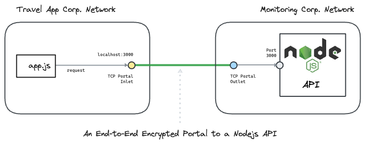

---
layout:
  title:
    visible: true
  description:
    visible: false
  tableOfContents:
    visible: true
  outline:
    visible: true
  pagination:
    visible: true
---

# nodejs

This hands-on example uses [<mark style="color:blue;">Ockam</mark>](../../) to create an end-to-end **encrypted portal** to a nodejs API.

We connect a nodejs app in one AWS VPC with a nodejs API in another AWS VPC. The example uses AWS CLI to create these VPCs.

To understand the details of how end-to-end trust is established, and how the portal works even though the two networks are isolated with no exposed ports, please read: “[<mark style="color:blue;">How does Ockam work?</mark>](../../how-does-ockam-work.md)”

<figure><figcaption></figcaption></figure>

## Run

This example requires Bash, Git, and AWS CLI. Please set up these tools for your operating system. In particular you need to [<mark style="color:blue;">login to your AWS account</mark>](https://docs.aws.amazon.com/cli/latest/userguide/sso-configure-profile-token.html) with `aws sso login`.

```bash
# Clone the Ockam repo from Github.
git clone --depth 1 https://github.com/build-trust/ockam && cd ockam

# Navigate to this example’s directory.
cd examples/command/portals/apis/nodejs/amazon_ec2/aws_cli/run.sh

# Run the example, use Ctrl-C to exit at any point.
./run.sh
```

If everything runs as expected, you'll see the message: _The example run was successful 🥳_

## Walkthrough

The [<mark style="color:blue;">run.sh script</mark>](https://github.com/build-trust/ockam/blob/develop/examples/command/portals/apis/nodejs/amazon\_ec2/aws\_cli/run.sh), that you ran above, and its [<mark style="color:blue;">accompanying files</mark>](https://github.com/build-trust/ockam/tree/develop/examples/command/portals/apis/nodejs/amazon\_ec2/aws\_cli) are full of comments and meant to be read. The example setup is only a few simple steps, so please take some time to read and explore.

### Administrator

* The [<mark style="color:blue;">run.sh script</mark>](https://github.com/build-trust/ockam/blob/develop/examples/command/portals/apis/nodejs/amazon\_ec2/aws\_cli/run.sh) calls the [<mark style="color:blue;">run function</mark>](https://github.com/build-trust/ockam/blob/develop/examples/command/portals/apis/nodejs/amazon\_ec2/aws\_cli/run.sh#L14) which invokes the [<mark style="color:blue;">enroll command</mark>](https://github.com/build-trust/ockam/blob/develop/examples/command/portals/apis/nodejs/amazon\_ec2/aws\_cli/run.sh#L27) to create an new identity, sign into Ockam Orchestrator, set up a new Ockam project, make you the administrator of this project, and get a project membership [<mark style="color:blue;">credential</mark>](../../reference/protocols/identities.md#credentials).
* The run function then [<mark style="color:blue;">generates two new enrollment tickets</mark>](https://github.com/build-trust/ockam/blob/develop/examples/command/portals/apis/nodejs/amazon\_ec2/aws\_cli/run.sh#L29-L45). The tickets are valid for 60 minutes. Each ticket can be redeemed only once and assigns [<mark style="color:blue;">attributes</mark>](../../reference/protocols/identities.md#credentials) to its redeemer. The [<mark style="color:blue;">first ticket</mark>](https://github.com/build-trust/ockam/blob/develop/examples/command/portals/apis/nodejs/amazon\_ec2/aws\_cli/run.sh#L29-L37) is meant for the Ockam node that will run in Monitoring Corp.’s network. The [<mark style="color:blue;">second ticket</mark>](https://github.com/build-trust/ockam/blob/develop/examples/command/portals/apis/nodejs/amazon\_ec2/aws\_cli/run.sh#L39-L45) is meant for the Ockam node that will run in Travel App Corp.’s network.
* In a typical production setup an administrator or provisioning pipeline generates enrollment tickets and gives them to nodes that are being provisioned. In our example, the run function is acting on your behalf as the administrator of the Ockam project.
* The run function passes the enrollment tickets as variables of the run scripts provisioning [Monitoring Corp.’s network](https://github.com/build-trust/ockam/blob/develop/examples/command/portals/apis/nodejs/amazon\_ec2/aws\_cli/run.sh#L50C43-L50C68) and [Travel App Corp.’s network](https://github.com/build-trust/ockam/blob/develop/examples/command/portals/apis/nodejs/amazon\_ec2/aws\_cli/run.sh#L55C43-L55C68).

### Monitoring Corp

First, the `monitoring_corp/run.sh` script creates a network to host the database:

* We [create a VPC](https://github.com/build-trust/ockam/blob/develop/examples/command/portals/apis/nodejs/amazon\_ec2/aws\_cli/monitoring\_corp/run.sh#L11-L12) and tag it.
* We [create an Internet gateway](https://github.com/build-trust/ockam/blob/develop/examples/command/portals/apis/nodejs/amazon\_ec2/aws\_cli/monitoring\_corp/run.sh#L15-L16) and attach it to the VPC.
* We [create a route table](https://github.com/build-trust/ockam/blob/develop/examples/command/portals/apis/nodejs/amazon\_ec2/aws\_cli/monitoring\_corp/run.sh#L19) and [create a route](https://github.com/build-trust/ockam/blob/develop/examples/command/portals/apis/nodejs/amazon\_ec2/aws\_cli/monitoring\_corp/run.sh#L20) to the Internet via the gateway.
* We [create a subnet](https://github.com/build-trust/ockam/blob/develop/examples/command/portals/apis/nodejs/amazon\_ec2/aws\_cli/monitoring\_corp/run.sh#L23-L27), and associate it with the route table.
* We finally [create a security group](https://github.com/build-trust/ockam/blob/develop/examples/command/portals/apis/nodejs/amazon\_ec2/aws\_cli/monitoring\_corp/run.sh#L32-L35) so that there is:
  * [One TCP egress to the Internet](https://github.com/build-trust/ockam/blob/develop/examples/command/portals/apis/nodejs/amazon\_ec2/aws\_cli/monitoring\_corp/run.sh#L34),
  * And [one SSH ingress](https://github.com/build-trust/ockam/blob/develop/examples/command/portals/apis/nodejs/amazon\_ec2/aws\_cli/monitoring\_corp/run.sh#L35) to install nodejs and run the API service.

Then, the `monitoring_corp/run.sh` script creates an EC2 instance where the Ockam outlet node will run:

* We [select an AMI](https://github.com/build-trust/ockam/blob/develop/examples/command/portals/apis/nodejs/amazon\_ec2/aws\_cli/monitoring\_corp/run.sh#L40-L42).
*   We [start an instance using the AMI](https://github.com/build-trust/ockam/blob/develop/examples/command/portals/apis/nodejs/amazon\_ec2/aws\_cli/monitoring\_corp/run.sh#L48-L50) above and a start script based on `run_ockam.sh` where the

    [`ENROLLMENT_TICKET` is replaced by the enrollment ticket](https://github.com/build-trust/ockam/blob/develop/examples/command/portals/apis/nodejs/amazon\_ec2/aws\_cli/monitoring\_corp/run.sh#L47) created by the administrator and given as a parameter to `run.sh`.
* We [tag the created instance](https://github.com/build-trust/ockam/blob/develop/examples/command/portals/apis/nodejs/amazon\_ec2/aws\_cli/monitoring\_corp/run.sh#L51) and [wait for it to be available](https://github.com/build-trust/ockam/blob/develop/examples/command/portals/apis/nodejs/amazon\_ec2/aws\_cli/monitoring\_corp/run.sh#L52).

Next, the instance is started and the `run_ockam.sh` script is executed:

* The [`ockam` executable is installed](https://github.com/build-trust/ockam/blob/develop/examples/command/portals/apis/nodejs/amazon\_ec2/aws\_cli/monitoring\_corp/run\_ockam.sh#L10).
* The [enrollment ticket is used to create a default identity and make it a project member](https://github.com/build-trust/ockam/blob/develop/examples/command/portals/apis/nodejs/amazon\_ec2/aws\_cli/monitoring\_corp/run\_ockam.sh#L26).
* We then create an Ockam node:
  * With [a TCP outlet](https://github.com/build-trust/ockam/blob/develop/examples/command/portals/apis/nodejs/amazon\_ec2/aws\_cli/monitoring\_corp/run\_ockam.sh#L40).
  * A [policy associated to the outlet](https://github.com/build-trust/ockam/blob/develop/examples/command/portals/apis/nodejs/amazon\_ec2/aws\_cli/monitoring\_corp/run\_ockam.sh#L39). The policy authorizes identities with a credential containing the attribute monitoring-api-inlet="true".
  * With [a relay](https://github.com/build-trust/ockam/blob/develop/examples/command/portals/apis/nodejs/amazon\_ec2/aws\_cli/monitoring\_corp/run\_ockam.sh#L38) capable of forwarding the TCP traffic to the TCP outlet.

Finally, we wait for the instance to be ready and run the nodejs api application:

* The [api.js file](https://github.com/build-trust/ockam/blob/develop/examples/command/portals/apis/nodejs/amazon\_ec2/aws\_cli/monitoring\_corp/api.js) is [copied to the instance](https://github.com/build-trust/ockam/blob/develop/examples/command/portals/apis/nodejs/amazon\_ec2/aws\_cli/monitoring\_corp/run.sh#L56) (this uses the previously created `key.pem` file to identify).
* We can then [SSH to the instance](https://github.com/build-trust/ockam/blob/develop/examples/command/portals/databases/postgres/amazon\_rds/aws\_cli/analysis\_corp/run.sh#L57) and:
  * [Install nodejs](https://github.com/build-trust/ockam/blob/develop/examples/command/portals/apis/nodejs/amazon\_ec2/aws\_cli/monitoring\_corp/run.sh#L59).
  * [Install dependencies](https://github.com/build-trust/ockam/blob/develop/examples/command/portals/apis/nodejs/amazon\_ec2/aws\_cli/monitoring\_corp/run.sh#L62).
  * [Run the nodejs api application](https://github.com/build-trust/ockam/blob/develop/examples/command/portals/apis/nodejs/amazon\_ec2/aws\_cli/monitoring\_corp/run.sh#L63).

#### Travel App Corp <a href="#analysis-corp" id="analysis-corp"></a>

First, the `travel_app_corp/run.sh` script creates a network to host the nodejs application:

* We [create a VPC](https://github.com/build-trust/ockam/blob/develop/examples/command/portals/apis/nodejs/amazon\_ec2/aws\_cli/travel\_app\_corp/run.sh#L11-L12) and tag it.
* We [create an Internet gateway](https://github.com/build-trust/ockam/blob/develop/examples/command/portals/apis/nodejs/amazon\_ec2/aws\_cli/travel\_app\_corp/run.sh#L15-L16) and attach it to the VPC.
* We [create a route table](https://github.com/build-trust/ockam/blob/develop/examples/command/portals/apis/nodejs/amazon\_ec2/aws\_cli/travel\_app\_corp/run.sh#L19) and [create a route](https://github.com/build-trust/ockam/blob/develop/examples/command/portals/apis/nodejs/amazon\_ec2/aws\_cli/travel\_app\_corp/run.sh#L20) to the Internet via the gateway.
* We [create a subnet](https://github.com/build-trust/ockam/blob/develop/examples/command/portals/apis/nodejs/amazon\_ec2/aws\_cli/travel\_app\_corp/run.sh#L23-L27), and associate it with the route table.
* We finally [create a security group](https://github.com/build-trust/ockam/blob/develop/examples/command/portals/apis/nodejs/amazon\_ec2/aws\_cli/travel\_app\_corp/run.sh#L32-L33) so that there is:
  * [One TCP egress to the Internet](https://github.com/build-trust/ockam/blob/develop/examples/command/portals/apis/nodejs/amazon\_ec2/aws\_cli/travel\_app\_corp/run.sh#L34),
  * And [One SSH ingress](https://github.com/build-trust/ockam/blob/develop/examples/command/portals/apis/nodejs/amazon\_ec2/aws\_cli/travel\_app\_corp/run.sh#L35) to download and install the nodejs application.

Then, we create an EC2 instance where the Ockam inlet node will run:

* We [select an AMI](https://github.com/build-trust/ockam/blob/develop/examples/command/portals/apis/nodejs/amazon\_ec2/aws\_cli/travel\_app\_corp/run.sh#L40-L42).
*   We [start an instance using the AMI](https://github.com/build-trust/ockam/blob/develop/examples/command/portals/apis/nodejs/amazon\_ec2/aws\_cli/travel\_app\_corp/run.sh#L48-L50) above and a start script based on `run_ockam.sh` where the

    [`ENROLLMENT_TICKET` is replaced by the enrollment ticket](https://github.com/build-trust/ockam/blob/develop/examples/command/portals/apis/nodejs/amazon\_ec2/aws\_cli/travel\_app\_corp/run.sh#L47) created by the administrator and given as a parameter to `run.sh`.

Next, the instance is started and the `run_ockam.sh` script is executed:

* The [`ockam` executable is installed](https://github.com/build-trust/ockam/blob/develop/examples/command/portals/apis/nodejs/amazon\_ec2/aws\_cli/travel\_app\_corp/run\_ockam.sh#10).
* The [enrollment ticket is used to create a default identity and make it a project member](https://github.com/build-trust/ockam/blob/develop/examples/command/portals/apis/nodejs/amazon\_ec2/aws\_cli/travel\_app\_corp/run\_ockam.sh#L26).
* We then create an Ockam node:
  * With [a TCP inlet](https://github.com/build-trust/ockam/blob/develop/examples/command/portals/apis/nodejs/amazon\_ec2/aws\_cli/travel\_app\_corp/run\_ockam.sh#L37).
  * A [policy associated to the inlet](https://github.com/build-trust/ockam/blob/develop/examples/command/portals/apis/nodejs/amazon\_ec2/aws\_cli/travel\_app\_corp/run\_ockam.sh#L36). The policy authorizes identities with a credential containing the attribute monitoring-api-outlet="true".

Finally, we wait for the instance to be ready and run the nodejs client application:

* The [client.js file](https://github.com/build-trust/ockam/blob/develop/examples/command/portals/apis/nodejs/amazon\_ec2/aws\_cli/travel\_app\_corp/client.js) is [copied to the instance](https://github.com/build-trust/ockam/blob/develop/examples/command/portals/apis/nodejs/amazon\_ec2/aws\_cli/travel\_app\_corp/run.sh#L56) (this uses the previously created `key.pem` file to identify).
* We can then [SSH to the instance](https://github.com/build-trust/ockam/blob/develop/examples/command/portals/apis/nodejs/amazon\_ec2/aws\_cli/travel\_app\_corp/run.sh#L57-L60) and:
  * [Install nodejs](https://github.com/build-trust/ockam/blob/develop/examples/command/portals/apis/nodejs/amazon\_ec2/aws\_cli/travel\_app\_corp/run.sh#L59).
  * [Run the nodejs client application](https://github.com/build-trust/ockam/blob/develop/examples/command/portals/apis/nodejs/amazon\_ec2/aws\_cli/travel\_app\_corp/run.sh#L60).

### Recap <a href="#recap" id="recap"></a>


<figure><figcaption></figcaption></figure>

We connected a nodejs app in one AWS VPC with a nodejs API service in another AWS VPC over an end-to-end encrypted portal.

Non-public access to private API endpoints are only accessible to enrolled members of the project with the appropriate attributes. The communication channel is [mutually authenticated](https://docs.ockam.io/reference/protocols/secure-channels) and [authorized](https://docs.ockam.io/reference/protocols/access-controls). Keys and credentials are automatically rotated. Access to the API can be easily revoked.

Travel App Corp. does not get unfettered access to Monitoring Corp.’s network. It only gets access to the API service. Monitoring Corp. does not get unfettered access to Travel App Corp.’s network. It gets access only to respond to requests over a tcp connection. Monitoring Corp. cannot initiate connections.

All [access controls](https://docs.ockam.io/reference/protocols/access-controls) are secure-by-default. Only project members, with valid credentials, can connect with each other. NAT’s are traversed using a relay and outgoing tcp connections. Neither Monitoring Corp. nor Travel App Corp. expose any listening endpoints to the Internet. Their networks are completely closed and protected from any attacks from the Internet.

## Cleanup

To delete all AWS resources created by this example:

```sh
./run.sh cleanup
```
