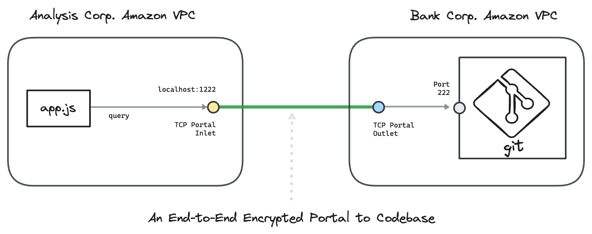

---
layout:
  title:
    visible: true
  description:
    visible: false
  tableOfContents:
    visible: true
  outline:
    visible: true
  pagination:
    visible: true
---

# Code Repos

Create an Ockam **Portal** from any application, to any code repo, in any environment.

In each example, we connect a nodejs app in one company's private network with a git repository managed by gitlab in another company's private network.&#x20;

Each company’s network is private, isolated, and doesn't expose ports. To learn how end-to-end trust is established, please read: “[<mark style="color:blue;">How does Ockam work?</mark>](../../how-does-ockam-work.md)”

<figure><figcaption></figcaption></figure>

Please select an example to dig in:


The examples below use a Gitlab server, however, the same setup works for any other coderepositories: Github, Gitea, Claude, etc.\_


<table data-card-size="large" data-view="cards"><thead><tr><th></th><th></th></tr></thead><tbody><tr><td><a href="gitlab/amazon_ec2.md"><mark style="color:blue;"><strong>Gitlab</strong></mark></a></td><td>We connect a nodejs app in an AWS virtual private network with a Gitlab hosted CodeRepository in another AWS virtual private network. The example uses the AWS CLI to instantiate AWS resources.</td></tr></tbody></table>
