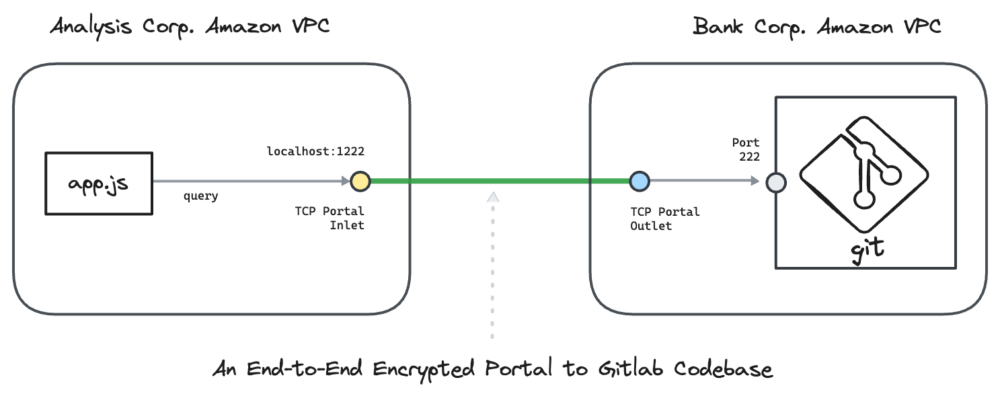

---
layout:
  title:
    visible: true
  description:
    visible: false
  tableOfContents:
    visible: true
  outline:
    visible: true
  pagination:
    visible: true
---

# Gitlab CodeRepository

This hands-on example uses [<mark style="color:blue;">Ockam</mark>](../../../) to create an end-to-end **encrypted portal** to Gitlab CodeRepository.

We connect a nodejs app in one Amazon VPC with a CodeRepository hosted on a Gitlab Server in another Amazon VPC. The example uses AWS CLI to create these VPCs.

To understand the details of how end-to-end trust is established, and how the portal works even though the two networks are isolated with no exposed ports, please read: “[<mark style="color:blue;">How does Ockam work?</mark>](../../../how-does-ockam-work.md)”

<figure><figcaption></figcaption></figure>

## Run

This example requires Bash, Git, AWS CLI, Influx CLI, jq. Please set up these tools for your operating system. In particular you need to [<mark style="color:blue;">login to your AWS account</mark>](https://docs.aws.amazon.com/cli/latest/userguide/sso-configure-profile-token.html) with `aws sso login`.

Then run the following commands:

```bash
# Clone the Ockam repo from Github.
git clone --depth 1 https://github.com/build-trust/ockam && cd ockam

# Navigate to this example’s directory.
cd examples/command/portals/coderepos/gitlab/amazon_ec2/aws_cli

# Run the example, use Ctrl-C to exit at any point.
./run.sh
```

If everything runs as expected, you'll see the message: _The example run was successful 🥳_

## Walkthrough

The [<mark style="color:blue;">run.sh script</mark>](https://github.com/build-trust/ockam/blob/develop/examples/command/portals/coderepos/gitlab/amazon\_ec2/aws\_cli/run.sh), that you ran above, and its [<mark style="color:blue;">accompanying files</mark>](https://github.com/build-trust/ockam/tree/develop/examples/command/portals/coderepos/gitlab/amazon\_ec2/aws\_cli) are full of comments and meant to be read. The example setup is only a few simple steps, so please take some time to read and explore.

### Administrator

* The [<mark style="color:blue;">run.sh script</mark>](https://github.com/build-trust/ockam/blob/develop/examples/command/portals/coderepos/gitlab/amazon\_ec2/aws\_cli/run.sh) calls the [<mark style="color:blue;">run function</mark>](https://github.com/build-trust/ockam/blob/develop/examples/command/portals/coderepos/gitlab/amazon\_ec2/aws\_cli/run.sh#L14) which invokes the [<mark style="color:blue;">enroll command</mark>](https://github.com/build-trust/ockam/blob/develop/examples/command/portals/coderepos/gitlab/amazon\_ec2/aws\_cli/run.sh#L27) to create an new identity, sign into Ockam Orchestrator, set up a new Ockam project, make you the administrator of this project, and get a project membership [<mark style="color:blue;">credential</mark>](../../../reference/protocols/identities.md#credentials).
* The run function then [<mark style="color:blue;">generates two new enrollment tickets</mark>](https://github.com/build-trust/ockam/blob/develop/examples/command/portals/coderepos/gitlab/amazon\_ec2/aws\_cli/run.sh#L36-L45). The tickets are valid for 10 minutes. Each ticket can be redeemed only once and assigns [<mark style="color:blue;">attributes</mark>](../../../reference/protocols/identities.md#credentials) to its redeemer. The [<mark style="color:blue;">first ticket</mark>](https://github.com/build-trust/ockam/blob/develop/examples/command/portals/coderepos/gitlab/amazon\_ec2/aws\_cli/run.sh#L36-L37) is meant for the Ockam node that will run in Bank Corp.’s network. The [<mark style="color:blue;">second ticket</mark>](https://github.com/build-trust/ockam/blob/develop/examples/command/portals/coderepos/gitlab/amazon\_ec2/aws\_cli/run.sh#L44-L45) is meant for the Ockam node that will run in Analysis Corp.’s network.
* In a typical production setup an administrator or provisioning pipeline generates enrollment tickets and gives them to nodes that are being provisioned. In our example, the run function is acting on your behalf as the administrator of the Ockam project.
* The run function passes the enrollment tickets as variables of the run scripts provisioning [<mark style="color:blue;">Bank Corp.'s network</mark>](https://github.com/build-trust/ockam/blob/develop/examples/command/portals/coderepos/gitlab/amazon\_ec2/aws\_cli/run.sh#L50C37-L50C56) and [<mark style="color:blue;">Analysis Corp.'s network</mark>](https://github.com/build-trust/ockam/blob/develop/examples/command/portals/coderepos/gitlab/amazon\_ec2/aws\_cli/run.sh#L55C41-L55C64).

### Bank Corp

First, the `bank_corp/run.sh` script creates a network to host the database:

* We [<mark style="color:blue;">create a VPC</mark>](https://github.com/build-trust/ockam/blob/develop/examples/command/portals/coderepos/gitlab/amazon\_ec2/aws\_cli/bank\_corp/run.sh#L11-L12) and tag it.
* We [<mark style="color:blue;">create an Internet gateway</mark>](https://github.com/build-trust/ockam/blob/develop/examples/command/portals/coderepos/gitlab/amazon\_ec2/aws\_cli/bank\_corp/run.sh#L15-L16) and attach it to the VPC.
* We [<mark style="color:blue;">create a route table</mark>](https://github.com/build-trust/ockam/blob/develop/examples/command/portals/coderepos/gitlab/amazon\_ec2/aws\_cli/bank\_corp/run.sh#L19) and [<mark style="color:blue;">create a route</mark>](https://github.com/build-trust/ockam/blob/develop/examples/command/portals/coderepos/gitlab/amazon\_ec2/aws\_cli/bank\_corp/run.sh#L20) to the Internet via the gateway.
* We [<mark style="color:blue;">create two subnets, located in two distinct availability zones</mark>](https://github.com/build-trust/ockam/blob/develop/examples/command/portals/coderepos/gitlab/amazon\_ec2/aws\_cli/bank\_corp/run.sh#L23-L33), and associated to the route table.
* We finally [<mark style="color:blue;">create a security group</mark>](https://github.com/build-trust/ockam/blob/develop/examples/command/portals/coderepos/gitlab/amazon\_ec2/aws\_cli/bank\_corp/run.sh#L38-L43) so that there is:
  * [<mark style="color:blue;">one TCP egress to the Internet</mark>](https://github.com/build-trust/ockam/blob/develop/examples/command/portals/coderepos/gitlab/amazon\_ec2/aws\_cli/bank\_corp/run.sh#L41),
  * [<mark style="color:blue;">one ingress to EC2 running Gitlab</mark>](https://github.com/build-trust/ockam/blob/develop/examples/command/portals/coderepos/gitlab/amazon\_ec2/aws\_cli/bank\_corp/run.sh#L42-L43) from the local machine running the example, to access Gitlab on port 22 and 80.


Then, the `bank_corp/run.sh` script creates a Gitlab server:


* We run [<mark style="color:blue;">a script to create and update auth token and org id </mark>](https://github.com/build-trust/ockam/blob/develop/examples/command/portals/coderepos/gitlab/amazon\_ec2/aws\_cli/bank\_corp/run.sh#L79) in [<mark style="color:blue;">app.mjs </mark>](https://github.com/build-trust/ockam/blob/develop/examples/command/portals/coderepos/gitlab/amazon\_ec2/aws\_cli/analysis\_corp/app.mjs#L10-L11).


We are now ready to create an EC2 instance where the Gitlab server and Ockam outlet node will run:

* An SSH keypair to access gitlab repository is created and, [<mark style="color:blue;">the public key is saved in a variable</mark>](https://github.com/build-trust/ockam/blob/develop/examples/command/portals/coderepos/gitlab/amazon\_ec2/aws\_cli/bank\_corp/run.sh#L48-L49).
* We [<mark style="color:blue;">select an AMI</mark>](https://github.com/build-trust/ockam/blob/develop/examples/command/portals/coderepos/gitlab/amazon\_ec2/aws\_cli/bank\_corp/run.sh#L51-L53).
* We [<mark style="color:blue;">create an ec2 keypair</mark>](https://github.com/build-trust/ockam/blob/develop/examples/command/portals/coderepos/gitlab/amazon\_ec2/aws\_cli/bank\_corp/run.sh#L54-L55) to access EC2 and to obtain gitlab password to be able to login to gitlab console.
* We [<mark style="color:blue;">start an instance using the AMI</mark>](https://github.com/build-trust/ockam/blob/develop/examples/command/portals/coderepos/gitlab/amazon\_ec2/aws\_cli/bank\_corp/run.sh#L61-L63) above and a start script based on `run_ockam.sh` and `run_gitlab.sh` where:
  * [<mark style="color:blue;">`ENROLLMENT_TICKET`</mark> <mark style="color:blue;"></mark><mark style="color:blue;">is replaced by the enrollment ticket</mark>](https://github.com/build-trust/ockam/blob/develop/examples/command/portals/coderepos/gitlab/amazon\_ec2/aws\_cli/bank\_corp/run.sh#L57) created by the administrator and given as a parameter to `run.sh`.
  * [<mark style="color:blue;">SSH_PUBLIC_KEY</mark>](https://github.com/build-trust/ockam/blob/develop/examples/command/portals/coderepos/gitlab/amazon\_ec2/aws\_cli/bank\_corp/run.sh#L59) in `run_gitlab.sh` script

* We [<mark style="color:blue;">tag the created instance</mark>](https://github.com/build-trust/ockam/blob/develop/examples/command/portals/coderepos/gitlab/amazon\_ec2/aws\_cli/bank\_corp/run.sh#L64) and [<mark style="color:blue;">wait for it to be available</mark>](https://github.com/build-trust/ockam/blob/develop/examples/command/portals/coderepos/gitlab/amazon\_ec2/aws\_cli/bank\_corp/run.sh#L65).
* We wait for 3 minutes for gitlab to be setup and [<mark style="color:blue;">check it's availability</mark>](https://github.com/build-trust/ockam/blob/develop/examples/command/portals/coderepos/gitlab/amazon\_ec2/aws\_cli/bank\_corp/run.sh#L68)

When the instance is started, the `run_gitlab.sh` script is executed:

* [<mark style="color:blue;">Gitlab and it's dependencies are installed</mark>](https://github.com/build-trust/ockam/blob/develop/examples/command/portals/coderepos/gitlab/amazon\_ec2/aws\_cli/bank\_corp/run\_gitlab.sh#L4-L71).
  * [<mark style="color:blue;">Gitlab SSH Port is mapped to 222</mark>](https://github.com/build-trust/ockam/blob/develop/examples/command/portals/coderepos/gitlab/amazon\_ec2/aws\_cli/bank\_corp/run\_gitlab.sh#L40).
* [<mark style="color:blue;">Obtain gitlab root password to create access token</mark>](https://github.com/build-trust/ockam/blob/develop/examples/command/portals/coderepos/gitlab/amazon\_ec2/aws\_cli/bank\_corp/run\_gitlab.sh#L74).
  * Password can be used to access the gitlab console from local machine
* [<mark style="color:blue;">Disable public signups</mark>](https://github.com/build-trust/ockam/blob/develop/examples/command/portals/coderepos/gitlab/amazon\_ec2/aws\_cli/bank\_corp/run\_gitlab.sh#L81).
* [<mark style="color:blue;">Create demo_project</mark>](https://github.com/build-trust/ockam/blob/develop/examples/command/portals/coderepos/gitlab/amazon\_ec2/aws\_cli/bank\_corp/run\_gitlab.sh#L86-L89).
* [<mark style="color:blue;">Configure access via created SSH Key</mark>](https://github.com/build-trust/ockam/blob/develop/examples/command/portals/coderepos/gitlab/amazon\_ec2/aws\_cli/bank\_corp/run\_gitlab.sh#L93-L97).


When the instance is started, the `run_ockam.sh` script is executed:

* The [<mark style="color:blue;">`ockam`</mark> <mark style="color:blue;"></mark><mark style="color:blue;">executable is installed</mark>](https://github.com/build-trust/ockam/blob/develop/examples/command/portals/coderepos/gitlab/amazon\_ec2/aws\_cli/bank\_corp/run\_ockam.sh#L10-L11).
* The [<mark style="color:blue;">enrollment ticket is used to create a default identity and make it a project member</mark>](https://github.com/build-trust/ockam/blob/develop/examples/command/portals/coderepos/gitlab/amazon\_ec2/aws\_cli/bank\_corp/run\_ockam.sh#L26).
* We then create an Ockam node:
  * With [<mark style="color:blue;">a TCP outlet</mark>](https://github.com/build-trust/ockam/blob/develop/examples/command/portals/coderepos/gitlab/amazon\_ec2/aws\_cli/bank\_corp/run\_ockam.sh#L38-L42).
  * A [<mark style="color:blue;">policy associated to the outlet</mark>](https://github.com/build-trust/ockam/blob/develop/examples/command/portals/coderepos/gitlab/amazon\_ec2/aws\_cli/bank\_corp/run\_ockam.sh#L40). The policy authorizes identities with a credential containing the attribute <mark style="background-color:yellow;">gitlab-inlet="true"</mark>.
  * With [<mark style="color:blue;">a relay</mark>](https://github.com/build-trust/ockam/blob/develop/examples/command/portals/coderepos/gitlab/amazon\_ec2/aws\_cli/bank\_corp/run\_ockam.sh#L41) capable of forwarding the TCP traffic to the TCP outlet.

### Analysis Corp

First, the `analysis_corp/run.sh` script creates a network to host the nodejs application:

* We [<mark style="color:blue;">create a VPC</mark>](https://github.com/build-trust/ockam/blob/develop/examples/command/portals/coderepos/gitlab/amazon\_ec2/aws\_cli/analysis\_corp/run.sh#L11-L12) and tag it.
* We [<mark style="color:blue;">create an Internet gateway</mark>](https://github.com/build-trust/ockam/blob/develop/examples/command/portals/coderepos/gitlab/amazon\_ec2/aws\_cli/analysis\_corp/run.sh#L15-L16) and attach it to the VPC.
* We [<mark style="color:blue;">create a route table</mark>](https://github.com/build-trust/ockam/blob/develop/examples/command/portals/coderepos/gitlab/amazon\_ec2/aws\_cli/analysis\_corp/run.sh#L19) and [<mark style="color:blue;">create a route</mark>](https://github.com/build-trust/ockam/blob/develop/examples/command/portals/coderepos/gitlab/amazon\_ec2/aws\_cli/analysis\_corp/run.sh#L20) to the Internet via the gateway.
* We [<mark style="color:blue;">create a subnet</mark>](https://github.com/build-trust/ockam/blob/develop/examples/command/portals/coderepos/gitlab/amazon\_ec2/aws\_cli/analysis\_corp/run.sh#L23-L27), and associated to the route table.
* We finally [<mark style="color:blue;">create a security group</mark>](https://github.com/build-trust/ockam/blob/develop/examples/command/portals/coderepos/gitlab/amazon\_ec2/aws\_cli/analysis\_corp/run.sh#L32-L36) so that there is:
  * [<mark style="color:blue;">One TCP egress to the Internet</mark>](https://github.com/build-trust/ockam/blob/develop/examples/command/portals/coderepos/gitlab/amazon\_ec2/aws\_cli/analysis\_corp/run.sh#L35),
  * And [<mark style="color:blue;">One SSH ingress</mark>](https://github.com/build-trust/ockam/blob/develop/examples/command/portals/coderepos/gitlab/amazon\_ec2/aws\_cli/analysis\_corp/run.sh#L36) to download and install the nodejs application from local machine running the script.

We are now ready to create an EC2 instance where the Ockam inlet node will run:

* We [<mark style="color:blue;">select an AMI</mark>](https://github.com/build-trust/ockam/blob/develop/examples/command/portals/coderepos/gitlab/amazon\_ec2/aws\_cli/analysis\_corp/run.sh#L41).
* We [<mark style="color:blue;">start an instance using the AMI</mark>](https://github.com/build-trust/ockam/blob/develop/examples/command/portals/coderepos/gitlab/amazon\_ec2/aws\_cli/analysis\_corp/run.sh#L45-L52) above and a start script based on `run_ockam.sh` where:
  * [<mark style="color:blue;">`ENROLLMENT_TICKET`</mark> <mark style="color:blue;"></mark><mark style="color:blue;">is replaced by the enrollment ticket</mark>](https://github.com/build-trust/ockam/blob/develop/examples/command/portals/coderepos/gitlab/amazon\_ec2/aws\_cli/analysis\_corp/run.sh#L48) created by the administrator and given as a parameter to `run.sh`.

The instance is started and the `run_repoaccess.sh` script is executed:

* The [<mark style="color:blue;">ssh config file</mark>](https://github.com/build-trust/ockam/blob/develop/examples/command/portals/coderepos/gitlab/amazon\_ec2/aws\_cli/analysis\_corp/run\_repoaccess.sh#L7-L11) is created on the EC2 with details of the private SSH key and permissions are updated

The instance is started and the `run_ockam.sh` script is executed:

* The [<mark style="color:blue;">`ockam`</mark> <mark style="color:blue;"></mark><mark style="color:blue;">executable is installed</mark>](https://github.com/build-trust/ockam/blob/develop/examples/command/portals/coderepos/gitlab/amazon\_ec2/aws\_cli/analysis\_corp/run\_ockam.sh#L10-L11).
* The [<mark style="color:blue;">enrollment ticket is used to create a default identity and make it a project member</mark>](https://github.com/build-trust/ockam/blob/develop/examples/command/portals/coderepos/gitlab/amazon\_ec2/aws\_cli/analysis\_corp/run\_ockam.sh#L26).
* We then create an Ockam node:
  * With [<mark style="color:blue;">a TCP inlet</mark>](https://github.com/build-trust/ockam/blob/develop/examples/command/portals/coderepos/gitlab/amazon\_ec2/aws\_cli/analysis\_corp/run\_ockam.sh#L36).
  * A [<mark style="color:blue;">policy associated to the inlet</mark>](https://github.com/build-trust/ockam/blob/develop/examples/command/portals/coderepos/gitlab/amazon\_ec2/aws\_cli/analysis\_corp/run\_ockam.sh#L39). The policy authorizes identities with a credential containing the attribute <mark style="background-color:yellow;">gitlab-outlet="true"</mark>.

We finally wait for the instance to be ready and install the nodejs application:

* The [<mark style="color:blue;">app.js file</mark>](https://github.com/build-trust/ockam/blob/develop/examples/command/portals/coderepos/gitlab/amazon\_ec2/aws\_cli/analysis\_corp/app.js) has code to access the code repository on `port 1222` configured [<mark style="color:blue;">in tcp inlet</mark>](https://github.com/build-trust/ockam/blob/develop/examples/command/portals/coderepos/gitlab/amazon\_ec2/aws\_cli/analysis\_corp/run\_ockam.sh#L37)
* We can then [<mark style="color:blue;">SSH to the instance</mark>](https://github.com/build-trust/ockam/blob/develop/examples/command/portals/coderepos/gitlab/amazon\_ec2/aws\_cli/analysis\_corp/run.sh#L57) and:
  * [<mark style="color:blue;">Copy app.js</mark>](https://github.com/build-trust/ockam/blob/develop/examples/command/portals/coderepos/gitlab/amazon\_ec2/aws\_cli/analysis\_corp/run.sh#L58).
  * [<mark style="color:blue;">Copy SSH Private key for Repository access</mark>](https://github.com/build-trust/ockam/blob/develop/examples/command/portals/coderepos/gitlab/amazon\_ec2/aws\_cli/analysis\_corp/run.sh#L59).
  * [<mark style="color:blue;">Install nodejs</mark>](https://github.com/build-trust/ockam/blob/develop/examples/command/portals/coderepos/gitlab/amazon\_ec2/aws\_cli/analysis\_corp/run.sh#L63).
  * [<mark style="color:blue;">Start the nodejs application</mark>](https://github.com/build-trust/ockam/blob/develop/examples/command/portals/coderepos/gitlab/amazon\_ec2/aws\_cli/analysis\_corp/run.sh#L65).

Once the nodejs application is started:

* It will [<mark style="color:blue;">connect to the Ockam inlet at port 1222</mark>](https://github.com/build-trust/ockam/blob/develop/examples/command/portals/coderepos/gitlab/amazon\_ec2/aws\_cli/analysis\_corp/app.js#L9).
* It [<mark style="color:blue;">executes the run function</mark>](https://github.com/build-trust/ockam/blob/develop/examples/command/portals/coderepos/gitlab/amazon\_ec2/aws\_cli/analysis\_corp/app.js#L95-L119) that clones the repository, makes sure README.md file exists, inserts a line to the README.md file, does a commit and push the commit to the remote gitlab server.

## Recap

<figure><figcaption></figcaption></figure>

We connected a nodejs app in one virtual private network with a Gitlab CodeRepository in another virtual private network over an end-to-end encrypted portal.

Sensitive business data in the Gitlab Codebase is only accessible to Bank Corp. and Analysis Corp. All data is [<mark style="color:blue;">encrypted</mark>](../../../reference/protocols/secure-channels.md) with strong forward secrecy as it moves through the Internet. The communication channel is [<mark style="color:blue;">mutually authenticated</mark>](../../../reference/protocols/secure-channels.md) and [<mark style="color:blue;">authorized</mark>](../../../reference/protocols/access-controls.md). Keys and credentials are automatically rotated. Access to connect with InfluxDB can be easily revoked.

Analysis Corp. does not get unfettered access to Bank Corp.’s network. It gets access only to the codebase hosted on the Gitlab server. Bank Corp. does not get unfettered access to Analysis Corp.’s network. It gets access only to respond to queries over a tcp connection. Bank Corp. cannot initiate connections.

All [<mark style="color:blue;">access controls</mark>](../../../reference/protocols/access-controls.md) are secure-by-default. Only project members, with valid credentials, can connect with each other. NAT’s are traversed using a relay and outgoing tcp connections. Bank Corp. or Analysis Corp. don’t expose any listening endpoints on the Internet. Their networks are completely closed and protected from any attacks from the Internet.

## Cleanup

To delete all AWS resources:

```sh
./run.sh cleanup
```
