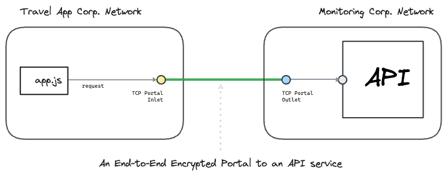

---
layout:
  title:
    visible: true
  description:
    visible: false
  tableOfContents:
    visible: true
  outline:
    visible: true
  pagination:
    visible: true
---

# APIs

This section contains hands-on examples that use [<mark style="color:blue;">Ockam</mark>](../../) to create **encrypted portals** to various APIs built in a variety of languages.

In each example, we connect a client app in one private network with am API service in another private network. To understand how end-to-end trust is established, and how the portal works even though the two networks are isolated with no exposed ports, please read: “[<mark style="color:blue;">How does Ockam work?</mark>](../../how-does-ockam-work.md)”

<figure><figcaption></figcaption></figure>

Please select an example to dig in:

<table data-card-size="large" data-view="cards"><thead><tr><th></th><th></th><th data-hidden data-card-target data-type="content-ref"></th></tr></thead><tbody><tr><td><a href="../databases/postgres/"><mark style="color:blue;"><strong>PostgreSQL</strong></mark></a></td><td>We connect a nodejs app in one private network with a PostgreSQL database in another private network.</td><td><a href="../databases/postgres/">postgres</a></td></tr><tr><td><a href="../databases/mongodb/"><mark style="color:blue;"><strong>MongoDB</strong></mark></a></td><td>We connect a nodejs app in one private network with a MongoDB database in another private network.</td><td><a href="../databases/mongodb/">mongodb</a></td></tr></tbody></table>
