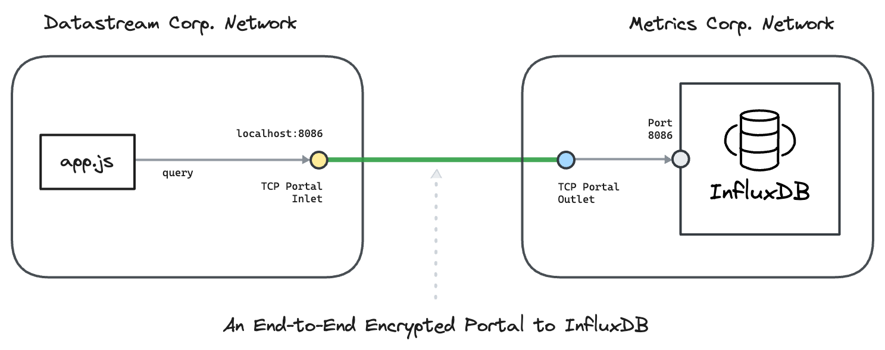

---
layout:
  title:
    visible: true
  description:
    visible: false
  tableOfContents:
    visible: true
  outline:
    visible: true
  pagination:
    visible: true
---

# InfluxDB

This section contains hands-on examples that use [<mark style="color:blue;">Ockam</mark>](<../../../README (1).md>) to create **encrypted portals** to InfluxDB databases running in various environments.

In each example, we connect a nodejs app in one private network with a InfluxDB database in another private network. To understand how end-to-end trust is established, and how the portal works even though the two networks are isolated with no exposed ports, please read: “[<mark style="color:blue;">How does Ockam work?</mark>](../../../how-does-ockam-work.md)”

<figure><figcaption></figcaption></figure>

Please select an example to dig in:

<table data-card-size="large" data-view="cards"><thead><tr><th></th><th></th></tr></thead><tbody><tr><td><a href="timestream.md"><mark style="color:blue;"><strong>InfluxDB - Amazon Timestream</strong></mark></a></td><td>We connect a nodejs app in one Amazon VPC with a InfluxDB database in another Amazon VPC. The example uses AWS CLI to create these VPCs.</td></tr></tbody></table>
