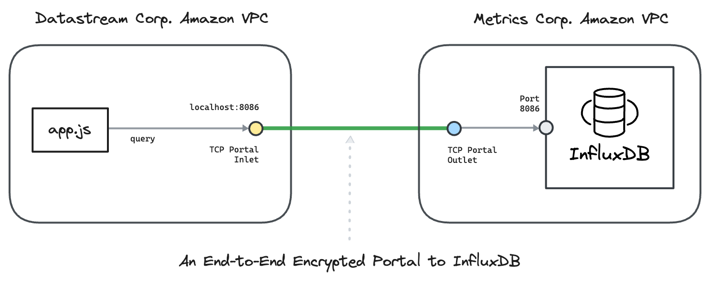

---
layout:
  title:
    visible: true
  description:
    visible: false
  tableOfContents:
    visible: true
  outline:
    visible: true
  pagination:
    visible: true
---

# Amazon Timestream

This hands-on example uses [<mark style="color:blue;">Ockam</mark>](../../../) to create an end-to-end **encrypted portal** to InfluxDB.

We connect a nodejs app in one Amazon VPC with a Amazon Timestream managed InfluxDB database in another Amazon VPC. The example uses AWS CLI to create these VPCs.

To understand the details of how end-to-end trust is established, and how the portal works even though the two networks are isolated with no exposed ports, please read: “[<mark style="color:blue;">How does Ockam work?</mark>](../../../how-does-ockam-work.md)”

<figure><figcaption></figcaption></figure>

## Run

This example requires Bash, Git, AWS CLI. Please set up these tools for your operating system. In particular you need to [<mark style="color:blue;">login to your AWS account</mark>](https://docs.aws.amazon.com/cli/latest/userguide/cli-chap-authentication.html).

Then run the following commands:

```bash
# Clone the Ockam repo from Github.
git clone --depth 1 https://github.com/build-trust/ockam && cd ockam

# Navigate to this example’s directory.
cd examples/command/portals/databases/influxdb/amazon_timestream/aws_cli

# Run the example, use Ctrl-C to exit at any point.
./run.sh
```

If everything runs as expected, you'll see the message: _The example run was successful 🥳_

## Walkthrough

The [<mark style="color:blue;">run.sh script</mark>](https://github.com/build-trust/ockam/blob/develop/examples/command/portals/databases/influxdb/amazon\_timestream/aws\_cli/run.sh), that you ran above, and its [<mark style="color:blue;">accompanying files</mark>](https://github.com/build-trust/ockam/tree/develop/examples/command/portals/databases/influxdb/amazon\_timestream/aws\_cli) are full of comments and meant to be read. The example setup is only a few simple steps, so please take some time to read and explore.

### Administrator

* The [<mark style="color:blue;">run.sh script</mark>](https://github.com/build-trust/ockam/blob/develop/examples/command/portals/databases/influxdb/amazon\_timestream/aws\_cli/run.sh) calls the [<mark style="color:blue;">run function</mark>](https://github.com/build-trust/ockam/blob/develop/examples/command/portals/databases/influxdb/amazon\_timestream/aws\_cli/run.sh#L14) which invokes the [<mark style="color:blue;">enroll command</mark>](https://github.com/build-trust/ockam/blob/develop/examples/command/portals/databases/influxdb/amazon\_timestream/aws\_cli/run.sh#L27) to create an new identity, sign into Ockam Orchestrator, set up a new Ockam project, make you the administrator of this project, and get a project membership [<mark style="color:blue;">credential</mark>](../../../reference/protocols/identities.md#credentials).
* The run function then [<mark style="color:blue;">generates two new enrollment tickets</mark>](https://github.com/build-trust/ockam/blob/develop/examples/command/portals/databases/influxdb/amazon\_timestream/aws\_cli/run.sh#L36-L45). The tickets are valid for 10 minutes. Each ticket can be redeemed only once and assigns [<mark style="color:blue;">attributes</mark>](../../../reference/protocols/identities.md#credentials) to its redeemer. The [<mark style="color:blue;">first ticket</mark>](https://github.com/build-trust/ockam/blob/develop/examples/command/portals/databases/influxdb/amazon\_timestream/aws\_cli/run.sh#L36-L37) is meant for the Ockam node that will run in Metrics Corp.’s network. The [<mark style="color:blue;">second ticket</mark>](https://github.com/build-trust/ockam/blob/develop/examples/command/portals/databases/influxdb/amazon\_timestream/aws\_cli/run.sh#L44-L45) is meant for the Ockam node that will run in Datastream Corp.’s network.
* In a typical production setup an administrator or provisioning pipeline generates enrollment tickets and gives them to nodes that are being provisioned. In our example, the run function is acting on your behalf as the administrator of the Ockam project.
* The run function passes the enrollment tickets as variables of the run scripts provisioning [<mark style="color:blue;">Metrics Corp.'s network</mark>](https://github.com/build-trust/ockam/blob/develop/examples/command/portals/databases/influxdb/amazon\_timestream/aws\_cli/run.sh#L50C37-L50C56) and [<mark style="color:blue;">Datastream Corp.'s network</mark>](https://github.com/build-trust/ockam/blob/develop/examples/command/portals/databases/influxdb/amazon\_timestream/aws\_cli/run.sh#L55C41-L55C64).

### Metrics Corp

First, the `metrics_corp/run.sh` script creates a network to host the database:

* It [<mark style="color:blue;">creates a VPC</mark>](https://github.com/build-trust/ockam/blob/develop/examples/command/portals/databases/influxdb/amazon\_timestream/aws\_cli/metrics\_corp/run.sh#L11-L12) and tags it.
* It [<mark style="color:blue;">creates an Internet gateway</mark>](https://github.com/build-trust/ockam/blob/develop/examples/command/portals/databases/influxdb/amazon\_timestream/aws\_cli/metrics\_corp/run.sh#L15-L16) and attaches it to the VPC.
* It [<mark style="color:blue;">creates a route table</mark>](https://github.com/build-trust/ockam/blob/develop/examples/command/portals/databases/influxdb/amazon\_timestream/aws\_cli/metrics\_corp/run.sh#L19) and [<mark style="color:blue;">a route</mark>](https://github.com/build-trust/ockam/blob/develop/examples/command/portals/databases/influxdb/amazon\_timestream/aws\_cli/metrics\_corp/run.sh#L20) to the Internet via the gateway.
* It [<mark style="color:blue;">creates a subnet</mark>](https://github.com/build-trust/ockam/blob/develop/examples/command/portals/databases/influxdb/amazon\_timestream/aws\_cli/metrics\_corp/run.sh#L27-L32) and associates it with the route table.
* It [<mark style="color:blue;">creates a security group</mark>](https://github.com/build-trust/ockam/blob/develop/examples/command/portals/databases/influxdb/amazon\_timestream/aws\_cli/metrics\_corp/run.sh#L34-L42) so that there is:
  * TCP egress to the Internet.
  * Ingress to InfluxDB from within the subnet.
  * Ingress to SSH, to provision EC2 instances.

Then, the `metrics_corp/run.sh` script creates a InfluxDB [<mark style="color:blue;">database</mark>](https://github.com/build-trust/ockam/blob/develop/examples/command/portals/databases/influxdb/amazon\_timestream/aws\_cli/metrics\_corp/run.sh#L44-L63) using Timestream. Next the script creates an EC2 instance. This instance runs an Ockam TCP Outlet.

* It [<mark style="color:blue;">selects an AMI</mark>](https://github.com/build-trust/ockam/blob/develop/examples/command/portals/databases/influxdb/amazon\_timestream/aws\_cli/metrics\_corp/run.sh#L68-L70).
* It then [<mark style="color:blue;">starts an instance using this AMI</mark>](https://github.com/build-trust/ockam/blob/develop/examples/command/portals/databases/influxdb/amazon\_timestream/aws\_cli/metrics\_corp/run.sh#L77-L79) and a start script based on `run_ockam.sh` where:
  * [<mark style="color:blue;">`ENROLLMENT_TICKET`</mark> <mark style="color:blue;">is replaced by the enrollment ticket</mark>](https://github.com/build-trust/ockam/blob/develop/examples/command/portals/databases/influxdb/amazon\_timestream/aws\_cli/metrics\_corp/run.sh#L75) created by the administrator and given as a parameter to `run.sh`.
  * [<mark style="color:blue;">`INFLUXDB_ADDRESS`</mark> <mark style="color:blue;">is replaced by the database address</mark>](https://github.com/build-trust/ockam/blob/develop/examples/command/portals/databases/influxdb/amazon\_timestream/aws\_cli/metrics\_corp/run.sh#L76) that we previously saved.
* It [<mark style="color:blue;">tags the created instance</mark>](https://github.com/build-trust/ockam/blob/develop/examples/command/portals/databases/influxdb/amazon\_timestream/aws\_cli/metrics\_corp/run.sh#L80) and [<mark style="color:blue;">waits for it to be available</mark>](https://github.com/build-trust/ockam/blob/develop/examples/command/portals/databases/influxdb/amazon\_timestream/aws\_cli/metrics\_corp/run.sh#L81).

When the instance is started, the `run_ockam.sh` script is executed:

* It install&#x20;
* It installs the [<mark style="color:blue;">`ockam`</mark> <mark style="color:blue;">executable is installed</mark>](https://github.com/build-trust/ockam/blob/develop/examples/command/portals/databases/influxdb/amazon\_timestream/aws\_cli/metrics\_corp/run\_ockam.sh#L10-L11).
* The [<mark style="color:blue;">enrollment ticket is used to create a default identity and make it a project member</mark>](https://github.com/build-trust/ockam/blob/develop/examples/command/portals/databases/influxdb/amazon\_timestream/aws\_cli/metrics\_corp/run\_ockam.sh#L26).
* We then create an Ockam node:
  * With [<mark style="color:blue;">a TCP outlet</mark>](https://github.com/build-trust/ockam/blob/develop/examples/command/portals/databases/influxdb/amazon\_timestream/aws\_cli/metrics\_corp/run\_ockam.sh#L38).
  * A [<mark style="color:blue;">policy associated to the outlet</mark>](https://github.com/build-trust/ockam/blob/develop/examples/command/portals/databases/influxdb/amazon\_timestream/aws\_cli/metrics\_corp/run\_ockam.sh#L40). The policy authorizes identities with a credential containing the attribute <mark style="background-color:yellow;">influxdb-inlet="true"</mark>.
  * With [<mark style="color:blue;">a relay</mark>](https://github.com/build-trust/ockam/blob/develop/examples/command/portals/databases/influxdb/amazon\_timestream/aws\_cli/metrics\_corp/run\_ockam.sh#L41) capable of forwarding the TCP traffic to the TCP outlet.

### Datastream Corp

First, the `datastream_corp/run.sh` script creates a network to host the nodejs application:

* We [<mark style="color:blue;">create a VPC</mark>](https://github.com/build-trust/ockam/blob/develop/examples/command/portals/databases/influxdb/amazon\_timestream/aws\_cli/datastream\_corp/run.sh#L11-L12) and tag it.
* We [<mark style="color:blue;">create an Internet gateway</mark>](https://github.com/build-trust/ockam/blob/develop/examples/command/portals/databases/influxdb/amazon\_timestream/aws\_cli/datastream\_corp/run.sh#L15-L16) and attach it to the VPC.
* We [<mark style="color:blue;">create a route table</mark>](https://github.com/build-trust/ockam/blob/develop/examples/command/portals/databases/influxdb/amazon\_timestream/aws\_cli/datastream\_corp/run.sh#L19) and [<mark style="color:blue;">create a route</mark>](https://github.com/build-trust/ockam/blob/develop/examples/command/portals/databases/influxdb/amazon\_timestream/aws\_cli/datastream\_corp/run.sh#L20) to the Internet via the gateway.
* We [<mark style="color:blue;">create a subnet</mark>](https://github.com/build-trust/ockam/blob/develop/examples/command/portals/databases/influxdb/amazon\_timestream/aws\_cli/datastream\_corp/run.sh#L23-L27), and associated to the route table.
* We finally [<mark style="color:blue;">create a security group</mark>](https://github.com/build-trust/ockam/blob/develop/examples/command/portals/databases/influxdb/amazon\_timestream/aws\_cli/datastream\_corp/run.sh#L32-L36) so that there is:
  * [<mark style="color:blue;">One TCP egress to the Internet</mark>](https://github.com/build-trust/ockam/blob/develop/examples/command/portals/databases/influxdb/amazon\_timestream/aws\_cli/datastream\_corp/run.sh#L40),
  * And [<mark style="color:blue;">One SSH ingress</mark>](https://github.com/build-trust/ockam/blob/develop/examples/command/portals/databases/influxdb/amazon\_timestream/aws\_cli/datastream\_corp/run.sh#L41) to download and install the nodejs application from local machine running the script.

We are now ready to create an EC2 instance where the Ockam inlet node will run:

* We [<mark style="color:blue;">select an AMI</mark>](https://github.com/build-trust/ockam/blob/develop/examples/command/portals/databases/influxdb/amazon\_timestream/aws\_cli/datastream\_corp/run.sh#L41).
* We [<mark style="color:blue;">start an instance using the AMI</mark>](https://github.com/build-trust/ockam/blob/develop/examples/command/portals/databases/influxdb/amazon\_timestream/aws\_cli/datastream\_corp/run.sh#L45-L61) above and a start script based on `run_ockam.sh` where:
* [<mark style="color:blue;">`ENROLLMENT_TICKET`</mark> <mark style="color:blue;">is replaced by the enrollment ticket</mark>](https://github.com/build-trust/ockam/blob/develop/examples/command/portals/databases/influxdb/amazon\_timestream/aws\_cli/datastream\_corp/run.sh#L48) created by the administrator and given as a parameter to `run.sh`.

The instance is started and the `run_ockam.sh` script is executed:

* The [<mark style="color:blue;">`ockam`</mark> <mark style="color:blue;">executable is installed</mark>](https://github.com/build-trust/ockam/blob/develop/examples/command/portals/databases/influxdb/amazon\_timestream/aws\_cli/datastream\_corp/run\_ockam.sh#L10-L11).
* The [<mark style="color:blue;">enrollment ticket is used to create a default identity and make it a project member</mark>](https://github.com/build-trust/ockam/blob/develop/examples/command/portals/databases/influxdb/amazon\_timestream/aws\_cli/datastream\_corp/run\_ockam.sh#L26).
* We then create an Ockam node:
  * With [<mark style="color:blue;">a TCP inlet</mark>](https://github.com/build-trust/ockam/blob/develop/examples/command/portals/databases/influxdb/amazon\_timestream/aws\_cli/datastream\_corp/run\_ockam.sh#L36).
  * A [<mark style="color:blue;">policy associated to the inlet</mark>](https://github.com/build-trust/ockam/blob/develop/examples/command/portals/databases/influxdb/amazon\_timestream/aws\_cli/datastream\_corp/run\_ockam.sh#L39). The policy authorizes identities with a credential containing the attribute <mark style="background-color:yellow;">influxdb-outlet="true"</mark>.

We finally wait for the instance to be ready and install the nodejs application:

* `TOKEN` and `ORG_ID` in [<mark style="color:blue;">app.mjs file</mark>](https://github.com/build-trust/ockam/blob/develop/examples/command/portals/databases/influxdb/amazon\_timestream/aws\_cli/datastream\_corp/app.mjs#L10-L11) is [<mark style="color:blue;">replaced</mark>](https://github.com/build-trust/ockam/blob/develop/examples/command/portals/databases/influxdb/amazon\_timestream/aws\_cli/metrics\_corp/run\_influx\_auth.sh#L31-L39) and a temporary file `run_app.mjs` is created.
* We then [<mark style="color:blue;">SSH to the instance</mark>](https://github.com/build-trust/ockam/blob/develop/examples/command/portals/databases/influxdb/amazon\_timestream/aws\_cli/datastream\_corp/run.sh#L57) and:
  * [<mark style="color:blue;">Copy run\_app.mjs</mark>](https://github.com/build-trust/ockam/blob/develop/examples/command/portals/databases/influxdb/amazon\_timestream/aws\_cli/datastream\_corp/run.sh#L56)
  * [<mark style="color:blue;">Install nodejs</mark>](https://github.com/build-trust/ockam/blob/develop/examples/command/portals/databases/influxdb/amazon\_timestream/aws\_cli/datastream\_corp/run.sh#L59).
  * [<mark style="color:blue;">Install the InfluxDB client library</mark>](https://github.com/build-trust/ockam/blob/develop/examples/command/portals/databases/influxdb/amazon\_timestream/aws\_cli/datastream\_corp/run.sh#L60).
  * [<mark style="color:blue;">Start the nodejs application</mark>](https://github.com/build-trust/ockam/blob/develop/examples/command/portals/databases/influxdb/amazon\_timestream/aws\_cli/datastream\_corp/run.sh#L61).

Once the nodejs application is started:

* It will [<mark style="color:blue;">connect to the Ockam inlet at port 8086</mark>](https://github.com/build-trust/ockam/blob/develop/examples/command/portals/databases/influxdb/amazon\_timestream/aws\_cli/datastream\_corp/app.mjs#L9).
* It [<mark style="color:blue;">inserts few system metrics of the node and retrieves the same</mark>](https://github.com/build-trust/ockam/blob/develop/examples/command/portals/databases/influxdb/amazon\_timestream/aws\_cli/datastream\_corp/app.mjs#L23-L94) to check that the connection with the InfluxDB database works.

## Recap

<figure><figcaption></figcaption></figure>

We connected a nodejs app in one virtual private network with a InfluxDB database in another virtual private network over an end-to-end encrypted portal.

Sensitive business data in the InfluxDB database is only accessible to Metrics Corp. and Datastream Corp. All data is [<mark style="color:blue;">encrypted</mark>](../../../reference/protocols/secure-channels.md) with strong forward secrecy as it moves through the Internet. The communication channel is [<mark style="color:blue;">mutually authenticated</mark>](../../../reference/protocols/secure-channels.md) and [<mark style="color:blue;">authorized</mark>](../../../reference/protocols/access-controls.md). Keys and credentials are automatically rotated. Access to connect with InfluxDB can be easily revoked.

Datastream Corp. does not get unfettered access to Metrics Corp.’s network. It gets access only to query InfluxDB. Metrics Corp. does not get unfettered access to Datastream Corp.’s network. It gets access only to respond to queries over a tcp connection. Metrics Corp. cannot initiate connections.

All [<mark style="color:blue;">access controls</mark>](../../../reference/protocols/access-controls.md) are secure-by-default. Only project members, with valid credentials, can connect with each other. NAT’s are traversed using a relay and outgoing tcp connections. Metrics Corp. or Datastream Corp. don’t expose any listening endpoints on the Internet. Their networks are completely closed and protected from any attacks from the Internet.

## Cleanup

To delete all AWS resources:

```sh
./run.sh cleanup
```
