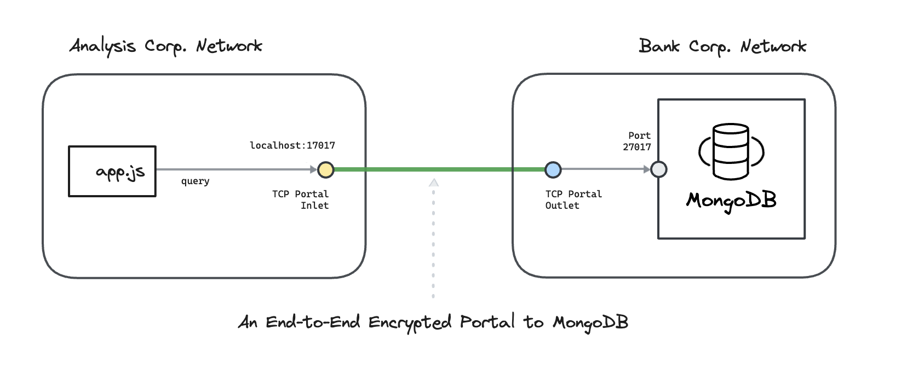

---
layout:
  title:
    visible: true
  description:
    visible: false
  tableOfContents:
    visible: true
  outline:
    visible: true
  pagination:
    visible: true
---

# MongoDB

In each example, we connect a nodejs app in one private network with a MongoDB database in another private network.&#x20;

Each company’s network is private, isolated, and doesn't expose ports. To learn how end-to-end trust is established, please read: “[<mark style="color:blue;">How does Ockam work?</mark>](../../../how-does-ockam-work.md)”

<figure><figcaption></figcaption></figure>

Please select an example to dig in:

<table data-card-size="large" data-view="cards"><thead><tr><th></th><th></th></tr></thead><tbody><tr><td><a href="docker.md"><mark style="color:blue;"><strong>MongoDB - Docker</strong></mark></a></td><td>We connect a nodejs app in one virtual private network with a MongoDB database in another virtual private network. The example uses docker and docker compose to create these virtual networks.</td></tr></tbody></table>
