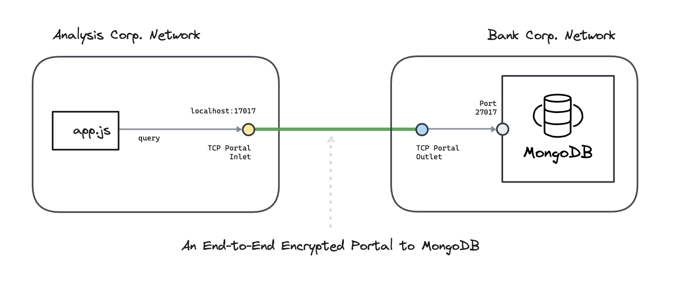

---
layout:
  title:
    visible: true
  description:
    visible: false
  tableOfContents:
    visible: true
  outline:
    visible: true
  pagination:
    visible: true
---

# Docker

This hands-on example uses [<mark style="color:blue;">Ockam</mark>](../../../) to create an end-to-end **encrypted portal** to MongoDB.

We connect a nodejs app in one virtual private network with a MongoDB database in another virtual private network. The example uses docker and docker compose to create these virtual networks.

To understand the details of how end-to-end trust is established, and how the portal works even though the two networks are isolated with no exposed ports, please read: “[<mark style="color:blue;">How does Ockam work?</mark>](../../../how-does-ockam-work.md)”

<figure><figcaption></figcaption></figure>

## Run

This example requires Bash, Git, Curl, Docker, and Docker Compose. Please set up these tools for your operating system, then run the following commands:

```bash
# Clone the Ockam repo from Github.
git clone --depth 1 https://github.com/build-trust/ockam && cd ockam

# Navigate to this example’s directory.
cd examples/command/portals/databases/mongodb/docker

# Run the example, use Ctrl-C to exit at any point.
./run.sh
```

If everything runs as expected, you'll see the message: _The example run was successful 🥳_

## Walkthrough

The [<mark style="color:blue;">run.sh script</mark>](https://github.com/build-trust/ockam/blob/develop/examples/command/portals/databases/mongodb/docker/run.sh), that you ran above, and its [<mark style="color:blue;">accompanying files</mark>](https://github.com/build-trust/ockam/tree/develop/examples/command/portals/databases/mongodb/docker) are full of comments and meant to be read. The example setup is only a few simple steps, so please take some time to read and explore.

### Administrator

* The [<mark style="color:blue;">run.sh script</mark>](https://github.com/build-trust/ockam/blob/develop/examples/command/portals/databases/mongodb/docker/run.sh) calls the [<mark style="color:blue;">run function</mark>](https://github.com/build-trust/ockam/blob/develop/examples/command/portals/databases/mongodb/docker/run.sh#L14) which invokes the [<mark style="color:blue;">enroll command</mark>](https://github.com/build-trust/ockam/blob/develop/examples/command/portals/databases/mongodb/kubernetes/run.sh#L16-L29) to create an new identity, sign into Ockam Orchestrator, set up a new Ockam project, make you the administrator of this project, and get a project membership [<mark style="color:blue;">credential</mark>](../../../reference/protocols/identities.md#credentials).
* The run function then [<mark style="color:blue;">generates two new enrollment tickets</mark>](https://github.com/build-trust/ockam/blob/develop/examples/command/portals/databases/mongodb/docker/run.sh#L30-L48). The tickets are valid for 10 minutes. Each ticket can be redeemed only once and assigns [<mark style="color:blue;">attributes</mark>](../../../reference/protocols/identities.md#credentials) to its redeemer. The [<mark style="color:blue;">first ticket</mark>](https://github.com/build-trust/ockam/blob/develop/examples/command/portals/databases/mongodb/docker/run.sh#L30-L39) is meant for the Ockam node that will run in Bank Corp.’s network. The [<mark style="color:blue;">second ticket</mark>](https://github.com/build-trust/ockam/blob/develop/examples/command/portals/databases/mongodb/mongodb/run.sh#L41-L48) is meant for the Ockam node that will run in Analysis Corp.’s network.
* In a typical production setup an administrator or provisioning pipeline generates enrollment tickets and gives them to nodes that are being provisioned. In our example, the run function is acting on your behalf as the administrator of the Ockam project. It uses [<mark style="color:blue;">environment variables to give tickets</mark>](https://github.com/build-trust/ockam/blob/develop/examples/command/portals/databases/mongodb/docker/run.sh#L55C28-L55C65) to and provision Ockam nodes in Bank Corp.’s and Analysis Corp.’s network.
* The run function takes the enrollment tickets, sets them as the value of an [<mark style="color:blue;">environment variable</mark>](https://github.com/build-trust/ockam/blob/develop/examples/command/portals/databases/mongodb/docker/run.sh#L55C28-L55C65), and [<mark style="color:blue;">invokes docker-compose</mark>](https://github.com/build-trust/ockam/blob/develop/examples/command/portals/databases/mongodb/docker/run.sh#L50-L65) to create Bank Corp.’s and Analysis Corp.’s networks.

### Bank Corp

```yaml
# Create a dedicated and isolated virtual network for bank_corp.
networks:
  bank_corp:
    driver: bridge
```

* Bank Corp.’s [<mark style="color:blue;">docker-compose configuration</mark>](https://github.com/build-trust/ockam/blob/develop/examples/command/portals/databases/mongodb/docker/bank\_corp/docker-compose.yml) is used when run.sh invokes docker-compose. It creates an [<mark style="color:blue;">isolated virtual network</mark>](https://github.com/build-trust/ockam/blob/develop/examples/command/portals/databases/mongodb/docker/bank\_corp/docker-compose.yml#L3-L6) for Bank Corp.
* In this network, docker compose starts a [<mark style="color:blue;">container with a MongoDB database</mark>](https://github.com/build-trust/ockam/blob/develop/examples/command/portals/databases/mongodb/docker/bank\_corp/docker-compose.yml#L9-L13). This container becomes available at <mark style="background-color:yellow;">mongodb:27017</mark> in the Bank Corp network.
* Once the mongodb container [<mark style="color:blue;">is ready</mark>](https://github.com/build-trust/ockam/blob/develop/examples/command/portals/databases/mongodb/docker/bank\_corp/docker-compose.yml#L24C5-L24C27), docker compose starts an [<mark style="color:blue;">Ockam node in a container</mark>](https://github.com/build-trust/ockam/blob/develop/examples/command/portals/databases/mongodb/docker/bank\_corp/docker-compose.yml#L19-L27) as a companion to the mongodb container. The Ockam node container is created using [<mark style="color:blue;">this dockerfile</mark>](https://github.com/build-trust/ockam/blob/develop/examples/command/portals/databases/mongodb/docker/ockam.dockerfile) and this [<mark style="color:blue;">entrypoint script</mark>](https://github.com/build-trust/ockam/blob/develop/examples/command/portals/databases/mongodb/docker/bank\_corp/run\_ockam.sh). The enrollment ticket from run.sh is [<mark style="color:blue;">passed to the container</mark>](https://github.com/build-trust/ockam/blob/develop/examples/command/portals/databases/mongodb/docker/bank\_corp/docker-compose.yml#L25).
* When the Ockam node container starts in the Bank Corp network, it runs [<mark style="color:blue;">its entrypoint</mark>](https://github.com/build-trust/ockam/blob/develop/examples/command/portals/databases/mongodb/docker/bank\_corp/run\_ockam.sh)<mark style="color:blue;">.</mark> The entrypoint script creates a new identity and uses the enrollment ticket to [<mark style="color:blue;">enroll with your project</mark>](https://github.com/build-trust/ockam/blob/develop/examples/command/portals/databases/mongodb/docker/bank\_corp/run\_ockam.sh#L6-L19) and get a project membership credential that attests to the attribute <mark style="background-color:yellow;">mongodb-outlet=true.</mark> The run function [<mark style="color:blue;">assigned this attribute</mark>](https://github.com/build-trust/ockam/blob/develop/examples/command/portals/databases/mongodb/docker/run.sh#L30-L39) to the enrollment ticket.
* The entrypoint script then [<mark style="color:blue;">creates a node that uses</mark> ](https://github.com/build-trust/ockam/blob/develop/examples/command/portals/databases/mongodb/docker/bank\_corp/run\_ockam.sh#L21-L33)this identity and membership credential to authenticate and create a [<mark style="color:blue;">relay</mark>](../../../reference/protocols/routing.md#relay) in the project, back to the node, at <mark style="background-color:yellow;">relay address: mongodb</mark>. The run function [<mark style="color:blue;">gave the enrollment ticket permission</mark>](https://github.com/build-trust/ockam/blob/develop/examples/command/portals/databases/mongodb/docker/run.sh#L39C44-L39C60) to use this relay address.
* Next, the entrypoint sets an [<mark style="color:blue;">access control policy</mark>](https://github.com/build-trust/ockam/blob/develop/examples/command/portals/databases/mongodb/docker/bank\_corp/run\_ockam.sh#L32C56-L32C91) that only allows project members that possesses a credential with attribute <mark style="background-color:yellow;">mongodb-inlet="true"</mark> to connect to tcp portal outlets on this node. It then creates tcp portal outlet to mongodb at [<mark style="color:blue;">mongodb:27017</mark>](https://github.com/build-trust/ockam/blob/develop/examples/command/portals/databases/mongodb/docker/bank\_corp/run\_ockam.sh#L33C30-L33C43).

### Analysis Corp

```yaml
# Create a dedicated and isolated virtual network for analysis_corp.
networks:
  analysis_corp:
    driver: bridge
```

* Analysis Corp.’s [<mark style="color:blue;">docker-compose configuration</mark>](https://github.com/build-trust/ockam/blob/develop/examples/command/portals/databases/mongodb/docker/analysis\_corp/docker-compose.yml) is used when run.sh invokes docker-compose. It creates an [<mark style="color:blue;">isolated virtual network</mark>](https://github.com/build-trust/ockam/blob/develop/examples/command/portals/databases/mongodb/docker/analysis\_corp/docker-compose.yml#L3-L6) for Analysis Corp. In this network, docker compose starts an [<mark style="color:blue;">Ockam node container</mark>](https://github.com/build-trust/ockam/blob/develop/examples/command/portals/databases/mongodb/docker/analysis\_corp/docker-compose.yml#L9-L20) and an [<mark style="color:blue;">app container</mark>](https://github.com/build-trust/ockam/blob/develop/examples/command/portals/databases/mongodb/docker/analysis\_corp/docker-compose.yml#L22-L32).
* The [<mark style="color:blue;">Ockam node container</mark>](https://github.com/build-trust/ockam/blob/develop/examples/command/portals/databases/mongodb/docker/analysis\_corp/docker-compose.yml#L9-L20) is created using [<mark style="color:blue;">this dockerfile</mark>](https://github.com/build-trust/ockam/blob/develop/examples/command/portals/databases/mongodb/docker/ockam.dockerfile) and this [<mark style="color:blue;">entrypoint script</mark>](https://github.com/build-trust/ockam/blob/develop/examples/command/portals/databases/mongodb/docker/analysis\_corp/run\_ockam.sh). The enrollment ticket from run.sh is [<mark style="color:blue;">passed to the container</mark>](https://github.com/build-trust/ockam/blob/develop/examples/command/portals/databases/mongodb/docker/analysis\_corp/docker-compose.yml#L18).
* When the Ockam node container starts in the Analysis Corp network, it runs [<mark style="color:blue;">its entrypoint</mark>](https://github.com/build-trust/ockam/blob/develop/examples/command/portals/databases/mongodb/docker/analysis\_corp/run\_ockam.sh)<mark style="color:blue;">.</mark> The entrypoint script creates a new identity and uses the enrollment ticket to [<mark style="color:blue;">enroll with your project</mark> ](https://github.com/build-trust/ockam/blob/develop/examples/command/portals/databases/mongodb/docker/analysis\_corp/run\_ockam.sh#L6-L19)and get a project membership credential that attests to the attribute <mark style="background-color:yellow;">mongodb-inlet=true.</mark> The run function [<mark style="color:blue;">assigned this attribute</mark>](https://github.com/build-trust/ockam/blob/develop/examples/command/portals/databases/mongodb/docker/run.sh#L41-L48) to the enrollment ticket.
* The entrypoint script then [<mark style="color:blue;">creates a node that uses</mark>](https://github.com/build-trust/ockam/blob/develop/examples/command/portals/databases/mongodb/docker/analysis\_corp/run\_ockam.sh#L21-L30) this identity and membership credential. It then sets an [<mark style="color:blue;">access control policy</mark>](https://github.com/build-trust/ockam/blob/develop/examples/command/portals/databases/mongodb/docker/analysis\_corp/run\_ockam.sh#L29C55-L29C91) that only allows project members that possesses a credential with attribute <mark style="background-color:yellow;">mongodb-outlet="true"</mark> to connect to tcp portal inlets on this node.
* Next, the entrypoint [<mark style="color:blue;">creates tcp portal</mark>](https://github.com/build-trust/ockam/blob/develop/examples/command/portals/databases/mongodb/docker/analysis\_corp/run\_ockam.sh#L30) inlet that makes the [<mark style="color:blue;">remote mongodb</mark>](https://github.com/build-trust/ockam/blob/develop/examples/command/portals/databases/mongodb/docker/analysis\_corp/run\_ockam.sh#L30C50-L30C58) available on all localhost IPs at [<mark style="color:blue;">0.0.0.0:15432</mark>](https://github.com/build-trust/ockam/blob/develop/examples/command/portals/databases/mongodb/docker/analysis\_corp/run\_ockam.sh#L30C31-L30C44). This makes mongodb available at <mark style="background-color:yellow;">ockam:15432</mark> within Analysis Corp’s virtual private network.
* Once the Ockam node container [<mark style="color:blue;">is ready</mark>](https://github.com/build-trust/ockam/blob/develop/examples/command/portals/databases/mongodb/docker/analysis\_corp/docker-compose.yml#L27), docker compose starts [<mark style="color:blue;">an app container</mark>](https://github.com/build-trust/ockam/blob/develop/examples/command/portals/databases/mongodb/docker/analysis\_corp/docker-compose.yml#L22-L32). The app container is created using [<mark style="color:blue;">this dockerfile</mark>](https://github.com/build-trust/ockam/blob/develop/examples/command/portals/databases/mongodb/docker/analysis\_corp/app.dockerfile) which runs this [<mark style="color:blue;">app.js</mark>](https://github.com/build-trust/ockam/blob/develop/examples/command/portals/databases/mongodb/docker/analysis\_corp/app.js) file on startup.
* The app.js file is a nodejs app, it [<mark style="color:blue;">connects with mongodb</mark>](https://github.com/build-trust/ockam/blob/develop/examples/command/portals/databases/mongodb/docker/analysis\_corp/app.js#L7-L26) on <mark style="background-color:yellow;">ockam:15432</mark>, then [<mark style="color:blue;">inserts some data</mark>](https://github.com/build-trust/ockam/blob/develop/examples/command/portals/databases/mongodb/docker/analysis\_corp/app.js#L34-L36), [<mark style="color:blue;">queries it</mark>](https://github.com/build-trust/ockam/blob/develop/examples/command/portals/databases/mongodb/docker/analysis\_corp/app.js#L38) back, and [<mark style="color:blue;">prints it</mark>](https://github.com/build-trust/ockam/blob/develop/examples/command/portals/databases/mongodb/docker/analysis\_corp/app.js#L39-L44).

## Recap

<figure><figcaption></figcaption></figure>

We connected a nodejs app in one virtual private network with a MongoDB database in another virtual private network over an end-to-end encrypted portal.

Sensitive business data in the MongoDB database is only accessible to Bank Corp. and Analysis Corp. All data is [<mark style="color:blue;">encrypted</mark>](../../../reference/protocols/secure-channels.md) with strong forward secrecy as it moves through the Internet. The communication channel is [<mark style="color:blue;">mutually authenticated</mark>](../../../reference/protocols/secure-channels.md) and [<mark style="color:blue;">authorized</mark>](../../../reference/protocols/access-controls.md). Keys and credentials are automatically rotated. Access to connect with MongoDB can be easily revoked.

Analysis Corp. does not get unfettered access to Bank Corp.’s network. It gets access only to run queries on the MongoDB server. Bank Corp. does not get unfettered access to Analysis Corp.’s network. It gets access only to respond to queries over a tcp connection. Bank Corp. cannot initiate connections.

All [<mark style="color:blue;">access controls</mark>](../../../reference/protocols/access-controls.md) are secure-by-default. Only project members, with valid credentials, can connect with each other. NAT’s are traversed using a relay and outgoing tcp connections. Bank Corp. or Analysis Corp. don’t expose any listening endpoints on the Internet. Their networks are completely closed and protected from any attacks from the Internet.

## Cleanup

To delete all containers and images:

```sh
./run.sh cleanup
```
