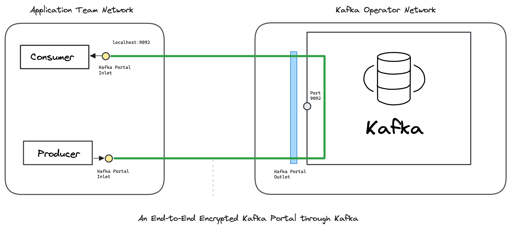

---
layout:
  title:
    visible: true
  description:
    visible: false
  tableOfContents:
    visible: true
  outline:
    visible: true
  pagination:
    visible: true
---

# Kafka

Create an Ockam **Portal** to send end-to-end encrypted messages through Kafka - from any producer, to any consumer, _through_ any Kafka API compatible data streaming platform.

[<mark style="color:blue;">Ockam</mark>](../../) encrypts messages as they leave a Producer in such a way that they can only be decrypted by a specific Consumer. This guarantees that your data cannot be seen or tampered as it passes through Kafka. Operators of the Kafka cluster only see end-to-end encrypted data.

To learn how end-to-end trust is established, please read: “[<mark style="color:blue;">How does Ockam work?</mark>](../../how-does-ockam-work.md)”

<figure><figcaption></figcaption></figure>

Please select an example to dig in:


The examples below use Apache Kafka and Redpanda, however, the same setup works for any Kafka API compatible data streaming platform: _Confluent, Instaclustr, Aiven, WarpStream etc._


<table data-card-size="large" data-view="cards"><thead><tr><th></th><th></th><th data-hidden data-card-target data-type="content-ref"></th></tr></thead><tbody><tr><td><a href="apache-kafka/"><mark style="color:blue;"><strong>Apache Kafka</strong></mark></a></td><td>We send end-to-end encrypted messages through Apache Kafka.</td><td><a href="apache-kafka/">apache-kafka</a></td></tr><tr><td><a href="redpanda/"><mark style="color:blue;"><strong>Redpanda</strong></mark></a></td><td>We send end-to-end encrypted messages through Redpanda.</td><td><a href="redpanda/">redpanda</a></td></tr></tbody></table>
