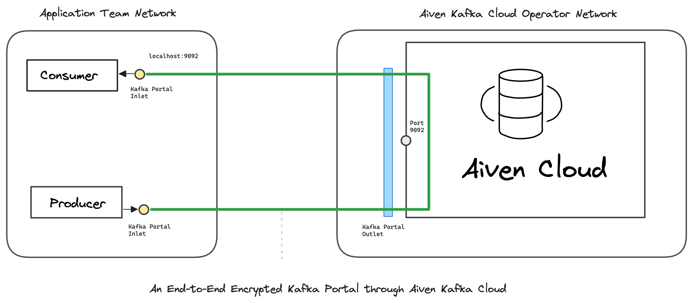

---
layout:
  title:
    visible: true
  description:
    visible: false
  tableOfContents:
    visible: true
  outline:
    visible: true
  pagination:
    visible: true
---

# Aiven

Create an Ockam **Portal** to send end-to-end encrypted messages _through_ Aiven.

[<mark style="color:blue;">Ockam</mark>](../../../) encrypts messages from a Producer all-of-the-way to a _specific_ Consumer. Only that _specific_ Consumer can decrypt these messages. This guarantees that your data cannot be observed or tampered with as it passes through Aiven or the network where it is hosted. The operators of Aiven can only see encrypted data in the network and in service that they operate. Thus, a compromise of the operator's infrastructure will not compromise the data stream's security, privacy, or integrity.

To learn how end-to-end trust is established, please read: “[<mark style="color:blue;">How does Ockam work?</mark>](../../../how-does-ockam-work.md)”

<figure><figcaption></figcaption></figure>

Please select an example to dig in:

<table data-card-size="large" data-view="cards"><thead><tr><th></th><th></th></tr></thead><tbody><tr><td><a href="aiven.md"><mark style="color:blue;"><strong>Aiven - Cloud</strong></mark></td><td>Send end-to-end encrypted messages through Aiven.</td></tr></tbody></table>
