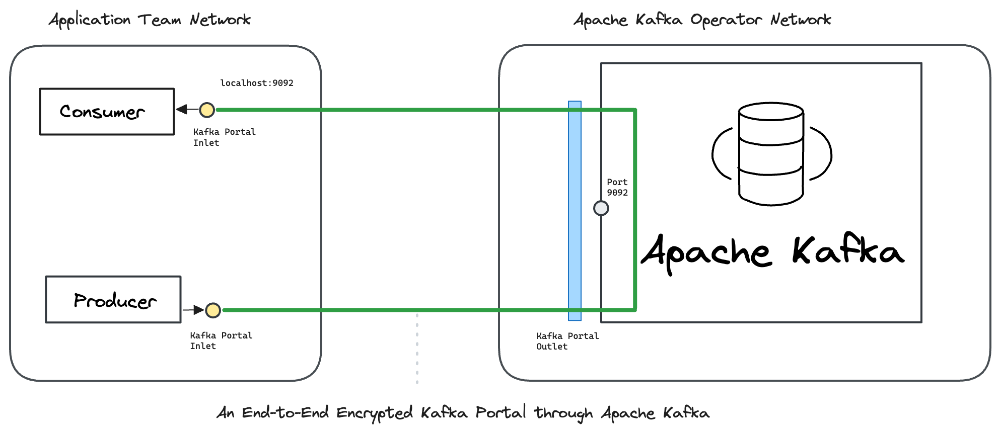

# Docker

In this hands-on example we send end-to-end encrypted messages _through_ Apache Kafka.

[<mark style="color:blue;">Ockam</mark>](../../../) encrypts messages from a Producer to a specific Consumer. Only that specific Consumer can decrypt these messages. This guarantees that your data cannot be observed or tampered as it passes through Kafka. Operators of the Kafka cluster only see end-to-end encrypted data. Any compromise of an operator's infrastructure cannot compromise your business data.

To learn how end-to-end trust is established, please read: “[<mark style="color:blue;">How does Ockam work?</mark>](../../../how-does-ockam-work.md)”

<figure><figcaption></figcaption></figure>

### Run

This example requires Bash, Git, Curl, Docker, and Docker Compose. Please set up these tools for your operating system, then run the following commands:

```bash
# Clone the Ockam repo from Github.
git clone --depth 1 https://github.com/build-trust/ockam && cd ockam

# Navigate to this example’s directory.
cd examples/command/portals/kafka/apache/docker/

# Run the example, use Ctrl-C to exit at any point.
./run.sh
```

If everything runs as expected, you'll see the message: _The example run was successful 🥳_

### Walkthrough

The [<mark style="color:blue;">run.sh script</mark>](https://github.com/build-trust/ockam/blob/develop/examples/command/portals/kafka/apache/docker/run.sh) that you ran above, and its [<mark style="color:blue;">accompanying files</mark>](https://github.com/build-trust/ockam/blob/develop/examples/command/portals/kafka/apache/docker), are full of comments and meant to be read. The example setup is only a few simple steps, so please take some time to read and explore.

#### Administrator

* The [<mark style="color:blue;">run.sh script</mark>](https://github.com/build-trust/ockam/blob/develop/examples/command/portals/kafka/apache/docker/run.sh) calls the [<mark style="color:blue;">run function</mark>](https://github.com/build-trust/ockam/blob/develop/examples/command/portals/kafka/apache/docker/run.sh#L15) which invokes the [<mark style="color:blue;">enroll command</mark>](https://github.com/build-trust/ockam/blob/develop/examples/command/portals/kafka/apache/docker/run.sh#L29) to create a new identity, sign in to Ockam Orchestrator, set up a new Ockam project, make you the administrator of this project, and get a project membership [<mark style="color:blue;">credential</mark>](../../../reference/protocols/identities.md#credentials).
* The run function then [<mark style="color:blue;">generates three new enrollment tickets</mark>](https://github.com/build-trust/ockam/blob/develop/examples/command/portals/kafka/apache/docker/run.sh#L31-L46), each valid for 10 minutes, and can be redeemed only once. The [<mark style="color:blue;">first ticket</mark>](https://github.com/build-trust/ockam/blob/develop/examples/command/portals/kafka/apache/docker/run.sh#L31-L38) is meant for the Ockam node that will run in Kafka Operator's network. The [<mark style="color:blue;">second and third tickets</mark>](https://github.com/build-trust/ockam/blob/develop/examples/command/portals/kafka/apache/docker/run.sh#L40-L46) are meant for the Ockam node that will run in Application Team’s network.
* In a typical production setup, an administrator or provisioning pipeline generates enrollment tickets and gives them to nodes that are being provisioned. In our example, the run function is acting on your behalf as the administrator of the Ockam project. It provisions Ockam nodes in [<mark style="color:blue;">Kafka Operator’s network</mark>](https://github.com/build-trust/ockam/blob/develop/examples/command/portals/kafka/apache/docker/run.sh#L53C31-L53C73) and [<mark style="color:blue;">Application Team’s network</mark>](https://github.com/build-trust/ockam/blob/develop/examples/command/portals/kafka/apache/docker/run.sh#L60C33-L60C158), passing them their tickets using environment variables.
* The run function invokes docker-compose for both [<mark style="color:blue;">Kafka Operator's network</mark>](https://github.com/build-trust/ockam/blob/develop/examples/command/portals/kafka/apache/docker/run.sh#L53C74-L53C94) and [<mark style="color:blue;">Application Team's network</mark>](https://github.com/build-trust/ockam/blob/develop/examples/command/portals/kafka/apache/docker/run.sh#L60C159-L60C176).

#### Kafka Operator

```yaml
# Create a dedicated and isolated virtual network for kafka_operator.
networks:
  kafka_operator:
    driver: bridge
```


* Kafka Operator’s [<mark style="color:blue;">docker-compose configuration</mark>](https://github.com/build-trust/ockam/blob/develop/examples/command/portals/kafka/apache/docker/kafka_operator/docker-compose.yml) is used when run.sh invokes docker-compose. It creates an [<mark style="color:blue;">isolated virtual network</mark>](https://github.com/build-trust/ockam/blob/develop/examples/command/portals/kafka/apache/docker/kafka_operator/docker-compose.yml#L4-L7) for Kafka Operator.
* In this network, docker compose starts a [<mark style="color:blue;">container with an Apache Kafka server</mark>](https://github.com/build-trust/ockam/blob/develop/examples/command/portals/kafka/apache/docker/kafka_operator/docker-compose.yml#L9-L21). This container becomes available at <mark style="background-color:yellow;">kafka:9092</mark> in the Kafka Operator's network.
* Once the Kafka container [<mark style="color:blue;">is ready</mark>](https://github.com/build-trust/ockam/blob/develop/examples/command/portals/kafka/apache/docker/kafka_operator/docker-compose.yml#L28C17-L28C24), docker compose starts an [<mark style="color:blue;">Ockam node in a container</mark>](https://github.com/build-trust/ockam/blob/develop/examples/command/portals/kafka/apache/docker/kafka_operator/docker-compose.yml#L23-L35) as a companion to the Kafka container described by `ockam.yaml`, [<mark style="color:blue;">embedded in the script</mark>](https://github.com/build-trust/ockam/blob/develop/examples/command/portals/kafka/apache/docker/kafka_operator/run_ockam.sh#L8-L22). The node will automatically create an identity, [<mark style="color:blue;">enroll with your project</mark>](https://github.com/build-trust/ockam/blob/develop/examples/command/portals/kafka/apache/docker/kafka_operator/run_ockam.sh#L8-L22) using the ticket [<mark style="color:blue;">passed to the container</mark>](https://github.com/build-trust/ockam/blob/develop/examples/command/portals/kafka/apache/docker/kafka_operator/docker-compose.yml#L33), and set up Kafka outlet.
* The Ockam node then uses this identity and membership credential to authenticate and create a <mark style="color:blue;">relay</mark> in the project, back to the node, at <mark style="background-color:yellow;">relay: kafka</mark>. The run function [<mark style="color:blue;">gave the enrollment ticket permission</mark>](https://github.com/build-trust/ockam/blob/develop/examples/command/portals/kafka/apache/docker/run.sh#L38C81-L38C94) to use this relay address.

#### Application Team

```yaml
# Create a dedicated and isolated virtual network for application_team.
networks:
  application_team:
    driver: bridge
```

* Application Team’s [<mark style="color:blue;">docker-compose configuration</mark>](https://github.com/build-trust/ockam/blob/develop/examples/command/portals/kafka/apache/docker/application_team/docker-compose.yml) is used when run.sh invokes docker-compose. It creates an [<mark style="color:blue;">isolated virtual network</mark>](https://github.com/build-trust/ockam/blob/develop/examples/command/portals/kafka/apache/docker/application_team/docker-compose.yml#L2-L4) for Application Team. In this network, docker compose starts a [<mark style="color:blue;">Kafka Consumer container</mark>](https://github.com/build-trust/ockam/blob/develop/examples/command/portals/kafka/apache/docker/application_team/docker-compose.yml#L6-L35) and a [<mark style="color:blue;">Kafka Producer container</mark>](https://github.com/build-trust/ockam/blob/develop/examples/command/portals/kafka/apache/docker/application_team/docker-compose.yml#L37-L67).
* The Kafka consumer container is created using [<mark style="color:blue;">a dockerfile</mark>](https://github.com/build-trust/ockam/blob/develop/examples/command/portals/kafka/apache/docker/kafka\_ockam.dockerfile) and an [<mark style="color:blue;">entrypoint script</mark>](https://github.com/build-trust/ockam/blob/develop/examples/command/portals/kafka/apache/docker/application_team/run_ockam.sh). The consumer enrollment ticket from run.sh is [<mark style="color:blue;">passed to the container</mark>](https://github.com/build-trust/ockam/blob/develop/examples/command/portals/kafka/apache/docker/application_team/docker-compose.yml#L15) via an environment variable.
* When the Kafka consumer node container starts in the Application Team's network, it runs [<mark style="color:blue;">its entrypoint</mark>](https://github.com/build-trust/ockam/blob/develop/examples/command/portals/kafka/apache/docker/application_team/run_ockam.sh), creating the Ockam node described by `ockam.yaml`, [<mark style="color:blue;">embedded in the script</mark>](https://github.com/build-trust/ockam/blob/develop/examples/command/portals/kafka/apache/docker/application_team/run_ockam.sh#L7-L15). The node will automatically create an identity, enroll with your project, and set up the Kafka inlet.
* Next, the entrypoint at the end executes the [<mark style="color:blue;">command present in the docker-compose configuration</mark>](https://github.com/build-trust/ockam/blob/develop/examples/command/portals/kafka/apache/docker/application_team/docker-compose.yml#L16-L35), which launches a Kafka consumer waiting for messages in the <mark style="background-color:yellow;">demo</mark> topic. Once the messages are received, they are printed out.
* In the producer container, the process is analogous. Once the Ockam node is setup, the [<mark style="color:blue;">command within docker-compose configuration</mark>](https://github.com/build-trust/ockam/blob/develop/examples/command/portals/kafka/apache/docker/application_team/docker-compose.yml#L45-L67) launches a Kafka producer that sends messages.

### Recap

We sent end-to-end encrypted messages _through_ Apache Kafka.

Messages are encrypted with strong forward secrecy as soon as they leave a Producer, and only the intended Consumer can decrypt those messages. Kafka brokers and other Consumers can only see encrypted messages.

All communication is mutually authenticated and authorized. Keys and credentials are automatically rotated. Access can be easily revoked.

### Cleanup

To delete all containers and images:

```sh
./run.sh cleanup
```
