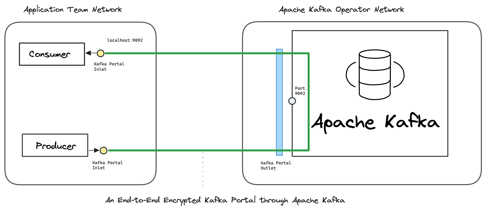

# Docker

This hands-on example uses [<mark style="color:blue;">Ockam</mark>](../../../) to send end-to-end encrypted messages to and from Apache Kafka.

We connect a Kafka consumer and a producer in one virtual private network with an Apache Kafka server in another virtual private network. The example uses docker and docker compose to create these virtual networks.

To understand the details of how end-to-end trust is established, and how the portal works even though the two networks are isolated with no exposed ports, please read:  “[<mark style="color:blue;">How does Ockam work?</mark>](../../../how-does-ockam-work.md)”


<figure><figcaption></figcaption></figure>

### Run

This example requires Bash, Git, Curl, Docker, and Docker Compose. Please set up these tools for your operating system, then run the following commands:

```bash
# Clone the Ockam repo from Github.
git clone --depth 1 https://github.com/build-trust/ockam && cd ockam

# Navigate to this example’s directory.
cd examples/command/portals/kafka/apache/docker/

# Run the example, use Ctrl-C to exit at any point.
./run.sh
```

If everything runs as expected, you'll see the message: _The example run was successful 🥳_

### Walkthrough

The [<mark style="color:blue;">run.sh script</mark>](https://github.com/build-trust/ockam/blob/develop/examples/command/portals/kafka/apache/docker/run.sh) that you ran above, and its [<mark style="color:blue;">accompanying files</mark>](https://github.com/build-trust/ockam/blob/develop/examples/command/portals/kafka/apache/docker), are full of comments and meant to be read. The example setup is only a few simple steps, so please take some time to read and explore.

#### Administrator

* The [<mark style="color:blue;">run.sh script</mark>](https://github.com/build-trust/ockam/blob/develop/examples/command/portals/kafka/apache/docker/run.sh) calls the [<mark style="color:blue;">run function</mark>](https://github.com/build-trust/ockam/blob/develop/examples/command/portals/kafka/apache/docker/run.sh#L15) which invokes the [<mark style="color:blue;">enroll command</mark>](https://github.com/build-trust/ockam/blob/develop/examples/command/portals/kafka/apache/docker/run.sh#L29) to create a new identity, sign into Ockam Orchestrator, set up a new Ockam project, make yourself the administrator of this project, and get a project membership [<mark style="color:blue;">credential</mark>](../../../reference/protocols/identities.md#credentials).
* The run function then [<mark style="color:blue;">generates three new enrollment tickets</mark>](https://github.com/build-trust/ockam/blob/develop/examples/command/portals/kafka/apache/docker/run.sh#L31-L46). The tickets are valid for 10 minutes. Each ticket can be redeemed only once. The [<mark style="color:blue;">first ticket</mark>](https://github.com/build-trust/ockam/blob/develop/examples/command/portals/kafka/apache/docker/run.sh#L31-L38) is meant for the Ockam node that will run in Kafka Operator's network. The [<mark style="color:blue;">second and third tickets</mark>](https://github.com/build-trust/ockam/blob/develop/examples/command/portals/kafka/apache/docker/run.sh#L40-L46) are meant for the Ockam node that will run in Application Team’s network.
* In a typical production setup an administrator or provisioning pipeline generates enrollment tickets and gives them to nodes that are being provisioned. In our example, the run function is acting on your behalf as the administrator of the Ockam project. It uses environment variables to give tickets to and provision Ockam nodes in [<mark style="color:blue;">Kafka Operator’s network</mark>](https://github.com/build-trust/ockam/blob/develop/examples/command/portals/kafka/apache/docker/run.sh#L53C31-L53C73) and [<mark style="color:blue;">Application Team’s network</mark>](https://github.com/build-trust/ockam/blob/develop/examples/command/portals/kafka/apache/docker/run.sh#L60C33-L60C158).
* The run function invokes docker-compose for both [<mark style="color:blue;">Kafka Operator's network</mark>](https://github.com/build-trust/ockam/blob/develop/examples/command/portals/kafka/apache/docker/run.sh#L53C74-L53C94) and [<mark style="color:blue;">Application Team's network</mark>](https://github.com/build-trust/ockam/blob/develop/examples/command/portals/kafka/apache/docker/run.sh#L60C159-L60C176).

#### Kafka Operator

```yaml
# Create a dedicated and isolated virtual network for kafka_operator.
networks:
  kafka_operator:
    driver: bridge
```

* Kafka Operator’s [<mark style="color:blue;">docker-compose configuration</mark>](https://github.com/build-trust/ockam/blob/develop/examples/command/portals/kafka/apache/docker/kafka_operator/docker-compose.yml) is used when run.sh invokes docker-compose. It creates an [<mark style="color:blue;">isolated virtual network</mark>](https://github.com/build-trust/ockam/blob/develop/examples/command/portals/kafka/apache/docker/kafka_operator/docker-compose.yml#L3-L6) for Kafka Operator.
* In this network, docker compose starts a [<mark style="color:blue;">container with a Kafka server</mark>](https://github.com/build-trust/ockam/blob/develop/examples/command/portals/kafka/apache/docker/kafka_operator/docker-compose.yml#L9-L20). This container becomes available at <mark style="background-color:yellow;">kafka:9092</mark> in the Kafka Operator's network.
* In the Ockam container, the entrypoint creates the Ockam node described by `ockam.yaml`. The node will automatically create an identity,  [<mark style="color:blue;">enroll with your project</mark>](https://github.com/build-trust/ockam/blob/develop/examples/command/portals/kafka/apache/docker/kafka_operator/run_ockam.sh#L24), and setup Kafka inlet and outlet.
* The entrypoint script then [<mark style="color:blue;">creates a node</mark> ](https://github.com/build-trust/ockam/blob/develop/examples/command/portals/kafka/apache/docker/kafka_operator/run_ockam.sh#L24) that uses this identity and membership credential to authenticate and create a <mark style="color:blue;">relay</mark> in the project, back to the node at <mark style="background-color:yellow;">relay address: kafka</mark>. The run function [<mark style="color:blue;">gave the enrollment ticket permission</mark>](https://github.com/build-trust/ockam/blob/develop/examples/command/portals/kafka/apache/docker/run.sh#L53C31-L53C73) to use this relay address.


#### Application Team

```yaml
# Create a dedicated and isolated virtual network for application_team.
networks:
  application_team:
    driver: bridge
```

* Application Team’s [<mark style="color:blue;">docker-compose configuration</mark>](https://github.com/build-trust/ockam/blob/develop/examples/command/portals/kafka/apache/docker/application_team/docker-compose.yml) is used when run.sh invokes docker-compose. It creates an [<mark style="color:blue;">isolated virtual network</mark>](https://github.com/build-trust/ockam/blob/develop/examples/command/portals/kafka/apache/docker/application_team/docker-compose.yml#L2-L4) for Application Team. In this network docker compose starts a Kafka consumer container and a Kafka producer container.
* The Kafka consumer container is created using [<mark style="color:blue;">a dockerfile</mark>](https://github.com/build-trust/ockam/blob/develop/examples/command/portals/kafka/apache/docker/kafka_ockam.dockerfile) and an [<mark style="color:blue;">entrypoint script</mark>](https://github.com/build-trust/ockam/blob/develop/examples/command/portals/kafka/apache/docker/application_team/run_ockam.sh). The enrollment ticket from run.sh is [<mark style="color:blue;">passed to the container</mark>](https://github.com/build-trust/ockam/blob/develop/examples/command/portals/kafka/apache/docker/application_team/docker-compose.yml#L15) via an environment variable.
* When the Kafka consumer node container starts in the Application Team's network, it runs [<mark style="color:blue;">its entrypoint</mark>](https://github.com/build-trust/ockam/blob/develop/examples/command/portals/kafka/apache/docker/application_team/run_ockam.sh)<mark style="color:blue;">.</mark> The entrypoint creates the Ockam node described by `ockam.yaml`. The node will automatically create an identity, enroll with your project, and setup the Kafka inlet.
* Next, the entrypoint executes the command present in the docker-compose configuration which launches a Kafka consumer waiting for messages in the <mark style="background-color:yellow;">demo</mark> topic. Once the messages are received, they are printed out.
* In the producer container the process is analogous. Once the Ockam node is setup the command within docker-compose configuration launches a Kafka producer sending 5 messages spaced 5 seconds apart.

### Recap

We connected a Kafka consumer and a producer in one virtual private network with Apache Kafka in another virtual private network over an end-to-end encrypted portal.

Messages from the producer are always encrypted before leaving the node, and the Apache Kafka event storage only holds encrypted messages.

Sensitive business data in Apache Kafka can only be decrypted by Application Team. Every communication is <mark style="background-color:yellow;">encrypted</mark> with strong forward secrecy as it moves through the Internet. The communication channel is <mark style="background-color:yellow;">mutually authenticated</mark> and <mark style="background-color:yellow;">authorized</mark>. Keys and credentials are automatically rotated. Access to connect with Apache Kafka can be easily revoked.

Application Team does not get unfettered access to Apache Kafka Operator’s network. It only gets access to make requests to the Apache Kafka. Apache Kafka Operator does not get unfettered access to Application Team’s network. It only gets access to respond to requests over a tcp connection. Apache Kafka Operator cannot initiate connections.

All <mark style="background-color:yellow;">access controls</mark> are secure-by-default. Only project members with valid credentials can connect with each other. NAT’s are traversed using a relay and outgoing tcp connections. Neither Apache Kafka Operator nor Application Team expose any listening endpoints to the Internet. Their networks are completely closed and protected from any attacks from the Internet.

### Cleanup

To delete all containers and images:

```sh
./run.sh cleanup
```


