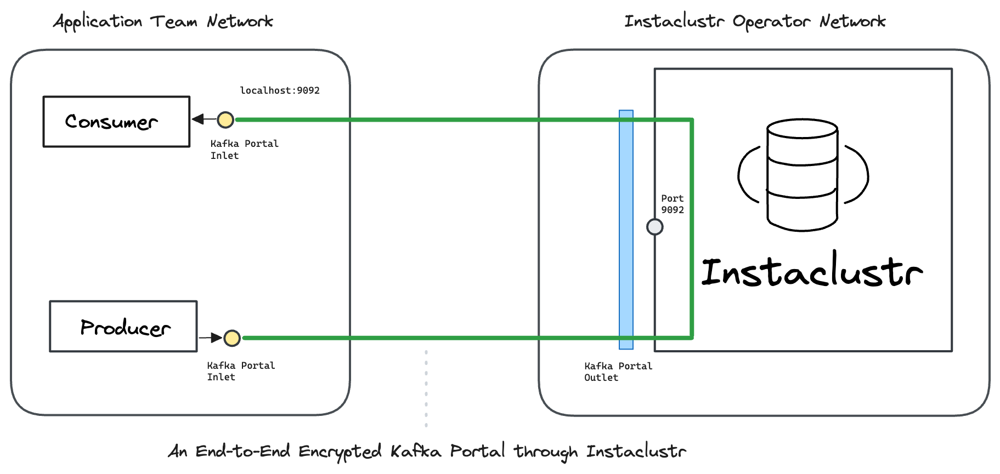

---
layout:
  title:
    visible: true
  description:
    visible: false
  tableOfContents:
    visible: true
  outline:
    visible: true
  pagination:
    visible: true
---

# Instaclustr - Docker

In this hands-on example we send end-to-end encrypted messages _through_ Instaclustr.

[<mark style="color:blue;">Ockam</mark>](../../../) encrypts messages from a Producer all-of-the-way to a _specific_ Consumer. Only that _specific_ Consumer can decrypt these messages. This guarantees that your data cannot be observed or tampered with as it passes through Instaclustr or the network where it is hosted. The operators of Instaclustr can only see encrypted data in the network and in service that they operate. Thus, a compromise of the operator's infrastructure will not compromise the data stream's security, privacy, or integrity.

To learn how end-to-end trust is established, please read: “[<mark style="color:blue;">How does Ockam work?</mark>](../../../how-does-ockam-work.md)”

<figure><figcaption></figcaption></figure>

### Run

This example requires Bash, Git, jq, Curl, Docker, and Docker Compose. Please set up these tools for your operating system, then run the following commands:

```bash
# Clone the Ockam repo from Github.
git clone --depth 1 https://github.com/build-trust/ockam && cd ockam

# Navigate to this example’s directory.
cd examples/command/portals/kafka/instaclustr/docker/

# Run the example, use Ctrl-C to exit at any point.
./run.sh
```

If everything runs as expected, you'll see the message: _The example run was successful 🥳_

### Walkthrough

The [<mark style="color:blue;">run.sh script</mark>](https://github.com/build-trust/ockam/blob/develop/examples/command/portals/kafka/instaclustr/docker/run.sh), that you ran above, and its [<mark style="color:blue;">accompanying files</mark>](https://github.com/build-trust/ockam/blob/develop/examples/command/portals/kafka/instaclustr/docker) are full of comments and meant to be read. The example setup is only a few simple steps, so please take some time to read and explore.

This example requires Instaclustr Username and API key to create a kafka cluster to use for the example. You can create a trial account at https://www.instaclustr.com/platform/managed-apache-kafka/

#### Administrator

* The [<mark style="color:blue;">run.sh script</mark>](https://github.com/build-trust/ockam/blob/develop/examples/command/portals/kafka/instaclustr/docker/run.sh) calls the [<mark style="color:blue;">run function</mark>](https://github.com/build-trust/ockam/blob/develop/examples/command/portals/kafka/instaclustr/docker/run.sh#L15) which invokes the [<mark style="color:blue;">enroll command</mark>](https://github.com/build-trust/ockam/blob/develop/examples/command/portals/kafka/instaclustr/docker/run.sh#L29) to create an new identity, sign into Ockam Orchestrator, set up a new Ockam project, make you the administrator of this project, and get a project membership [<mark style="color:blue;">credential</mark>](../../../reference/protocols/identities.md#credentials).
* The run function then [<mark style="color:blue;">generates three new enrollment tickets</mark>](https://github.com/build-trust/ockam/blob/develop/examples/command/portals/kafka/instaclustr/docker/run.sh#L47-L62), each valid for 10 minutes, and can be redeemed only once. The [<mark style="color:blue;">first ticket</mark>](https://github.com/build-trust/ockam/blob/develop/examples/command/portals/kafka/instaclustr/docker/run.sh#L54) is meant for the Ockam node that will run in Instaclustr Operator’s network. The [<mark style="color:blue;">second and third tickets</mark>](https://github.com/build-trust/ockam/blob/develop/examples/command/portals/kafka/instaclustr/docker/run.sh#L61-L62) are meant for the Consumer and Producer, in the Ockam node that will run in Application Team’s network.
* Run function [<mark style="color:blue;">authorizes to instaclustr</mark>](https://github.com/build-trust/ockam/blob/develop/examples/command/portals/kafka/instaclustr/docker/run.sh#L30-L40) using Username and API Key and [<mark style="color:blue;">setup a free trial Instaclustr Kafka Cluster</mark>](https://github.com/build-trust/ockam/blob/develop/examples/command/portals/kafka/instaclustr/docker/run.sh#L41) to create and configure a kafka cluster
  * Upon logged in to Instaclustr console, Account API keys can be created from the console by going to gear icon to the top right > Account Settings > API Keys. Create a Provisioning API key and note it down.
  * Alternative to entering the username and API key, you can export them as environment variables `INSTACLUSTR_USER_NAME` and `INSTACLUSTR_API_KEY`
* [<mark style="color:blue;">cluster_manager.sh</mark>](https://github.com/build-trust/ockam/blob/develop/examples/command/portals/kafka/instaclustr/docker/cluster_manager.sh) gets invoked which:
  * Creates a [<mark style="color:blue;">trial cluster</mark>](https://github.com/build-trust/ockam/blob/develop/examples/command/portals/kafka/instaclustr/docker/cluster_manager.sh#L4-L33).
  * [<mark style="color:blue;">Creates a user</mark>](https://github.com/build-trust/ockam/blob/develop/examples/command/portals/kafka/instaclustr/docker/cluster_manager.sh#L101-L123) for kafka consumer and producer to use.
  * [<mark style="color:blue;">Setup firewall rules</mark>](https://github.com/build-trust/ockam/blob/develop/examples/command/portals/kafka/instaclustr/docker/cluster_manager.sh#L79-L98) to access the cluster from the machine running the script.
  * [<mark style="color:blue;">Obtains the bootstrap server public address</mark>](https://github.com/build-trust/ockam/blob/develop/examples/command/portals/kafka/instaclustr/docker/cluster_manager.sh#L166-L167).
* In a typical production setup, an administrator or provisioning pipeline generates enrollment tickets and gives them to nodes that are being provisioned. In our example, the run function is acting on your behalf as the administrator of the Ockam project. It provisions Ockam nodes in [<mark style="color:blue;">Instaclustr Operator’s network</mark>](https://github.com/build-trust/ockam/blob/develop/examples/command/portals/kafka/instaclustr/docker/run.sh#L68C31-L68C73) and [<mark style="color:blue;">Application Team’s network</mark>](https://github.com/build-trust/ockam/blob/develop/examples/command/portals/kafka/instaclustr/docker/run.sh#L75C33-L75C158), passing them their tickets using environment variables.
* The run function takes the enrollment tickets, sets them as the value of an [<mark style="color:blue;">environment variable</mark>](https://github.com/build-trust/ockam/blob/develop/examples/command/portals/kafka/instaclustr/docker/run.sh#L68C36-L68C53), and [<mark style="color:blue;">invokes docker-compose</mark>](https://github.com/build-trust/ockam/blob/develop/examples/command/portals/kafka/instaclustr/docker/run.sh#L63-L75) to create Instaclustr Operator’s and Application Teams’s networks.


#### Instaclustr Operator

```yaml
# Create a dedicated and isolated virtual network for instaclustr_operator.
networks:
  instaclustr_operator:
    driver: bridge
```

* Instaclustr Operator’s [<mark style="color:blue;">docker-compose configuration</mark>](https://github.com/build-trust/ockam/blob/develop/examples/command/portals/kafka/instaclustr/docker/instaclustr\_operator/docker-compose.yml) is used when run.sh invokes docker-compose. It creates an [<mark style="color:blue;">isolated virtual network</mark>](https://github.com/build-trust/ockam/blob/develop/examples/command/portals/kafka/instaclustr/docker/instaclustr\_operator/docker-compose.yml#L3-L5) for Instaclustr Operator.
* In the same network, docker compose starts a [<mark style="color:blue;">Kafka UI</mark> ](https://github.com/build-trust/ockam/blob/develop/examples/command/portals/kafka/instaclustr/docker/instaclustr\_operator/docker-compose.yml#L20-L32), connecting directly to <mark style="background-color:yellow;">${BOOTSTRAPSERVER}:9092</mark>. The console will be reachable throughout the example at http://127.0.0.1:8080.
* Docker compose starts an [<mark style="color:blue;">Ockam node in a container</mark>](https://github.com/build-trust/ockam/blob/develop/examples/command/portals/kafka/instaclustr/docker/instaclustr\_operator/docker-compose.yml#L11-L19) described by `ockam.yaml`, [<mark style="color:blue;">embedded in the script</mark>](https://github.com/build-trust/ockam/blob/develop/examples/command/portals/kafka/instaclustr/docker/instaclustr\_operator/run\_ockam.sh#L6-L17). The node will automatically create an identity, [<mark style="color:blue;">enroll with your project</mark>](https://github.com/build-trust/ockam/blob/develop/examples/command/portals/kafka/instaclustr/docker/application\_team/run\_ockam.sh#L6-L17) using the ticket [<mark style="color:blue;">passed to the container</mark>](https://github.com/build-trust/ockam/blob/develop/examples/command/portals/kafka/instaclustr/docker/instaclustr\_operator/docker-compose.yml#L16), and set up Kafka outlet with the [<mark style="color:blue;">bootstrap server details</mark>](https://github.com/build-trust/ockam/blob/develop/examples/command/portals/kafka/instaclustr/docker/instaclustr\_operator/docker-compose.yml#L17) passed to the container
* The Ockam node then uses this identity and membership credential to authenticate and create a <mark style="color:blue;">relay</mark> in the project, back to the node, at <mark style="background-color:yellow;">relay: instaclustr</mark>. The run function [<mark style="color:blue;">gave the enrollment ticket permission</mark>](https://github.com/build-trust/ockam/blob/develop/examples/command/portals/kafka/instaclustr/docker/run.sh#L53C86-L53C102) to use this relay address.

#### Application Teams

```yaml
# Create a dedicated and isolated virtual network for application_team.
networks:
  application_team:
      driver: bridge
```

* Application Teams’s [<mark style="color:blue;">docker-compose configuration</mark>](https://github.com/build-trust/ockam/blob/develop/examples/command/portals/kafka/instaclustr/docker/application\_team/docker-compose.yml) is used when run.sh invokes docker-compose. It creates an [<mark style="color:blue;">isolated virtual network</mark>](https://github.com/build-trust/ockam/blob/develop/examples/command/portals/kafka/instaclustr/docker/application\_team/docker-compose.yml#L3-L5) for Application Teams. In this network, docker compose starts a [<mark style="color:blue;">Kafka Consumer container</mark>](https://github.com/build-trust/ockam/blob/develop/examples/command/portals/kafka/instaclustr/docker/application\_team/docker-compose.yml#L11-L38) and a [<mark style="color:blue;">Kafka Producer container</mark>](https://github.com/build-trust/ockam/blob/develop/examples/command/portals/kafka/instaclustr/docker/application\_team/docker-compose.yml#L40-L73).
* The Kafka consumer node container is created using [<mark style="color:blue;">this dockerfile</mark>](https://github.com/build-trust/ockam/blob/develop/examples/command/portals/kafka/instaclustr/docker/application\_team/kafka\_client.dockerfile) and this [<mark style="color:blue;">entrypoint script</mark>](https://github.com/build-trust/ockam/blob/develop/examples/command/portals/kafka/instaclustr/docker/application\_team/run\_ockam.sh). The consumer enrollment ticket from run.sh is [<mark style="color:blue;">passed to the container</mark>](https://github.com/build-trust/ockam/blob/develop/examples/command/portals/kafka/instaclustr/docker/application\_team/docker-compose.yml#L16) via environment variable.
* When the Kafka consumer node container starts in the Application Teams network, it runs [<mark style="color:blue;">its entrypoint</mark>](https://github.com/build-trust/ockam/blob/develop/examples/command/portals/kafka/instaclustr/docker/application\_team/run\_ockam.sh). The entrypoint creates the Ockam node described by `ockam.yaml`, [<mark style="color:blue;">embedded in the script</mark>](https://github.com/build-trust/ockam/blob/develop/examples/command/portals/kafka/instaclustr/docker/application\_team/run\_ockam.sh#L15-L25). The node will automatically create an identity, [<mark style="color:blue;">enroll with your project</mark>](https://github.com/build-trust/ockam/blob/develop/examples/command/portals/kafka/instaclustr/docker/application\_team/run\_ockam.sh#L15-L25), and setup Kafka inlet.
* Next, the [<mark style="color:blue;">entrypoint at the end</mark>](https://github.com/build-trust/ockam/blob/develop/examples/command/portals/kafka/instaclustr/docker/application\_team/docker-compose.yml#L19) executes the [<mark style="color:blue;">consumer commands</mark>](https://github.com/build-trust/ockam/blob/develop/examples/command/portals/kafka/instaclustr/docker/application\_team/docker-compose.yml#L23-L37), which launches a Kafka consumer waiting for messages in the <mark style="background-color:yellow;">demo</mark> topic. Once the messages are received, they are printed out.
* In the producer container, the process is analogous, once the Ockam node is set up the [<mark style="color:blue;">command within docker-compose configuration</mark>](https://github.com/build-trust/ockam/blob/develop/examples/command/portals/kafka/instaclustr/docker/application\_team/docker-compose.yml#L48-L73) launches a Kafka producer that sends messages.
* Both consumer and producer uses [<mark style="color:blue;">kafka.config</mark>](https://github.com/build-trust/ockam/blob/develop/examples/command/portals/kafka/instaclustr/docker/application\_team/run_ockam.sh#L4-L11) that has credentials of the kafka user created when setting up the cluster
* You can view the Kafak UI available at http://127.0.0.1:8080 to see the encrypted messages

### Recap

We sent end-to-end encrypted messages _through_ Instaclustr.

Messages are encrypted with strong forward secrecy as soon as they leave a Producer, and only the intended Consumer can decrypt those messages. Instaclustr and other Consumers can only see encrypted messages.

All communication is mutually authenticated and authorized. Keys and credentials are automatically rotated. Access can be easily revoked.

### Cleanup

To delete all containers, images and instaclustr cluster:

```sh
./run.sh cleanup
```
