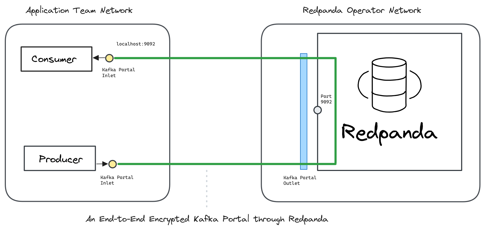

---
layout:
  title:
    visible: true
  description:
    visible: false
  tableOfContents:
    visible: true
  outline:
    visible: true
  pagination:
    visible: true
---

# Redpanda

Create an Ockam **Portal** to send end-to-end encrypted messages _through_ Redpanda.

[<mark style="color:blue;">Ockam</mark>](../../../) encrypts messages from a Producer to a specific Consumer. Only that specific Consumer can decrypt these messages. This guarantees that your data cannot be observed or tampered as it passes through Kafka. Operators of the Kafka cluster only see end-to-end encrypted data. Any compromise of an operator's infrastructure cannot compromise your business data.

To learn how end-to-end trust is established, please read: “[<mark style="color:blue;">How does Ockam work?</mark>](../../../how-does-ockam-work.md)”

<figure><figcaption></figcaption></figure>

Please select an example to dig in:

<table data-card-size="large" data-view="cards"><thead><tr><th></th><th></th></tr></thead><tbody><tr><td><a href="docker.md"><mark style="color:blue;"><strong>Redpanda - Docker</strong></mark></a></td><td>We send end-to-end encrypted messages through Redpanda.</td></tr></tbody></table>
