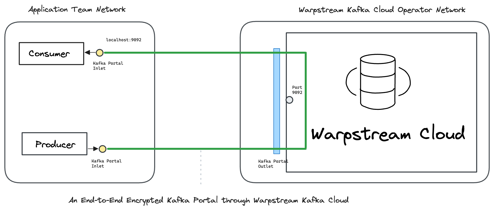

---
layout:
  title:
    visible: true
  description:
    visible: false
  tableOfContents:
    visible: true
  outline:
    visible: true
  pagination:
    visible: true
---

# Warpstream Cloud

In this hands-on example we send end-to-end encrypted messages _through_ Warpstream Cloud.

[<mark style="color:blue;">Ockam</mark>](../../../) encrypts messages from a Producer all-of-the-way to a _specific_ Consumer. Only that _specific_ Consumer can decrypt these messages. This guarantees that your data cannot be observed or tampered with as it passes through Warpstream Cloud or the network where it is hosted. The operators of Warpstream Cloud can only see encrypted data in the network and in service that they operate. Thus, a compromise of the operator's infrastructure will not compromise the data stream's security, privacy, or integrity.

To learn how end-to-end trust is established, please read: “[<mark style="color:blue;">How does Ockam work?</mark>](../../../how-does-ockam-work.md)”

<figure><figcaption></figcaption></figure>

### Run

This example requires Bash, Git, Curl, Docker, and Docker Compose. Please set up these tools for your operating system. It's also necessary to include your warpstream API key as an environment variable when running the example, example can be run as following:

```bash
# Clone the Ockam repo from Github.
git clone --depth 1 https://github.com/build-trust/ockam && cd ockam

# Navigate to this example’s directory.
cd examples/command/portals/kafka/warpstream/

# Run the example by calling the run.sh script and passing your warpstream api key as an argument, use Ctrl-C to exit at any point.
./run.sh _warpstream_api_key_
```

If everything runs as expected, you'll see the message: _The example run was successful 🥳_

### Walkthrough

The [<mark style="color:blue;">run.sh script</mark>](https://github.com/build-trust/ockam/blob/develop/examples/command/portals/kafka/warpstream/run.sh), that you ran above, and its [<mark style="color:blue;">accompanying files</mark>](https://github.com/build-trust/ockam/blob/develop/examples/command/portals/kafka/warpstream) are full of comments and meant to be read. The example setup is only a few simple steps, so please take some time to read and explore.

#### Administrator

* The [<mark style="color:blue;">run.sh script</mark>](https://github.com/build-trust/ockam/blob/develop/examples/command/portals/kafka/warpstream/run.sh) calls the [<mark style="color:blue;">run function</mark>](https://github.com/build-trust/ockam/blob/develop/examples/command/portals/kafka/warpstream/run.sh#L15) which invokes the [<mark style="color:blue;">enroll command</mark>](https://github.com/build-trust/ockam/blob/develop/examples/command/portals/kafka/warpstream/run.sh#L29) to create a new identity, sign in to Ockam Orchestrator, set up a new Ockam project, make you the administrator of this project, and get a project membership [<mark style="color:blue;">credential</mark>](../../../reference/protocols/identities.md#credentials).
* The run function then [<mark style="color:blue;">creates a new Kafka cluster</mark>](https://github.com/build-trust/ockam/blob/develop/examples/command/portals/kafka/warpstream/run.sh#L31-L45) by using your Warpstream's API key.
* An Ockam relay is then started [<mark style="color:blue;">using the Ockam Kafka addon</mark>](https://github.com/build-trust/ockam/blob/develop/examples/command/portals/kafka/warpstream/run.sh#L48) which creates an encrypted relay that transmits Kafka messages over a secure portal.
* We then [<mark style="color:blue;">generate two new enrollment tickets</mark>](https://github.com/build-trust/ockam/blob/develop/examples/command/portals/kafka/warpstream/run.sh#50-L56), each valid for 10 minutes, and can be redeemed only once. The [<mark style="color:blue;">two tickets</mark>](https://github.com/build-trust/ockam/blob/develop/examples/command/portals/kafka/warpstream/run.sh#L50-L56) are meant for the Consumer and Producer, in the Ockam node that will run in Application Team’s network.
* In a typical production setup, an administrator or provisioning pipeline generates enrollment tickets and gives them to nodes that are being provisioned. In our example, the run function is acting on your behalf as the administrator of the Ockam project. It creates a Kafka relay using a pre-baked Ockam Kafka addon which will host the Warpstream Kafka server and [<mark style="color:blue;">Application Team’s network</mark>](https://github.com/build-trust/ockam/blob/develop/examples/command/portals/kafka/warpstream/run.sh#L63C36-L62C160), passing them their tickets using environment variables.
* For the Application team, the run function takes the enrollment tickets, sets them as the value of an [<mark style="color:blue;">environment variable</mark>](https://github.com/build-trust/ockam/blob/develop/examples/command/portals/kafka/warpstream/run.sh#L63C36-L62C160), [<mark style="color:blue;">passes the Warpstream authentication variables</mark>](https://github.com/build-trust/ockam/blob/develop/examples/command/portals/kafka/warpstream/run.sh#L64C9-L63C99) and [<mark style="color:blue;">invokes docker-compose</mark>](https://github.com/build-trust/ockam/blob/develop/examples/command/portals/kafka/warpstream/run.sh#L65C9-L64C26) to create the Application Teams’s networks.

#### Application Teams

```yaml
# Create a dedicated and isolated virtual network for application_team.
networks:
  application_team:
      driver: bridge
```

* Application Teams’s [<mark style="color:blue;">docker-compose configuration</mark>](https://github.com/build-trust/ockam/blob/develop/examples/command/portals/kafka/warpstream/application\_team/docker-compose.yml) is used when run.sh invokes docker-compose. It creates an [<mark style="color:blue;">isolated virtual network</mark>](https://github.com/build-trust/ockam/blob/develop/examples/command/portals/kafka/warpstream/application\_team/docker-compose.yml#L3-L5) for Application Teams. In this network, docker compose starts a [<mark style="color:blue;">Kafka Consumer container</mark>](https://github.com/build-trust/ockam/blob/develop/examples/command/portals/kafka/warpstream/application\_team/docker-compose.yml#L7-L40) and a [<mark style="color:blue;">Kafka Producer container</mark>](https://github.com/build-trust/ockam/blob/develop/examples/command/portals/kafka/warpstream/application\_team/docker-compose.yml#L42-L78).
* The Kafka consumer node container is created using [<mark style="color:blue;">this dockerfile</mark>](https://github.com/build-trust/ockam/blob/develop/examples/command/portals/kafka/warpstream/application\_team/kafka\_ockam.dockerfile) and this [<mark style="color:blue;">entrypoint script</mark>](https://github.com/build-trust/ockam/blob/develop/examples/command/portals/kafka/warpstream/application\_team/run\_ockam.sh). The consumer enrollment ticket from run.sh is [<mark style="color:blue;">passed to the container</mark>](https://github.com/build-trust/ockam/blob/develop/examples/command/portals/kafka/warpstream/application\_team/docker-compose.yml#L17) via environment variable.
* When the Kafka consumer node container starts in the Application Teams network, it runs [<mark style="color:blue;">its entrypoint</mark>](https://github.com/build-trust/ockam/blob/develop/examples/command/portals/kafka/warpstream/application\_team/run\_ockam.sh)<mark style="color:blue;">.</mark> The entrypoint [<mark style="color:blue;">enrolls with your project</mark>](https://github.com/build-trust/ockam/blob/develop/examples/command/portals/kafka/warpstream/application\_team/run\_ockam.sh#L22) and then calls the [<mark style="color:blue;">Ockam kafka-consumer command</mark>](https://github.com/build-trust/ockam/blob/develop/examples/command/portals/kafka/warpstream/application\_team/run\_ockam.sh#L29) which starts the Kafka inlet and listens and traffic connection on localhost port 9092 through Ockam relay.
* Next, the entrypoint at the end executes the [<mark style="color:blue;">command present in the docker-compose configuration</mark>](https://github.com/build-trust/ockam/blob/develop/examples/command/portals/kafka/warpstream/application\_team/docker-compose.yml#L24-L39), which launches a Kafka consumer waiting for messages in the <mark style="background-color:yellow;">demo</mark> topic. Once the messages are received, they are printed out.
* In the producer container, the process is analogous, once the Ockam kafka-producer inlet is set up, the [<mark style="color:blue;">command within docker-compose configuration</mark>](https://github.com/build-trust/ockam/blob/develop/examples/command/portals/kafka/warpstream/application\_team/docker-compose.yml#55-L78) launches a Kafka producer that sends messages.


### Recap

We sent end-to-end encrypted messages _through_ Warpstream cloud.

Messages are encrypted with strong forward secrecy as soon as they leave a Producer, and only the intended Consumer can decrypt those messages. Warpstream Cloud and other Consumers can only see encrypted messages.

All communication is mutually authenticated and authorized. Keys and credentials are automatically rotated. Access can be easily revoked.

### Cleanup

To delete all containers and images:

```sh
./run.sh cleanup _warpstream_api_key
```
