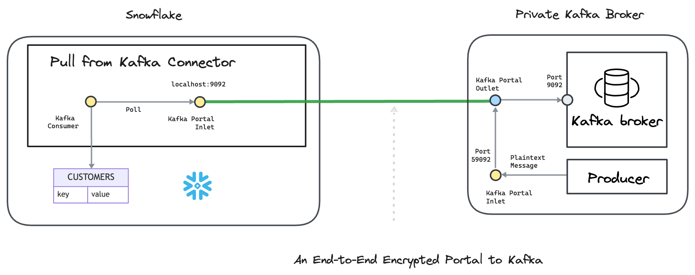

---
layout:
  title:
    visible: true
  description:
    visible: false
  tableOfContents:
    visible: true
  outline:
    visible: true
  pagination:
    visible: true
---

# Snowflake

Create an Ockam **Portal** to export or import encrypted data from or to a Snowflake database.

The [<mark style="color:blue;">Ockam</mark>](../../) Snowflake connectors can:

 - Import encrypted messages from a private Kafka cluster into Snowflake tables.
 - Export data changes (CDC) from specific Snowflake tables as encrypted messages to a private Kafka cluster (**Coming soon**).
 - Import data changes (CDC) from private Postgres tables as encrypted data to private Snowflake tables (**Coming soon**).
 - Export data changes (CDC) from specific Snowflake tables as encrypted messages to a private Postgres tables (**Coming soon**).

To learn how end-to-end trust is established, please read: “[<mark style="color:blue;">How does Ockam work?</mark>](../../how-does-ockam-work.md)”

<figure><figcaption></figcaption></figure>

Please select a connector to dig in:

<table data-card-size="large" data-view="cards">

<thead><tr><th></th><th></th><th data-hidden data-card-target data-type="content-ref"></th></tr></thead>
<tbody>
<tr><td><a href="pull-from-kafka-connector/"><mark style="color:blue;"><strong>Pull From Kafka Connector</strong></mark></a></td><td>We send end-to-end encrypted messages through Apache Kafka.</td><td><a href="pull-from-kafka-connector/">Pull From Kafka</a></td></tr>
</tbody>
</table>
