---
layout:
  title:
    visible: true
  description:
    visible: false
  tableOfContents:
    visible: true
  outline:
    visible: true
  pagination:
    visible: true
---

# Pull From Kafka Connector

The following sections contain all the instructions required to install and configure the **Pull From Kafka Connector**.

There are 3 main steps required to run the connector:

1. Subscribe to Ockam and create enrollment tickets.
2. Install the "Pull From Kafka - Connector" application from the Snowflake marketplace.
3. Finalize the configuration via a Worksheet.

## Get started with Ockam

[Signup for Ockam](https://www.ockam.io/signup) and download the `ockam`  command line application with
```shell
curl --proto '=https' --tlsv1.2 -sSfL https://install.command.ockam.io | bash && source "$HOME/.ockam/env"
```

Then create enrollment tickets for each side of the portal:

```sh
# Enroll with Ockam Orchestrator.
ockam enroll

# Create an enrollment ticket for the connector
export PULL_FROM_KAFKA_CONNECTOR_TICKET="$(ockam project ticket --usage-count 1 --expires-in 1h --attribute pull-from-kafka-connector)"

# Create an enrollment ticket for the Ockam node running at the Kafka broker
export KAFKA_BROKER_TICKET="$(ockam project ticket --usage-count 1 --expires-in 1h --attribute kafka-broker --relay kafka)"
```

## Install Ockam nodes on the Kafka broker side

On the Kafka broker side you need to run an Ockam node with the following configuration. Create a file name `kafka.yml`:
```yaml
ticket: $KAFKA_BROKER_TICKET

relay: kafka

kafka-outlet:
  bootstrap-server: 127.0.0.1:9092
  allow: pull-from-kafka-connector

kafka-inlet:
  to: /project/default/service/forward_to_kafka/secure/api
  allow: pull-from-kafka-connector
  disable-content-encryption: true
```

And use it to start an Ockam node from your private network:
```shell
ockam node create --configuration "$(cat kafka.yml)"
``` 

Notes: 

 - The name of the relay must be the name used when configuring the Pull From Kafka Connector (see section below).
 - The name of the relay must also be the value of the `--relay` attribute used to issue the `KAFKA_BROKER_TICKET`.
 - The `allow` field must correspond to the `--attribute` value used to created the `PULL_FROM_KAFKA_CONNECTOR_TICKET`.

## Install and configure the **Pull From Kafka Connector**

Select the **Pull From Kafka Connector** from the Snowflake Marketplace and press "Get" twice to install the application:

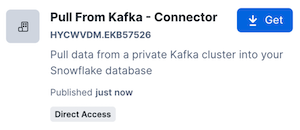

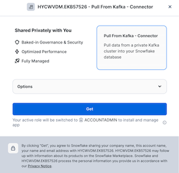

Wait until the application is installed 

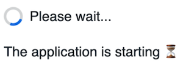

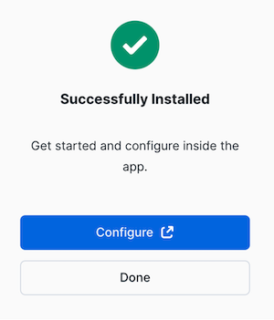

Press "Configure", this will open a new browser tab (Do _not_ click on "view your apps").

Grant the permission to create a compute pool:

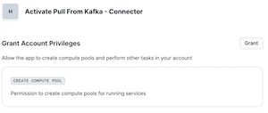

Then "Activate" the application:

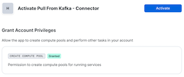

Then click on the "UI" tab to get to the configuration screen:

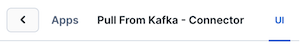

Configure the connector:

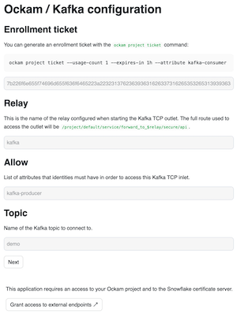

Notes:

 - The `Via` field must match the `relay` field specified on the Kafka outlet on the Kafka broker side.
 - The `Allow` field must match the `attribute` value set in the `KAFKA_OUTLET_TICKET` 
 
Press "Next" then grant access to external endpoints:

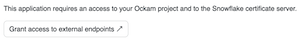

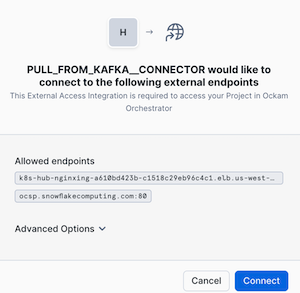

Press "Connect", then grant access to an ingestion table:

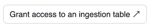

Select a table and "Save": 

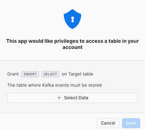

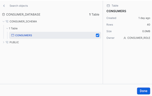

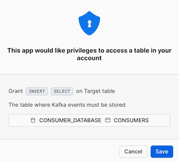

Then grant usage on a warehouse:

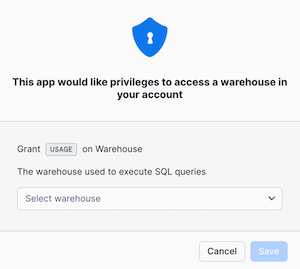

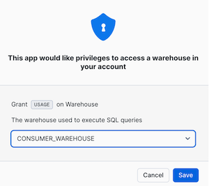


_Before_ pressing "Start", open a SQL Worksheet and enter the following commands:
```sqlite-sql
USE ROLE ACCOUNTADMIN;
GRANT USAGE ON WAREHOUSE CONSUMER_WAREHOUSE TO APPLICATION PULL_FROM_KAFKA__CONNECTOR;
GRANT APPLICATION ROLE PULL_FROM_KAFKA__CONNECTOR.app_role TO ROLE CONSUMER_ROLE;
```
Where:
 - `PULL_FROM_KAFKA__CONNECTOR` is the name of the application that was just installed.
 - `CONSUMER_ROLE` is the role to are using to access the target table used to ingest Kafka message.

Then press "Start":

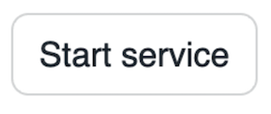

And wait until the application has finished starting, this can take 1 or 2 minutes:


When the application is finally ready, you can open a worksheet and run the following commands to check that 
your messages are being ingested.

Get the status of the Ockam node and the Kafka consumer. They should be both `READY`:
```sqlite-sql
USE ROLE CONSUMER_ROLE;

CALL PULL_FROM_KAFKA__CONNECTOR.external.ockam_node_service_status();
CALL PULL_FROM_KAFKA__CONNECTOR.external.kafka_consumer_service_status();
```

Check the logs of the Ockam node:
```sqlite-sql
CALL PULL_FROM_KAFKA__CONNECTOR.external.ockam_node_service_logs();
```

There should be log lines like these, showing that we are connected to the Kafka broker:
```shell
2024-08-08T13:41:52.041648Z DEBUG ockam_abac::policy::incoming: found the policy List([Ident("="), Ident("subject.snowflake-kafka-outlet"), Str("true")]) to be used for incoming access control
2024-08-08T13:41:52.042150Z DEBUG ockam_abac::abac::abac: policy evaluated policy=(= subject.snowflake-kafka-outlet "true") id=I5af870077b313ede9915cb5093c60c99868594950473b4d9b490c359e520ac28 is_authorized=true
```

Then, if messages are produced on the selected Kafka topic, you can check the logs of the Kafka consumer:
```sqlite-sql
CALL PULL_FROM_KAFKA__CONNECTOR.external.kafka_consumer_service_logs();
```

This should return log lines like these showing that messages are being ingested:
```shell
2024-08-08 14:07:20,152 - INFO - Received message: Partition: 0, Offset: 0, Key: Message
2024-08-08 14:07:20,945 - INFO - Successfully processed message. Total processed: 1
2024-08-08 14:07:20,946 - INFO - Committed offset 0 for partition 0
2024-08-08 14:07:25,205 - INFO - Received message: Partition: 0, Offset: 1, Key: Message
2024-08-08 14:07:25,699 - INFO - Successfully processed message. Total processed: 2
```

Of course for the final test you can select data from the ingestion table:
```sqlite-sql
SELECT * FROM consumer_table;
```
