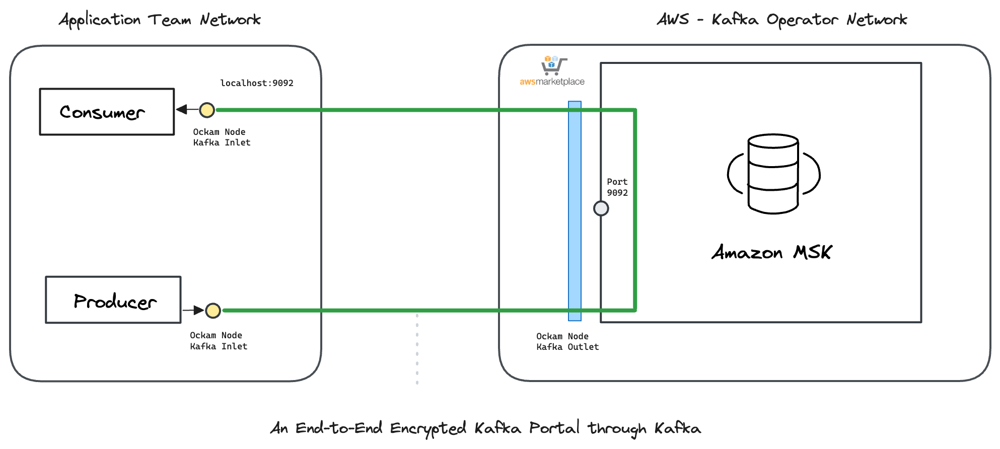

# Ockam Node for Amazon MSK

This guide contains instructions to launch within AWS environment, an&#x20;

* An Ockam Kafka Outlet Node within an AWS environment
* An Ockam Kafka Inlet Node:
  * Within an AWS environment, or
  * Using Docker in any environment

The walkthrough demonstrates:

1. Running an Ockam kafka outlet node in your AWS environment that contains Amazon MSK instance&#x20;
2. Setting up Ockam Kafka inlet nodes using either AWS or Docker from any location.
3. Verifying secure communication between kafka clients and Amazon MSK cluster.

Read: “[How does Ockam work?](https://docs.ockam.io/how-does-ockam-work)” to learn about end-to-end trust establishment.

<figure><figcaption></figcaption></figure>

### PreRequisite

**Amazon MSK Cluster Configuration**: Ensure that your Amazon MSK cluster is configured with the following settings:

1. **Access Control Methods**: **Unauthenticated access** should be enabled.
2. **Encryption between Clients and Brokers**: **PLAINTEXT** should be enabled
3. **Network Access to Amazon MSK Cluster**:  Verify that the Security Group associated with the Amazon MSK cluster allows inbound traffic on the required port(s) (e.g., 9092) from the subnet where the EC2 instance will reside.

### Create an Orchestrator Project

1. [Sign up for Ockam](https://www.ockam.io/download) and pick a subscription plan through the guided workflow on Ockam.io.
2. Run the following commands to install Ockam Command and enroll with the Ockam Orchestrator.

```bash
curl --proto '=https' --tlsv1.2 -sSfL https://install.command.ockam.io | bash
source "$HOME/.ockam/env"

ockam enroll
```

Completing this step creates a Project in Ockam Orchestrator.

3. Control which identities are allowed to enroll themselves into your project by issuing unique one-time use enrollment tickets. Generate two enrollment tickets, one for the Outlet and one for the Inlet.

```bash
# Enrollment ticket for Ockam Outlet Node
ockam project ticket --expires-in 10h --usage-count 1 \
  --attribute amazon-msk-kafka-outlet \
  --relay kafka \
    > "outlet.ticket"

# Enrollment ticket for Ockam Inlet Node
ockam project ticket --expires-in 10h --usage-count 1 \
  --attribute amazon-msk-kafka-inlet \
    > "inlet.ticket"
```

### Setup Ockam Kafka Outlet Node

* Login to AWS Account you would like to use
* Subscribe to "Ockam - Node for Amazon MSK"  in AWS Marketplace&#x20;
* Navigate to `AWS Marketplace -> Manage subscriptions`. Select `Ockam - Node for Amazon MSK` from the list of subscriptions. Select `Actions-> Launch Cloudformation stack`&#x20;
* Select the Region you want to deploy and click `Continue to Launch`. Under Actions, select `Launch Cloudformation`
* Create stack with the following details
  * **Stack name**: `msk-ockam-outlet` or any name you prefer
  * Network Configuration
    * **VPC ID:** Choose a VPC ID where the EC2 instance will be deployed.
    * **Subnet ID:** Select a suitable Subnet ID within the chosen VPC that has access to Amazon MSK cluster.
    * **EC2 Instance Type**: Default instance type is `m6a.8xlarge` because of the predictable network bandwidth of 12.5 Gbps. Adjust to a small instance type depending on your use case&#x20;
  * Ockam Configuration
    * **Enrollment ticket**: Copy and paste the content of the `outlet.ticket` generated above
    * **Amazon MSK Bootstrap Server with Port**: To configure the Ockam Kafka Outlet Node, you'll need to specify the bootstrap servers for your Amazon MSK cluster. This configuration allows the Ockam Kafka Outlet Node to connect to the Kafka brokers.
      * **Go to the MSK cluster in the AWS Management Console** and select the cluster name.
      * **In the Connectivity Summary** section**,** select **View Client information**, copy the **Bootstrap servers (plaintext)** string with port `9092`.
    * **JSON Node Configuration**: Copy and paste the below configuration. Note that the configuration values match with the enrollment tickets created in the previous step

```json
{
    "name": "amazon_msk_kafka_outlet",
    "http-server-port": 23345,
    "relay": "kafka",
    "kafka-outlet": {
      "bootstrap-server": "$BOOTSTRAP_SERVER_WITH_PORT",
      "allow": "amazon-msk-kafka-inlet"
    }
  }

```

* Click Next to launch the CloudFormation run.
* A successful CloudFormation stack run configures the Ockam Kafka outlet node on an EC2 machine.
  * EC2 machine mounts an EFS volume created in the same subnet. Ockam state is stored in the EFS volume.
  * A security group with egress access to the internet will be attached to the EC2 machine.
* Connect to the EC2 machine via AWS Session Manager.&#x20;
  * To view the log file, run `sudo cat /var/log/cloud-init-output.log`.
    * Successful run will show `Ockam node setup completed successfully` in the logs
  * To view the status of Ockam node run `curl http://localhost:23345/show | jq`
* View the Ockam node status in CloudWatch.
  * Navigate to `Cloudwatch -> Log Group` and select `msk-outlet-ockam-status-logs`. Select the Logstream for the EC2 instance.&#x20;
  * The Cloudformation template creates a subscription filter that sends data to a Cloudwatch alarm `msk-ockam-outlet-OckamNodeDownAlarm.`Alarm will turn green upon ockam node successfully running.&#x20;
* An Autoscaling group ensures atleast one EC2 instance is running at all times.

Ockam Kafka outlet node setup is complete. You can now create Ockam Kafka inlet nodes in any network to establish secure communication.

### Setup Ockam Kafka Inlet Node

You can set up an Ockam Kafka Inlet Node either in AWS or locally using Docker. Here are both options:

**Option 1: Setup Inlet Node in AWS**

To set up an Inlet Node in AWS,  follow similar steps as the Outlet Node setup, with these modifications:

* Use the same CloudFormation template as before.
* When configuring the stack,&#x20;
  * Use the `inlet.ticket` instead of the `outlet.ticket`.
  * **VPC and Subnet:** You can choose any VPC and subnet for the Inlet Node. It doesn't need to be in the same network as the MSK cluster or the Outlet Node.
* For the JSON Node Configuration, use the following:

```json
{
    "name": "amazon_msk_kafka_inlet",
    "http-server-port": 23345,
    "kafka-inlet": {
      "from": "127.0.0.1:9092",
      "disable-content-encryption": true,
      "avoid-publishing": true,
      "allow": "amazon-msk-kafka-outlet",
      "to": "/project/default/service/forward_to_kafka/secure/api"
    }
  }
```

* Use any kafka client and connect to `127.0.0.1:9092` as the `bootstrap-server,` from the same machine running the Ockam Kafak Inlet node.

**Option 2: Setup Inlet Node Locally with Docker Compose**

To set up an Inlet Node locally and interact with it outside of AWS,  use Docker Compose.&#x20;

* Create a file named `docker-compose.yml` with the following content:

```yaml
services:
  ockam:
    image: ghcr.io/build-trust/ockam
    environment:
      ENROLLMENT_TICKET: ${ENROLLMENT_TICKET:-}
      OCKAM_DEVELOPER: ${OCKAM_DEVELOPER:-false}
      OCKAM_LOGGING: true
      OCKAM_LOG_LEVEL: info
    command:
      - node
      - create
      - --foreground
      - --node-config
      - |
        name: amazon_msk_kafka_inlet
        http-server-port: 23345
        ticket: ${ENROLLMENT_TICKET}

        kafka-inlet:
          from: 0.0.0.0:19092
          disable-content-encryption: true
          avoid-publishing: true
          allow: amazon-msk-kafka-outlet
          to: /project/default/service/forward_to_kafka/secure/api
    network_mode: host

  kafka-tools:
    image: apache/kafka
    container_name: kafka-tools
    command: /bin/sh -c "while true; do sleep 30; done"
    depends_on:
      - ockam
    network_mode: host
```

* Run the following command from the same location as the `docker-compose.yml` and the `inlet.ticket` to create an Ockam kafka inlet that can connect to the outlet running in AWS , along with kakfa client tools container

```
ENROLLMENT_TICKET=$(cat inlet.ticket) docker-compose up -d
```

* Exec into the `kafka-tools` and run commands to produce as well as consume kafka messages.

```bash
# Exec into tools container
docker exec -it kafka-tools /bin/bash

# List topics
/opt/kafka/bin/kafka-topics.sh --list --bootstrap-server localhost:19092

# Create a topic
/opt/kafka/bin/kafka-topics.sh --create --topic test-topic --bootstrap-server localhost:19092 --partitions 1 --replication-factor 1

# Publish a message
date | /opt/kafka/bin/kafka-console-producer.sh --broker-list localhost:19092 --topic test-topic

# Read messages
/opt/kafka/bin/kafka-console-consumer.sh --bootstrap-server localhost:19092 --topic test-topic --from-beginning

```

This setup allows you to run an Ockam Kafka Inlet Node locally and communicate securely with the Outlet Node running in AWS.
