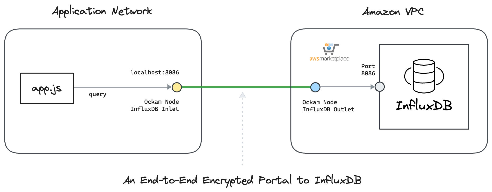

# Ockam Node for Amazon Timestream InfluxDB

This guide contains instructions to launch within AWS environment, an&#x20;

* An Ockam Timestream InfluxDB Outlet Node within an AWS environment
* An Ockam Timestream InfluxDB Inlet Node:
  * Within an AWS environment, or
  * Using Docker in any environment

The walkthrough demonstrates:

* Running an Ockam Timestream InfluxDB Outlet node in your AWS environment that contains a private Amazon Timestream InfluxDB Database&#x20;
* Setting up Ockam Timestream InfluxDB inlet nodes using either AWS or Docker from any location.
* Verifying secure communication between InfluxDB clients and Amazon Timestream InfluxDB  Database.

Read: “[How does Ockam work?](https://docs.ockam.io/how-does-ockam-work)” to learn about end-to-end trust establishment.

<figure><figcaption></figcaption></figure>

### PreRequisite

* A private Amazon Timestream InfluxDB Database is created and accessible from the VPC and Subnet where the Ockam Node will be launched. You have the details of `Organization`, `Username and Password`
* Security Group associated with the Amazon Timestream InfluxDBDatabase allows inbound traffic on the required port (TCP 8086) from the subnet where the Ockam Outlet Node will reside.
* You have permission to subscribe and launch Cloudformation stack from AWS Marketplace on the AWS Account running Timestream InfluxDB Database.
* Permission to create an "All Access" InfluxDB token to use by Ockam Node and store it in AWS Secrets Manager.&#x20;

### Create an Orchestrator Project

1. [Sign up for Ockam](https://www.ockam.io/download) and pick a subscription plan through the guided workflow on Ockam.io.
2. Run the following commands to install Ockam Command and enroll with the Ockam Orchestrator.

```bash
curl --proto '=https' --tlsv1.2 -sSfL https://install.command.ockam.io | bash
source "$HOME/.ockam/env"

ockam enroll
```

Completing this step creates a Project in Ockam Orchestrator

3. Control which identities are allowed to enroll themselves into your project by issuing unique one-time use enrollment tickets. Generate two enrollment tickets, one for the Outlet and one for the Inlet.

```bash
# Enrollment ticket for Ockam Outlet Node
ockam project ticket --expires-in 10h --usage-count 1 \
  --attribute amazon-influxdb-outlet \
  --relay influxdb \
    > "outlet.ticket"

# Enrollment ticket for Ockam Inlet Node
ockam project ticket --expires-in 10h --usage-count 1 \
  --attribute amazon-influxdb-inlet --tls \
    > "inlet.ticket"
```

### Create an All Access InfluxDB Token and obtain Org ID

* &#x20;Use Influx CLI to create a token. For instructions, please see: [Install and use the influx CLI](https://docs.influxdata.com/influxdb/v2/tools/influx-cli/).
* Configure your CLI to use `--username-password` to be able to create the operator:

```bash
INFLUXDB_ORG="REPLACE_WITH_ORG_NAME"
INFLUXDB_USERNAME="REPLACE_WITH_USERNAME"
INFLUXDB_PASSWORD="REPLACE_WITH_PASSWORD"
INFLUXDB_ENDPOINT="https://REPLACE_WITH_INFLUXDB_ENDPOINT:8086"

influx config create --active --config-name testconfig \
  --host-url $INFLUXDB_ENDPOINT \
  --org $INFLUXDB_ORG \
  --username-password "$INFLUXDB_USERNAME:$INFLUXDB_PASSWORD"
```

* Find out Org ID to use as an input to cloudformation template

```
influx org list
```

* Create your new token.&#x20;

```bash
influx auth create --all-access --json | jq -r .token
```

* Create influxDB token as secret within secret manager.  Note the ARN of the secret.

```bash
SECRET_NAME="influxdb-token" #Update as necessary
INFLUXDB_TOKEN="REPLACE_WITH_TOKEN"
AWS_REGION="us-east-1"

# Create secret
aws secretsmanager create-secret \
--region $AWS_REGION \
--name $SECRET_NAME \
--description "Ockam node InfluxDB lessor token" \
--secret-string "$INFLUXDB_TOKEN"

# Get the ARN of the secret

aws secretsmanager describe-secret --secret-id $SECRET_NAME --query ARN --output text
```

### Setup Ockam Timestream InfluxDB Outlet Node

* Login to AWS Account you would like to use
* Subscribe to "Ockam - Node for Amazon Timestream InfluxDB"  in AWS Marketplace&#x20;
* Navigate to `AWS Marketplace -> Manage subscriptions`. Select `Ockam - Node for Amazon Timestream InfluxDB` from the list of subscriptions. Select `Actions-> Launch Cloudformation stack`&#x20;
* Select the Region you want to deploy and click `Continue to Launch`. Under Actions, select `Launch Cloudformation`
* Create stack with the following details
  * **Stack name**: `influxdb-ockam-outlet` or any name you prefer
  * Network Configuration
    * **VPC ID:** Choose a VPC ID where the EC2 instance will be deployed.
    * **Subnet ID:** Select a suitable Subnet ID within the chosen VPC that has access to Amazon Timestream InfluxDB Database.
    * **EC2 Instance Type**: Default instance type is `m6a.large` Adjust instance type depending on your use case. If you would like to have predictable network bandwidth of 12.5 Gbps use `m6a.8xlarge`. Make sure the instance type is available in the subnet you are launching in.
  * Ockam Node Configuration
    * **Enrollment ticket**: Copy and paste the content of the `outlet.ticket` generated above
    * **InfluxDBEndpoint:** To configure the Ockam Timestream InfluxDB Outlet Node, you'll need to specify the Amazon Timestream InfluxDB Endpoint. This configuration allows the Ockam Postgres Outlet Node to connect to the database. In AWS Console, go to Timestream -> InfluxDB databases, select your influxdb database and copy "Endpoint" details
    * **InfluxDBOrgID**: Enter the Organization of InfluxDB instance.
    * **InfluxDBTokenSecretArn**: Enter the ARN of the Secret that contains the all access token.&#x20;
    * **InfluxDBLeasedTokenPermissions:** JSON array of permission objects for InfluxDB leased token in the below format. Update as needed. Leave the variable `INFLUX_ORG_ID` as it will be replaced during runtime.&#x20;

```json
[
    {
      "action": "read",
      "resource": {
        "type": "buckets",
        "orgID": "INFLUX_ORG_ID"
      }
    },
    {
      "action": "write",
      "resource": {
        "type": "buckets",
        "orgID": "INFLUX_ORG_ID"
      }
    }
]

```

* **NodeConfig**: Copy and paste the below configuration. Note that the configuration values match with the enrollment tickets created in the previous step. `INFLUX_ENDPOINT`, `INFLUX_ORG_ID` and `INFLUX_TOKEN` will be replaced during runtime.

<pre class="language-json"><code class="lang-json"><strong>{
</strong>    "relay": "influxdb",
    "influxdb-outlet": {
      "to": "INFLUX_ENDPOINT:8086",
      "tls": true,
      "allow": "amazon-influxdb-inlet",
      "org-id": "INFLUX_ORG_ID",
      "all-access-token": "INFLUX_TOKEN",
      "leased-token-expires-in": "300",
      "leased-token-permissions": "LEASED_TOKEN_PERMISSIONS"
    }
  }
</code></pre>

* Click Next to launch the CloudFormation run.
* A successful CloudFormation stack run configures the Ockam Timestream InfluxDB Outlet node on an EC2 machine.
  * EC2 machine mounts an EFS volume created in the same subnet. Ockam state is stored in the EFS volume.
  * A security group with egress access to the internet will be attached to the EC2 machine.
* Connect to the EC2 machine via AWS Session Manager.&#x20;
  * To view the log file, run `sudo cat /var/log/cloud-init-output.log`.
    * Successful run will show `Ockam node setup completed successfully` in the logs
  * To view the status of Ockam node run `curl http://localhost:23345/show | jq`
* View the Ockam node status in CloudWatch.
  * Navigate to `Cloudwatch -> Log Group` and select `influxdb-ockam-outlet-status-logs`. Select the Logstream for the EC2 instance.&#x20;
  * The Cloudformation template creates a subscription filter that sends data to a Cloudwatch alarm `influxdb-ockam-outlet-OckamNodeDownAlarm.`Alarm will turn green upon ockam node successfully running.&#x20;
* An Autoscaling group ensures atleast one EC2 instance is running at all times.

Ockam Timestream InfluxDB outlet node setup is complete. You can now create Ockam Timestream InfluxDB inlet nodes in any network to establish secure communication.

### Setup Ockam InfluxDB Inlet Node&#x20;

You can set up an Ockam Timestream InfluxDB Inlet Node either in AWS or locally using Docker. Here are both options:

**Option 1: Setup Inlet Node Locally with Docker Compose**

To set up an Inlet Node locally and interact with it outside of AWS,  use Docker Compose.&#x20;

* Find your Ockam project id by running the command where you created the enrollment tickets and use it to create to endpoint to use for `REPLACE_WITH_YOUR_PROJECT_ID`

```
# Below command will find your ockam project id 
ockam project show --jq .id 
```

* Create a file named `docker-compose.yml` with the following content:

<details>

<summary>docker-compose.yml</summary>

```yaml
services:
  ockam:
    image: ghcr.io/build-trust/ockam
    container_name: influxdb-inlet
    environment:
      ENROLLMENT_TICKET: ${ENROLLMENT_TICKET:-}
      OCKAM_DEVELOPER: ${OCKAM_DEVELOPER:-false}
      OCKAM_LOGGING: true
      OCKAM_LOG_LEVEL: info
    command:
      - node
      - create
      - --foreground
      - --node-config
      - |
        ticket: ${ENROLLMENT_TICKET}

        influxdb-inlet:
          from: 0.0.0.0:8086
          via: influxdb
          allow: amazon-influxdb-outlet
          tls: true
    network_mode: host

  node-app:
    image: node:18
    container_name: node-app
    volumes:
      - ./:/app
    working_dir: /app
    command: /bin/sh -c "while true; do sleep 30; done"
    depends_on:
      - ockam
    network_mode: host

```

</details>

* Create a file named `app.mjs` and `package.json.`
  * Update `REPLACE_WITH_*` variables&#x20;
  * Value of token doesn't matter as it will be injected with the temporary token by Ockam

<details>

<summary>app.mjs</summary>

```

"use strict";

import { InfluxDB, Point, flux } from "@influxdata/influxdb-client";
import os from "os";
import { execSync } from "child_process";
import * as https from "https";

// Update below URL 
const url = "https://influxdb-inlet.REPLACE_WITH_YOUR_PROJECT_ID.ockam.network:8086";
const token = "OCKAM_MANAGED" 
const org = "REPLACE_WITH_YOUR_ORG_NAME";
const bucket = "REPLACE_WITH_YOUR_BUCKET_NAME";

const httpsAgent = new https.Agent({ rejectUnauthorized: true });
const influxDB = new InfluxDB({ url, token, transportOptions: { agent: httpsAgent } });

const writeApi = influxDB.getWriteApi(org, bucket);

async function writeData() {
  const hostname = os.hostname();
  let cpuLoad;
  let freeDiskSpace;

  try {
    cpuLoad = parseFloat(execSync("uptime | awk '{print $(NF-2)}' | sed 's/,//'").toString().trim());
    freeDiskSpace = parseInt(execSync("df -BG / | tail -n 1 | awk '{print $4}' | sed 's/G//'").toString().trim(), 10);
  } catch (error) {
    console.error("Error extracting system metrics:", error);
    return;
  }

  if (isNaN(cpuLoad) || isNaN(freeDiskSpace)) {
    console.error("Extracted metrics are NaN", { cpuLoad, freeDiskSpace });
    return;
  }

  const point = new Point("system_metrics")
    .tag("host", hostname)
    .floatField("cpu_load", cpuLoad)
    .intField("free_disk_space", freeDiskSpace);

  console.log(`Writing point: ${point.toLineProtocol(writeApi)}`);

  writeApi.writePoint(point);

  await writeApi
    .close()
    .then(() => {
      console.log("WRITE FINISHED");
    })
    .catch((e) => {
      console.error("Write failed", e);
    });
}

async function queryData() {
  const queryApi = influxDB.getQueryApi(org);
  const query = flux`
    from(bucket: "${bucket}")
    |> range(start: -1h)
    |> filter(fn: (r) => r._measurement == "system_metrics")
  `;

  console.log("Querying data:");

  queryApi.queryRows(query, {
    next(row, tableMeta) {
      const fieldValue = row[5];
      const fieldName = row[6];

      let cpuLoad = "N/A";
      let freeDiskSpace = "N/A";

      if (fieldName === "cpu_load") {
        cpuLoad = fieldValue;
      } else if (fieldName === "free_disk_space") {
        freeDiskSpace = fieldValue;
      }

      console.log(`cpu_load=${cpuLoad}, free_disk_space=${freeDiskSpace}`);
    },
    error(error) {
      console.error("Query failed", error);
    },
    complete() {
      console.log(
        "\nThe example run was successful 🥳.\n" +
          "\nThe app connected with the database through an encrypted portal." +
          "\nInserted some data into a bucket, and querried it back.\n",
      );
    },
  });
}

writeData().then(() => {
  setTimeout(() => {
    queryData();
  }, 3000);
});

```

</details>

<details>

<summary>package.json</summary>

```
{
  "dependencies": {
    "@influxdata/influxdb-client": "^1.35.0"
  }
}
```

</details>

* Run the following command from the same location as the `docker-compose.yml` and the `inlet.ticket` to create an Ockam Timestream InfluxDB inlet that can connect to the outlet running in AWS , along with node client container

```
ENROLLMENT_TICKET=$(cat inlet.ticket) docker-compose up -d
```

* Check status of Ockam inlet node. You will see `The node is UP` when ockam is configured successfully and ready to accept connection

```
docker exec -it influxdb-inlet /ockam node show
```

* Connect to influxd&#x62;**-client** container and run commands

<pre class="language-bash"><code class="lang-bash"># Connect to the container
<strong>docker exec -it node-app /bin/bash
</strong>
# Install dependencies
npm install

# Run app that writes and read the data to a bucket in private influxDB via ockam
node app.mjs

# You will see below message upon a successful run
<strong># The example run was successful 🥳.
</strong></code></pre>

**Option 2: Setup Inlet Node in AWS**

* Login to AWS Account you would like to use
* Subscribe to "[Ockam - Node" ](https://aws.amazon.com/marketplace/pp/prodview-gov6p3wh224ho?sr=0-1\&ref_=beagle\&applicationId=AWSMPContessa) in AWS Marketplace&#x20;
* Navigate to `AWS Marketplace -> Manage subscriptions`. Select `Ockam - Node` from the list of subscriptions. Select `Actions-> Launch Cloudformation stack`&#x20;
* Select the Region you want to deploy and click `Continue to Launch`. Under Actions, select `Launch Cloudformation`
* Create stack with below details
  * Stack name: `influxdb-ockam-inlet` or any name you prefer
  * Network Configuration
    * Select suitable values for `VPC ID` and `Subnet ID`
    * **EC2 Instance Type**: Default instance type is `m6a.8xlarge` because of the predictable network bandwidth of 12.5 Gbps. Adjust to a small instance type depending on your use case. Eg: `m6a.large`
  * Ockam Configuration
    * **Enrollment ticket**: Copy and paste the content of the `inlet.ticket` generated above
    * **JSON Node Configuration**: Copy and paste the below configuration. &#x20;

```json
{
    "influxdb-inlet": {
      "from": "0.0.0.0:8086",
      "allow": "amazon-influxdb-outlet",
      "via": "influxdb",
      "tls": true 
    }
  }
```

* Click Next to launch the CloudFormation run.
* A successful CloudFormation stack run configures the Ockam inlet node on an EC2 machine.
* EC2 machine mounts an EFS volume created in the same subnet. Ockam state is stored in the EFS volume.
* Connect to the EC2 machine via AWS Session Manager.&#x20;
  * To view the log file, run `sudo cat /var/log/cloud-init-output.log`.
    * Successful run will show `Ockam node setup completed successfully` in the logs
  * To view the status of Ockam node run `curl http://localhost:23345/show | jq`
* View the Ockam node status in CloudWatch.
  * Navigate to `Cloudwatch -> Log Group` and select `influxdb-ockam-inlet-status-logs`. Select the Logstream for the EC2 instance.&#x20;
  * Cloudformation template creates a subscription filter that sends data to a Cloudwatch alarm `influxdb-ockam-inlet-OckamNodeDownAlarm.`Alarm will turn green upon ockam node successfully running.&#x20;
* An Autoscaling group ensures atleast one EC2 instance is running at all times.&#x20;
* Find your Ockam project id and use it to create to endpoint to use for `INFLUXDB_ENDPOINT`

```
# Below command will find your ockam project id 
ockam project show --jq .id 
```

* Follow testing steps in docker example above for node.js or use  InfluxDB cli client with below details

```
INFLUXDB_ENDPOINT="https://influxdb-inlet.REPLACE_WITH_YOUR_PROJECT_ID.ockam.network:8086"
# Need some value as influxdb client expects a value
INFLUXDB_TOKEN="OCKAM_MANAGED"
INFLUXDB_ORG="REPLACE_WITH_YOUR_ORG_NAME"

# Create config
influx config create -n testconfig  -u $INFLUXDB_ENDPOINT -o $INFLUXDB_ORG  -t "OCKAM_MANAGED"

# View buckets
influx bucket list
```

