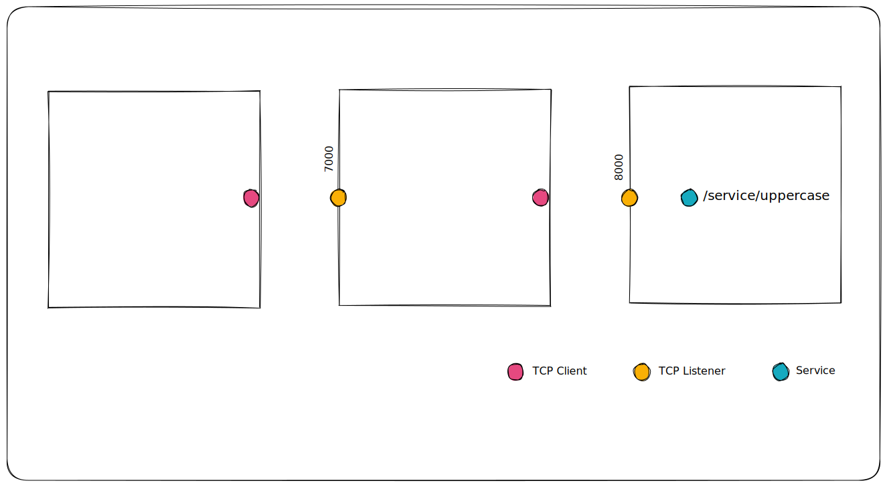

# Secure Channels

To [<mark style="color:blue;">trust data-in-motion</mark>](../../#trust-for-data-in-motion), applications need end-to-end guarantees of data authenticity, integrity, and confidentiality.

In previous sections we saw how Ockam [<mark style="color:blue;">Routing</mark>](routing.md) and [<mark style="color:blue;">Transports</mark>](routing.md#transport)<mark style="color:blue;">,</mark> when combined with the ability to model [<mark style="color:blue;">Bridges</mark>](advanced-routing.md) and [<mark style="color:blue;">Relays</mark>](advanced-routing.md#relay), make it possible to <mark style="color:orange;">create end-to-end, application layer protocols in</mark> <mark style="color:orange;"></mark><mark style="color:orange;">**any**</mark> <mark style="color:orange;"></mark><mark style="color:orange;">communication topology</mark> - across networks, clouds, and protocols over many transport layer hops.

Ockam [Secure Channels](secure-channels.md#secure-channel) is an end-to-end protocol build on top of Ockam Routing. This cryptographic protocol guarantees data authenticity, integrity, and confidentiality over any communication topology that can be traversed with Ockam Routing.


Distributed applications that are connected in this way can communicate without the risk of spoofing, tampering, or eavesdropping attacks irrespective of transport protocols, communication topologies, and network configuration. As application data flows _across data centers, through queues and caches, via gateways and brokers -_ these intermediaries, like the relay in the above picture, can facilitate communication but cannot eavesdrop or tamper data.

In contrast, traditional secure communication implementations are typically tightly coupled with transport protocols in a way that all their security is limited to the length and duration of one underlying transport connection.

For example, most TLS implementations are tightly coupled with the underlying TCP connection. If your application’s data and requests travel over two TCP connection hops `TCP -> TCP` then all TLS guarantees break at the bridge between the two networks. This bridge, gateway or load balancer then becomes a point of weakness for application data.

To make matters worse, if you don't setup another mutually authenticated TLS connection on the second hop between the gateway and your destination server then the entire second hop network – that may have thousands of applications and machines within it – becomes an attack vector to your application and its data. If any of these neighboring applications or machines are compromised then your application and its data can be easily compromised.

Traditional secure communication protocols are also unable to protect your application’s data if it travels over multiple different transport protocols. They can’t guarantee data authenticity or data integrity if your application’s communication path is `UDP -> TCP` or `BLE -> TCP`.

Ockam [<mark style="color:blue;">Routing</mark>](routing.md) and [<mark style="color:blue;">Transports</mark>](routing.md#transport)<mark style="color:blue;">,</mark> when combined with the ability to model [<mark style="color:blue;">Bridges</mark>](advanced-routing.md) and [<mark style="color:blue;">Relays</mark>](advanced-routing.md#relay) make it possible to bidirectionally exchange messages over a large variety of communication topologies: `TCP -> TCP` or `TCP -> TCP -> TCP` or `BLE -> UDP -> TCP` or `BLE -> TCP -> TCP` or `TCP -> Kafka -> TCP` etc.

By layering Ockam Secure Channels over Ockam Routing its becomes simple to provide end-to-end, application layer guarantees of data authenticity, integrity, and confidentiality in any communication topology.

## Secure Channel

Ockam Secure Channels provides the following <mark style="color:orange;">end-to-end guarantees</mark>:

1. **Authenticity:** Each end of the channel knows that messages received on the channel must have been sent by someone who possesses the secret keys of a specific Ockam Identifier.
2. **Integrity:** Each end of the channel knows that the messages received on the channel could not have been tapered en-route and are exactly what was sent by the authenticated sender at the other end of the channel.
3. **Confidentiality:**  Each end of the channel knows that the contents of messages received on the channel could not have been observed en-route between the sender and the receiver.



To establish the secure channel, the two ends run an [authenticated key establishment](../protocols/secure-channels.md) protocol and then [authenticate](identities.md#identifier-authentication) each other's [Ockam Identifier](identities.md#identifier) by signing the transcript hash of the key establishment protocol. The cryptographic key establishment safely derives shared secrets without transporting these secrets on the wire.

Once the shared secrets are established, they are used for authenticated encryption that ensures data integrity and confidentiality of application data.

Our secure channel protocol is based on a handshake design pattern described in the Noise Protocol Framework. Designs based on this framework are widely deployed and the described patterns have formal security proofs. The specific pattern that we use in Ockam Secure Channels provides sender and receiver authentication and is resistant to key compromise impersonation attacks. It also ensures integrity and secrecy of application data and provides strong forward secrecy.

Now that you're familiar with the basics, let's create some secure channels. If you haven't already, [<mark style="color:blue;">install ockam command</mark>](./#install)<mark style="color:blue;">,</mark> run `ockam enroll`, and delete any nodes from previous examples with `ockam node delete --all`.

## Hello Secure Channels <a href="#hello" id="hello"></a>

In this example we'll create a secure channel from [Node](nodes.md) `n1` to node `n2`. Ever node created with Ockam Command starts a secure channel listener at address `/service/api`.

```
» ockam node create n1
» ockam node create n2
» ockam secure-channel create --from n1 --to /node/n2/service/api

  Created Secure Channel:
  • From: /node/n1
  •   To: /node/n2/service/api (/ip4/127.0.0.1/tcp/53483/service/api)
  •   At: /service/d92ef0aea946ec01cdbccc5b9d3f2e16

» ockam message send hello --from n1 --to /service/d92ef0aea946ec01cdbccc5b9d3f2e16/service/uppercase
HELLO
```

In the above example `n1` and `n2` mutually authenticate using the default [Ockam Identity](identities.md) that was generated when we create the first node. Both nodes, in this case, are using the same identity.

Once the channel is created, note above how we used the service address of the channel on `n1` to send messages through the channel. This can be shortened to one step:

```
» ockam secure-channel create --from n1 --to /node/n2/service/api \
    | ockam message send hello --from n1 --to -/service/uppercase
```

The first command writes `/service/a1a2cc8a5a89e07cde1c0683c130f6c3` the address of a new secure channel on `n1` to standard output and the second command replaces the `-` in the `to` argument with this value from standard input. Everything else works the same.

## Through a Relay

In the previous section, we saw how [<mark style="color:blue;">Relays</mark>](advanced-routing.md#relay) make it possible to establish end-to-end protocols with services operating in a remote private networks, without requiring a remote service to expose listening ports on an outside hostile network like the Internet. We also learnt that Ockam Orchestrator can create and manage [<mark style="color:blue;">Elastic Relays</mark>](advanced-routing.md#elastic-relays) that are designed for high throughput and low latency.


```
» ockam node delete --all
» ockam project information --output json > project.json

» ockam node create a --project project.json
» ockam node create b --project project.json

» ockam forwarder create b --at /project/default --to /node/a
/service/forward_to_b

» ockam secure-channel create --from a --to /project/default/service/forward_to_b/service/api \
    | ockam message send hello --from a --to -/service/uppercase
HELLO
```

## Secure Portals


```
» python3 -m http.server --bind 127.0.0.1 9000

» ockam tcp-outlet create --at a --from /service/outlet --to 127.0.0.1:9000
» ockam secure-channel create --from a --to /project/default/service/forward_to_b/service/api \
    | ockam tcp-inlet create --at a --from 127.0.0.1:6000 --to -/service/outlet

» curl --head 127.0.0.1:6000
HTTP/1.0 200 OK
...
```

## Mutual Authorization

Trust and authorization decisions must be anchored in some pre-existing knowledge.

```
» ockam node delete --all

» ockam identity create i1
» ockam identity show i1 > i1.identifier
» ockam node create n1 --identity i1

» ockam identity create i2
» ockam identity show i2 > i2.identifier
» ockam node create n2 --identity i2

» ockam secure-channel-listener create l --at n2 \
    --identity i2 --authorized $(cat i1.identifier)

» ockam secure-channel create \
    --from n1 --to /node/n2/service/l \
    --identity i1 --authorized $(cat i2.identifier) \
      | ockam message send hello --from n1 --to -/service/uppercase
HELLO
```

#### Recap


To cleanup and delete all nodes, run: `ockam node delete --all`


Ockam [Secure Channels](secure-channels.md#secure-channel) is an end-to-end protocol build on top of Ockam Routing. This cryptographic protocol guarantees data authenticity, integrity, and confidentiality over any communication topology that can be traversed with Ockam Routing.


If you’re stuck or have questions at any point, [<mark style="color:blue;">please reach out to us</mark>](https://www.ockam.io/contact)<mark style="color:blue;">**.**</mark>


Next let's explore how we can scale mutual authentication with Ockam [Credentials](credentials.md).
