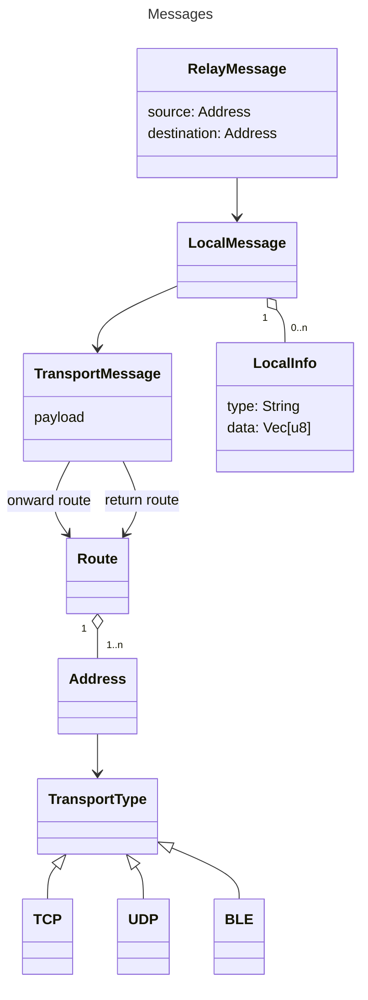
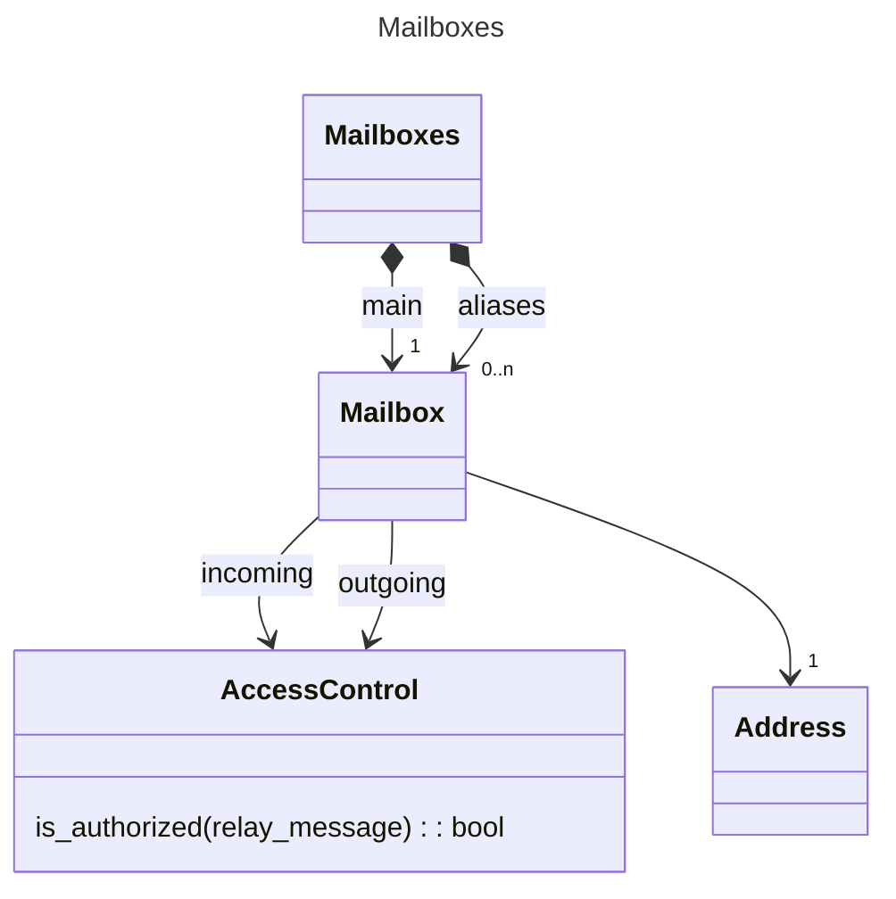
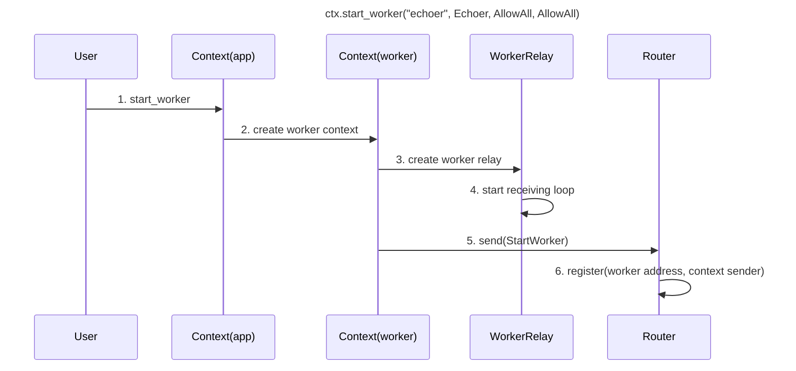
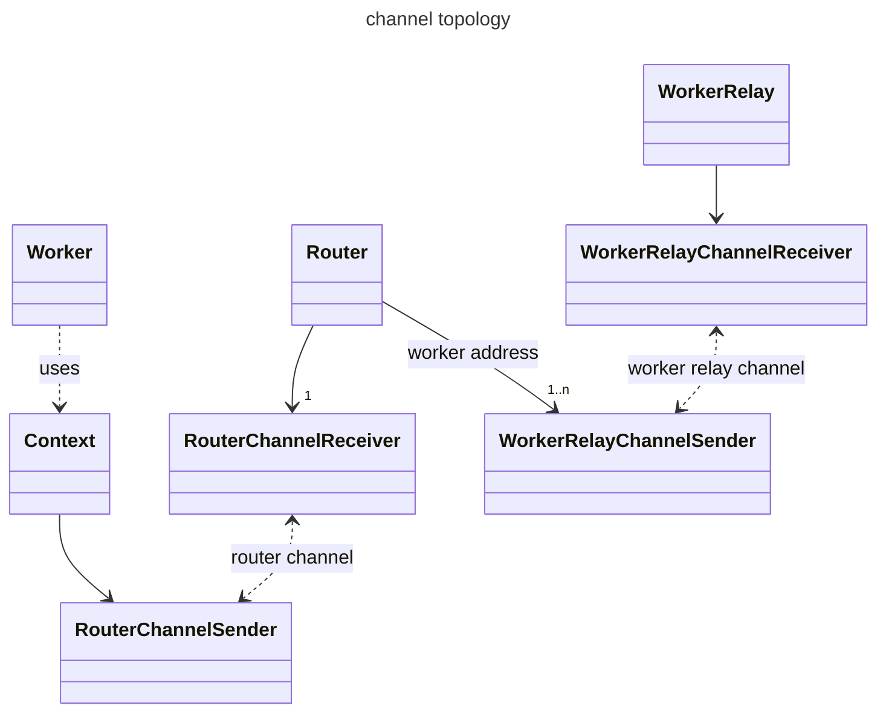
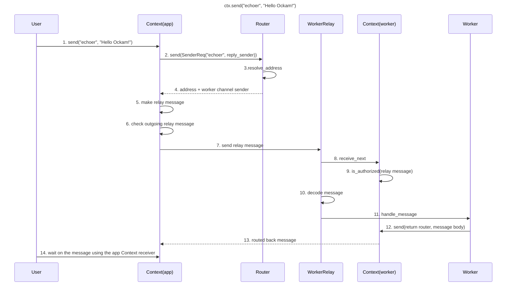

# Nodes and Workers

## ockam-core crate

The `ockam-core` crate defines types for creating routes and sending of messages:

* `Address`: a location on a machine, accessible via a `TransportType`
* `TransportType`: a type of protocol for routing payloads between addresses
* `Route`: a list of addresses used to send messages between peers
* `TransportMessage`: a payload that is routed between a sender and a receiver through a `Route`. The deserialized payload can be processed by a `Worker` at the end of the onward route and messages created by a worker can be sent through the return route.
* `LocalMessage`: a `TransportMessage` with additional metadata which is safe to be read inside a local node
* `RelayMessage`: a `LocalMessage` with a source and destination which might be different than the end of the underlying return route and the end of the underlying onward route

This diagram shows the relationships for messages:

This diagram shows the relationships for mailboxes:

* `Mailbox`: an `Address` with access control policies used when a `Worker` receives or emits messages
* `Mailboxes`: a list of `Addresses` for a `Worker` with a main address and some alias addresses
* `AccessControl`: a policy for authorizing a `RelayMessage`, either before its processing by a `Worker` or a message sent by a `Worker`
* `Worker`: an asynchronous handler of messages
* `Processor`: an asynchronous activity producing side-effects (reading from a socket for example)

### ockam-node

The `ockam-node` crate uses the entities available in the `ockam_core` crate to effectively route messages between workers:

* `NodeMessage`: binary message received by a node. It is handled by a `Router`
* `Router`: a `Router` is responsible for
  * keeping a list of active `Workers`/`Processors`, identified by their `Mailbox` address
  * keeping a list of routers for registered `Transports`, identified by their address
  * returning a `Worker` given an `Address` along with a channel sender to send a `RelayMessage` to the worker

Note: a `Router` communicates asynchronously with the `Context` by processing `NodeMessages` and sending back `NodeReplyResults`

* `Executor`: an `Executor` essentially contains a handle to the (tokio) runtime, and a reference to the `Router`
* `Context`: a `Context` controls the communication of a `Worker` (or `Processor`) with the rest of the system. It contains:
  * a list of mailboxes (cf addresses + access control rules) on which the worker can receive messages
  * a channel receiver to receive messages from the `Router` (incoming messages)
  * a channel sender to send messages to the `Router` (outgoing messages)
  * a `Handle` to the runtime system to start threads (not used directly in workers)
  * `ctx.address()`: used for debugging
  * `ctx.aliases()`: used for debugging

The following diagrams show the interactions between the top level `Context`, the `Router` and a `Worker` when sending a local message. This is how a `Worker` is started when calling `start_worker`

The steps are the following:

1. call `start_worker` with the worker address and `Worker` object
2. a `Worker` context is created with a channel allowing to send and receive messages
3. a `WorkerRelay` is started.
4. the `WorkerRelay` is essentially a loop which waits for messages addressed to the worker, decodes them, and pass it to the worker so that they can be handled
5. a `StartWorker` message is created and sent to the `Router` via the router channel sender which is available on the `Context(worker)`. That message contains the worker address and the worker channel sender (the worker channel receiver is stored in the `Context(worker)` and used by the `WorkerRelay`)
6. the `Router` stores the worker address + channel sender in a map for later retrieval

As we can see, there are several entities communicating via channels. Here is a diagram showing the channel topology in order to make things clear:

Then, we send a message to the `Worker` address

The steps are the following:

1. the user sends a string message to the echoer worker address
2. the app `Context` sends a request to the `Router` to find out which `Worker` is registered at the echoer address. A temporary channel is created to get the response asynchronously
3. the `Router` finds out in its internal map which `Worker` was registered at the "echoer" address
4. the `Router` returns the address and the channel sender that the `WorkerRelay` for the Echoer worker is using to receive messages
5. the app `Context` constructs a `RelayMessage` by encoding the message string in a `TransportMessage` then adding local information to make a `LocalMessage`, and finally sender / destination addresses to make a `RelayMessage`
6. the app `Context` checks, using its `Mailbox`, that it is authorized to send this `RelayMessage`
7. the app `Context` sends the relay message to the `WorkerRelay` channel sender
8. the `WorkerRelay` loop tries to receive the next message from the worker `Context`
9. the worker `Context` checks, via its `Mailbox`, that the `RelayMessage` is an authorized incoming message
10. the `WorkerRelay` decodes the `RelayMessage` to make it a `Routed<M>` message where `M` is the type of message which can be processed by the `Worker`
11. the `WorkerRelay` calls the `Worker` `handle_message` function
12. the `Worker` just uses its worker `Context` to send back the message using the return route specified on the `Routed` message
13. the echoed message follows the steps 2. to 12. in order to reach the app `Context`
14. the User waits on the app `Context` channel receiver to get the echoed message
