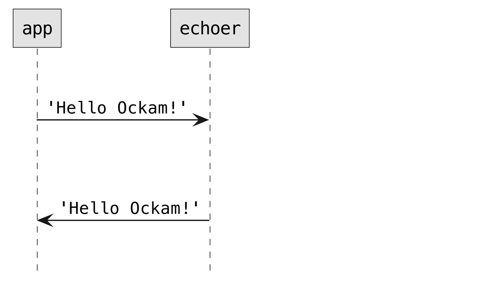

# Nodes and Workers

At Ockam’s core are a collection of cryptographic and messaging protocols. These protocols make it possible to create **private** and **secure by design** applications that provide end-to-end application layer trust it data.

Our goal is to make these powerful protocols **easy** and **safe** to use **in any application environment** – from highly scalable cloud services to tiny battery operated microcontroller based devices.

However, many of these protocols require multiple steps and have complicated internal state that must be managed with care. It can be quite challenging to make them simple to use, secure and platform independent.

Ockam [Nodes](nodes.md#node) and [Workers](nodes.md#worker) help us decouple from the host environment and provide simple interfaces to complex, stateful, and asynchronous message-based protocols.

## Node

An Ockam Node is any program that can interact with other Ockam Nodes using various Ockam Protocols like Ockam [Routing](routing.md) and Ockam Secure Channels.

Using the Ockam Rust crates, you can easily turn any application into a lightweight Ockam Node. This flexible approach allows your to build secure by design applications that can run efficiently on tiny microcontrollers or scale horizontally in cloud environments.

Rust based Ockam Nodes run very lightweight, concurrent, stateful actors called Ockam [Workers](nodes.md#worker). Using Ockam Routing, a node can deliver messages from one worker to another local worker. Using Ockam Transports, nodes can also route messages to workers on other remote nodes.

A node requires an asynchronous runtime to concurrently execute workers. The default Ockam Node implementation uses `tokio`, a popular asynchronous runtime in the Rust ecosystem. We also support Ockam Node implementations for various `no_std` embedded targets.

#### Create a node

The first thing any Ockam rust program must do is initialize and start an Ockam node. This setup can be done manually but the most convenient way is to use the `#[ockam::node]` attribute that injects the initialization code. It creates the asynchronous environment, initializes worker management, sets up routing and initializes the node context.

For your new node, create a new file at `examples/01-node.rs` in your [hello\_ockam](broken-reference) project:

```
touch examples/01-node.rs
```

Add the following code to this file:

```rust
// examples/01-node.rs
// This program creates and then immediately stops a node.

use ockam::{Context, Result};

#[ockam::node]
async fn main(mut ctx: Context) -> Result<()> {
    // Stop the node as soon as it starts.
    ctx.stop().await
}
```

Here we add the `#[ockam::node]` attribute to an `async` main function that receives the node execution context as a parameter and returns `ockam::Result` which helps make our error reporting better.

As soon as the main function starts, we use `ctx.stop()` to immediately stop the node that was just started. If we don't add this line, the node will run forever.

To run the node program:

```
cargo run --example 01-node
```

This will download various dependencies, compile and then run our code. When it runs, you'll see log output that shows the node starting and then immediately shutting down.

## Worker

Ockam [Nodes](nodes.md#node) run very lightweight, concurrent, and stateful actors called Ockam Workers.

When a worker is started on a node, it is given one or more addresses. The node maintains a mailbox for each address and whenever a message arrives for a specific address it delivers that message to the corresponding registered worker.

Workers can handle messages from other workers running on the same or a different node. In response to a message, an worker can: make local decisions, change its internal state, create more workers, or send more messages to other workers running on the same or a different node.

Above we've [created our first node](nodes.md#create-a-node), now let's create a new worker, send it a message, and receive a reply.

#### **Echoer worker**

To create a worker, we create a struct that can optionally have some fields to store the worker's internal state. If the worker is stateless, it can be defined as a field-less unit struct.

This struct:

* Must implement the `ockam::Worker` trait.
* Must have the `#[ockam::worker]` attribute on the Worker trait implementation
* Must define two associated types `Context` and `Message`
  * The `Context` type is usually set to `ockam::Context` which is provided by the node implementation.
  * The `Message` type must be set to the type of message the worker wishes to handle.

For a new `Echoer` worker, create a new file at `src/echoer.rs` in your [hello\_ockam](https://github.com/build-trust/ockam/blob/develop/documentation/guides/rust/#setup) project. We're creating this inside the `src` directory so we can easily reuse the `Echoer` in other examples that we'll write later in this guide:

```
touch src/echoer.rs
```

Add the following code to this file:

```rust
// src/echoer.rs

use ockam::{Context, Result, Routed, Worker};

pub struct Echoer;

#[ockam::worker]
impl Worker for Echoer {
    type Context = Context;
    type Message = String;

    async fn handle_message(&mut self, ctx: &mut Context, msg: Routed<String>) -> Result<()> {
        println!("Address: {}, Received: {}", ctx.address(), msg);

        // Echo the message body back on its return_route.
        ctx.send(msg.return_route(), msg.body()).await
    }
}
```

Note that we define the `Message` associated type of the worker as `String`, which specifies that this worker expects to handle `String` messages. We then go on to define a `handle_message(..)` function that will be called whenever a new message arrives for this worker.

In the Echoer's `handle_message(..)`, we print any incoming message, along with the address of the `Echoer`. We then take the body of the incoming message and echo it back on its return route (more about routes soon).

To make this Echoer type accessible to our main program, export it from `src/lib.rs` file by adding the following to it:

```rust
// src/lib.rs

mod echoer;
pub use echoer::*;
```

#### App worker

When a new node starts and calls an `async` main function, it turns that function into a worker with address of `"app"`. This makes it easy to send and receive messages from the main function (i.e the `"app"` worker).

In the code below, we start a new `Echoer` worker at address `"echoer"`, send this `"echoer"` a message `"Hello Ockam!"` and then wait to receive a `String` reply back from the `"echoer"`.

Create a new file at:

```
touch examples/02-worker.rs
```

Add the following code to this file:

```rust
// examples/02-worker.rs
// This node creates a worker, sends it a message, and receives a reply.

use hello_ockam::Echoer;
use ockam::access_control::AllowAll;
use ockam::{Context, Result};

#[ockam::node]
async fn main(mut ctx: Context) -> Result<()> {
    // Start a worker, of type Echoer, at address "echoer"
    ctx.start_worker("echoer", Echoer, AllowAll, AllowAll).await?;

    // Send a message to the worker at address "echoer".
    ctx.send("echoer", "Hello Ockam!".to_string()).await?;

    // Wait to receive a reply and print it.
    let reply = ctx.receive::<String>().await?;
    println!("App Received: {}", reply); // should print "Hello Ockam!"

    // Stop all workers, stop the node, cleanup and return.
    ctx.stop().await
}
```

To run this new node program:

```
cargo run --example 02-worker
```

You'll see console output that shows `"Hello Ockam!"` received by the `"echoer"` and then an echo of it received by the `"app"`.

#### Message Flow

The message flow looked like this:


<figure><figcaption></figcaption></figure>

Next, let’s explore how Ockam’s [Application Layer Routing](routing.md) enables us to create protocols that provide end-to-end security and privacy guarantees.
