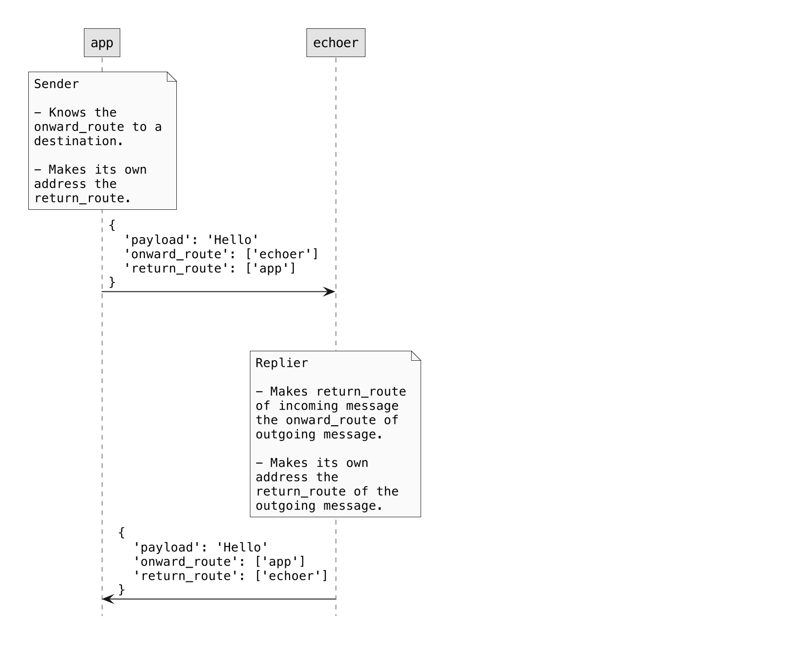
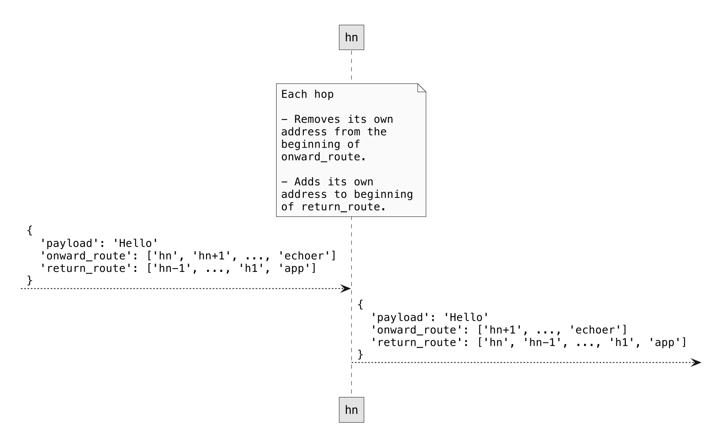

# Routing and Transports

Data, within modern applications, routinely flows over complex, multi-hop, multi-protocol routes before reaching its end destination. It’s common for application layer requests and data to move across network boundaries, beyond data centers, via shared or public networks, through queues and caches, from gateways and brokers to reach remote services and other distributed parts of an application.

Our goal is to enable end-to-end application layer guarantees in any communication topology. For example Ockam [<mark style="color:blue;">Secure Channels</mark>](secure-channels.md) can provide end-to-end guarantees of data authenticity, integrity, and confidentiality in any of the above communication topologies.

In contrast, traditional secure communication protocol implementations are typically tightly coupled with transport protocols in a way that all their security is limited to the length and duration of the underlying transport connections.

For example, most TLS[^1] implementations are coupled to the underlying TCP connection. If your application’s data and requests travel over two TCP connection hops `TCP -> TCP` then all TLS guarantees break at the bridge between the two networks. This bridge, gateway or load balancer then becomes a point of weakness for application data. To makes matters worse, if you don't setup another mutually authenticated TLS connection on the second hop between the gateway and your destination server then the entire second hop network – all applications and machines within it – become attack vectors to your application and its data.

Traditional secure communication protocols are also unable to protect your application’s data if it travels over multiple different transport protocols. They can’t guarantee data authenticity or data integrity if your application’s communication path is `UDP -> TCP` or `BLE -> TCP`.

Ockam [<mark style="color:blue;">Routing</mark>](routing.md#routing) is a simple and lightweight message based protocol that makes it possible to bidirectionally exchange message over a large variety of communication topologies: `TCP -> TCP` or `TCP -> TCP -> TCP` or `BLE -> UDP -> TCP` or `BLE -> TCP -> TCP` or `TCP -> Kafka -> TCP` and more.

By layering Ockam [<mark style="color:blue;">Secure Channels</mark>](secure-channels.md) and other protocols over Ockam Routing, we can provide end-to-end guarantees over arbitrary transport topologies.

## Routing

So far, we've created an [<mark style="color:blue;">`"echoer"`</mark> <mark style="color:blue;"></mark><mark style="color:blue;">worker</mark>](nodes.md#echoer-worker) in our node, sent it a message, and received a reply. This worker was a simple one hop away from our [<mark style="color:blue;">`"app"`</mark> <mark style="color:blue;"></mark><mark style="color:blue;">worker</mark>.](nodes.md#app-worker)

To achieve this, messages carry with them two metadata fields: `onward_route` and `return_route`, where a route is a list of addresses.

To get a sense of how that works, let's route a message over two hops.

<figure><figcaption></figcaption></figure>

<figure><figcaption></figcaption></figure>

<figure><figcaption></figcaption></figure>

<figure><figcaption></figcaption></figure>

###

#### Protocol

Sender:

* Needs to know the route to a destination, makes that route the onward\_route of a new message
* Makes its own address the return\_route of the new message

Hop:

* Removes its own address from beginning of onward\_route
* Adds its own address to beginning of return\_route

Replier:

* Makes return\_route of incoming message, onward\_route of outgoing message
* Makes its own address the return\_route of the new message

#### Hop worker

For demonstration, we'll create a simple worker, called `Hop`, that takes every incoming message and forwards it to the next address in the `onward_route` of that message.

Just before forwarding the message, `Hop`'s handle message function will:

1. Print the message
2. Remove its own address (first address) from the `onward_route`, by calling `step()`
3. Insert its own address as the first address in the `return_route` by calling `prepend()`

Create a new file at:

```
touch src/hop.rs
```

Add the following code to this file:

```rust
// src/hop.rs
use ockam::{Any, Context, Result, Routed, Worker};

pub struct Hop;

#[ockam::worker]
impl Worker for Hop {
    type Context = Context;
    type Message = Any;

    /// This handle function takes any incoming message and forwards
    /// it to the next hop in it's onward route
    async fn handle_message(&mut self, ctx: &mut Context, msg: Routed<Any>) -> Result<()> {
        println!("Address: {}, Received: {:?}", ctx.address(), msg);

        // Send the message to the next worker on its onward_route
        ctx.forward(msg.into_local_message().step_forward(&ctx.address())?)
            .await
    }
}

```

To make this `Hop` type accessible to our main program, export it from `src/lib.rs` by adding the following to it:

```rust
mod hop;
pub use hop::*;
```

#### Echoer worker

We'll also use the `Echoer` worker that we created in the [<mark style="color:blue;">previous example</mark>](nodes.md#echoer-worker). So make sure that it stays exported from `src/lib.rs`.

#### App worker

Next, let's create our main `"app"` worker.

In the code below we start an `Echoer` worker at address `"echoer"` and a `Hop` worker at address `"h1"`. Then, we send a message along the `h1 => echoer` route by passing `route!["h1", "echoer"]` to `send(..)`.

Create a new file at:

```
touch examples/03-routing.rs
```

Add the following code to this file:

```rust
// examples/03-routing.rs
// This node routes a message.

use hello_ockam::{Echoer, Hop};
use ockam::{node, route, Context, Result};

#[ockam::node]
async fn main(ctx: Context) -> Result<()> {
    // Create a node with default implementations
    let mut node = node(ctx).await?;

    // Start a worker, of type Echoer, at address "echoer"
    node.start_worker("echoer", Echoer).await?;

    // Start a worker, of type Hop, at address "h1"
    node.start_worker("h1", Hop).await?;

    // Send a message to the worker at address "echoer",
    // via the worker at address "h1"
    node.send(route!["h1", "echoer"], "Hello Ockam!".to_string()).await?;

    // Wait to receive a reply and print it.
    let reply = node.receive::<String>().await?;
    println!("App Received: {}", reply.into_body()?); // should print "Hello Ockam!"

    // Stop all workers, stop the node, cleanup and return.
    node.stop().await
}

```

To run this new node program:

```
cargo run --example 03-routing
```

Note the message flow and how routing information is manipulated as the message travels.

#### Routing over many hops

Routing is not limited to one or two hops, we can easily create routes with many hops. Let's try that in a quick example:

This time we'll create multiple hop workers between the `"app"` and the `"echoer"` and route our message through them.

Create a new file at:

```
touch examples/03-routing-many-hops.rs
```

Add the following code to this file:

```rust
// examples/03-routing-many-hops.rs
// This node routes a message through many hops.

use hello_ockam::{Echoer, Hop};
use ockam::{node, route, Context, Result};

#[ockam::node]
async fn main(ctx: Context) -> Result<()> {
    // Create a node with default implementations
    let mut node = node(ctx).await?;

    // Start an Echoer worker at address "echoer"
    node.start_worker("echoer", Echoer).await?;

    // Start 3 hop workers at addresses "h1", "h2" and "h3".
    node.start_worker("h1", Hop).await?;
    node.start_worker("h2", Hop).await?;
    node.start_worker("h3", Hop).await?;

    // Send a message to the echoer worker via the "h1", "h2", and "h3" workers
    let r = route!["h1", "h2", "h3", "echoer"];
    node.send(r, "Hello Ockam!".to_string()).await?;

    // Wait to receive a reply and print it.
    let reply = node.receive::<String>().await?;
    println!("App Received: {}", reply.into_body()?); // should print "Hello Ockam!"

    // Stop all workers, stop the node, cleanup and return.
    node.stop().await
}

```

To run this new node program:

```
cargo run --example 03-routing-many-hops
```

Note the message flow.

## Transport

An Ockam Transport is a plugin for Ockam Routing. It moves Ockam Routing messages using a specific transport protocol like TCP, UDP, WebSockets, Bluetooth etc.

In previous examples, we routed messages locally within one node. Routing messages over transport layer connections looks very similar.

Let's try the TcpTransport, we'll need to create two nodes: a [<mark style="color:blue;">responder</mark>](routing.md#responder-node) and an [<mark style="color:blue;">initiator</mark>](routing.md#initiator-node).

Create a new file at:

```
touch examples/04-routing-over-transport-responder.rs
```

Add the following code to this file:

```rust
// examples/04-routing-over-transport-responder.rs
// This node starts a tcp listener and an echoer worker.
// It then runs forever waiting for messages.

use hello_ockam::Echoer;
use ockam::tcp::{TcpListenerOptions, TcpTransportExtension};
use ockam::{node, Context, Result};

#[ockam::node]
async fn main(ctx: Context) -> Result<()> {
    // Create a node with default implementations
    let node = node(ctx).await?;

    // Initialize the TCP Transport
    let tcp = node.create_tcp_transport().await?;

    // Create an echoer worker
    node.start_worker("echoer", Echoer).await?;

    // Create a TCP listener and wait for incoming connections.
    let listener = tcp.listen("127.0.0.1:4000", TcpListenerOptions::new()).await?;

    // Allow access to the Echoer via TCP connections from the TCP listener
    node.flow_controls().add_consumer("echoer", listener.flow_control_id());

    // Don't call node.stop() here so this node runs forever.
    Ok(())
}

```

#### Initiator node

Create a new file at:

```
touch examples/04-routing-over-transport-initiator.rs
```

Add the following code to this file:

```rust
// examples/04-routing-over-transport-initiator.rs
// This node routes a message, to a worker on a different node, over the tcp transport.

use ockam::tcp::{TcpConnectionOptions, TcpTransportExtension};
use ockam::{node, route, Context, Result};

#[ockam::node]
async fn main(ctx: Context) -> Result<()> {
    // Create a node with default implementations
    let mut node = node(ctx).await?;

    // Initialize the TCP Transport.
    let tcp = node.create_tcp_transport().await?;

    // Create a TCP connection to a different node.
    let connection_to_responder = tcp.connect("localhost:4000", TcpConnectionOptions::new()).await?;

    // Send a message to the "echoer" worker on a different node, over a tcp transport.
    // Wait to receive a reply and print it.
    let r = route![connection_to_responder, "echoer"];
    let reply = node.send_and_receive::<String>(r, "Hello Ockam!".to_string()).await?;

    println!("App Received: {}", reply); // should print "Hello Ockam!"

    // Stop all workers, stop the node, cleanup and return.
    node.stop().await
}

```

#### Run

Run the responder in a separate terminal tab and keep it running:

```
cargo run --example 04-routing-over-transport-responder
```

Run the initiator:

```
cargo run --example 04-routing-over-transport-initiator
```

Note the message flow.

<figure><figcaption></figcaption></figure>

#### Routing over two transport hops

#### Relay worker

For demonstration, we'll create another worker, called `Relay`, that takes every incoming message and forwards it to the predefined address.

Just before forwarding the message, `Relay`'s handle message function will:

1. Print the message
2. Remove its own address (first address) from the `onward_route`, by calling `step()`
3. Insert predefined address as the first address in the `onward_route` by calling `prepend()`

Create a new file at:

```
touch src/relay.rs
```

Add the following code to this file:

```rust
// src/relay.rs
use ockam::{Any, Context, Result, Route, Routed, Worker};

pub struct Relay {
    route: Route,
}

impl Relay {
    pub fn new(route: impl Into<Route>) -> Self {
        let route = route.into();

        if route.is_empty() {
            panic!("Relay can't forward messages to an empty route");
        }

        Self { route }
    }
}

#[ockam::worker]
impl Worker for Relay {
    type Context = Context;
    type Message = Any;

    /// This handle function takes any incoming message and forwards
    /// it to the next hop in it's onward route
    async fn handle_message(&mut self, ctx: &mut Context, msg: Routed<Any>) -> Result<()> {
        println!("Address: {}, Received: {:?}", ctx.address(), msg);

        let next_on_route = self.route.next()?.clone();

        // Some type conversion
        let mut local_message = msg.into_local_message();

        local_message = local_message.pop_front_onward_route()?;
        local_message = local_message.prepend_front_onward_route(&self.route); // Prepend predefined route to the onward_route

        let prev_hop = local_message.return_route_ref().next()?.clone();

        if let Some(info) = ctx
            .flow_controls()
            .find_flow_control_with_producer_address(&next_on_route)
        {
            ctx.flow_controls()
                .add_consumer(prev_hop.clone(), info.flow_control_id());
        }

        if let Some(info) = ctx.flow_controls().find_flow_control_with_producer_address(&prev_hop) {
            ctx.flow_controls().add_consumer(next_on_route, info.flow_control_id());
        }

        // Send the message on its onward_route
        ctx.forward(local_message).await
    }
}

```

To make this `Relay` type accessible to our main program, export it from `src/lib.rs` by adding the following to it:

```rust
mod relay;
pub use relay::*;
```

#### Responder node

Create a new file at:

```
touch examples/04-routing-over-transport-two-hops-responder.rs
```

Add the following code to this file:

```rust
// examples/04-routing-over-transport-two-hops-responder.rs
// This node starts a tcp listener and an echoer worker.
// It then runs forever waiting for messages.

use hello_ockam::Echoer;
use ockam::tcp::{TcpListenerOptions, TcpTransportExtension};
use ockam::{node, Context, Result};

#[ockam::node]
async fn main(ctx: Context) -> Result<()> {
    // Create a node with default implementations
    let node = node(ctx).await?;

    // Initialize the TCP Transport
    let tcp = node.create_tcp_transport().await?;

    // Create an echoer worker
    node.start_worker("echoer", Echoer).await?;

    // Create a TCP listener and wait for incoming connections.
    let listener = tcp.listen("127.0.0.1:4000", TcpListenerOptions::new()).await?;

    // Allow access to the Echoer via TCP connections from the TCP listener
    node.flow_controls().add_consumer("echoer", listener.flow_control_id());

    // Don't call node.stop() here so this node runs forever.
    Ok(())
}

```

#### Middle node

Create a new file at:

```
touch examples/04-routing-over-transport-two-hops-middle.rs
```

Add the following code to this file:

```rust
// examples/04-routing-over-transport-two-hops-middle.rs
// This node creates a tcp connection to a node at 127.0.0.1:4000
// Starts a relay worker to forward messages to 127.0.0.1:4000
// Starts a tcp listener at 127.0.0.1:3000
// It then runs forever waiting to route messages.

use hello_ockam::Relay;
use ockam::tcp::{TcpConnectionOptions, TcpListenerOptions, TcpTransportExtension};
use ockam::{node, Context, Result};

#[ockam::node]
async fn main(ctx: Context) -> Result<()> {
    // Create a node with default implementations
    let node = node(ctx).await?;

    // Initialize the TCP Transport
    let tcp = node.create_tcp_transport().await?;

    // Create a TCP connection to the responder node.
    let connection_to_responder = tcp.connect("127.0.0.1:4000", TcpConnectionOptions::new()).await?;

    // Create and start a Relay worker
    node.start_worker("forward_to_responder", Relay::new(connection_to_responder))
        .await?;

    // Create a TCP listener and wait for incoming connections.
    let listener = tcp.listen("127.0.0.1:3000", TcpListenerOptions::new()).await?;

    // Allow access to the Relay via TCP connections from the TCP listener
    node.flow_controls()
        .add_consumer("forward_to_responder", listener.flow_control_id());

    // Don't call node.stop() here so this node runs forever.
    Ok(())
}

```

#### Initiator node

Create a new file at:

```
touch examples/04-routing-over-transport-two-hops-initiator.rs
```

Add the following code to this file:

```rust
// examples/04-routing-over-transport-two-hops-initiator.rs
// This node routes a message, to a worker on a different node, over two tcp transport hops.

use ockam::tcp::{TcpConnectionOptions, TcpTransportExtension};
use ockam::{node, route, Context, Result};

#[ockam::node]
async fn main(ctx: Context) -> Result<()> {
    // Create a node with default implementations
    let mut node = node(ctx).await?;

    // Initialize the TCP Transport
    let tcp = node.create_tcp_transport().await?;

    // Create a TCP connection to the middle node.
    let connection_to_middle_node = tcp.connect("localhost:3000", TcpConnectionOptions::new()).await?;

    // Send a message to the "echoer" worker, on a different node, over two tcp hops.
    // Wait to receive a reply and print it.
    let r = route![connection_to_middle_node, "forward_to_responder", "echoer"];
    let reply = node.send_and_receive::<String>(r, "Hello Ockam!".to_string()).await?;
    println!("App Received: {}", reply); // should print "Hello Ockam!"

    // Stop all workers, stop the node, cleanup and return.
    node.stop().await
}

```

#### Run

Run the responder in a separate terminal tab and keep it running:

```
cargo run --example 04-routing-over-transport-two-hops-responder
```

Run the middle node in a separate terminal tab and keep it running:

```
cargo run --example 04-routing-over-transport-two-hops-middle
```

Run the initiator:

```
cargo run --example 04-routing-over-transport-two-hops-initiator
```

Note how the message is routed.

[^1]: Transport Layer Security
