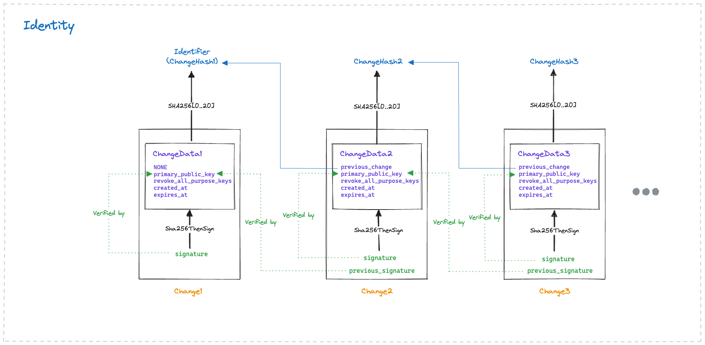
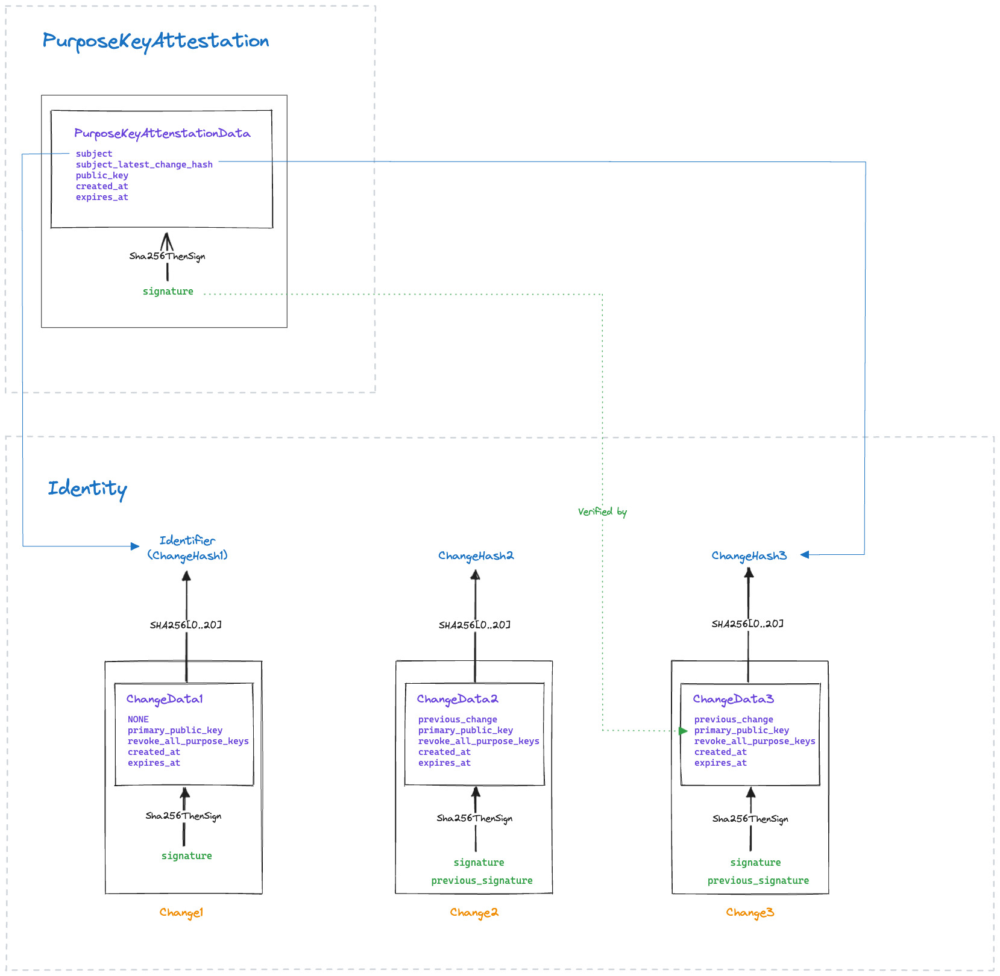
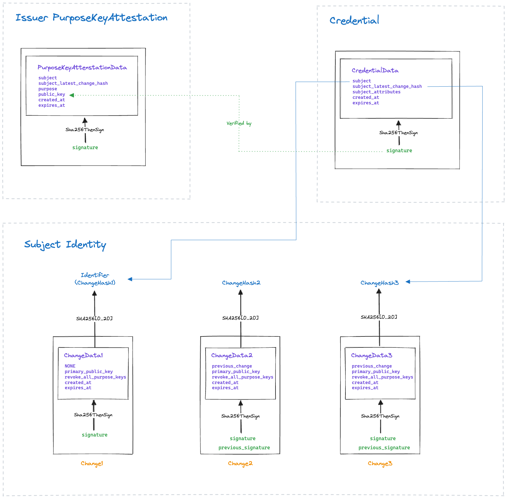

# Identities and Credentials

## Identities

Ockam Identities are cryptographically verifiable digital identities. Each Identity maintains one or more secret keys and has a unique Ockam Identifier.

When an Ockam Identity is first created, it generates a random primary secret key inside an Ockam Vault. This secret key must be capable of performing a `ChangeSignature`. We support two types of change signatures - `EdDSACurve25519Signature` or `ECDSASHA256CurveP256Signature`. When both options are supported by a vault implementation that `EdDSACurve25519Signature` is our preferred option.

The public part of the primary secret key is then written into a `Change` (see data structure below) and this `Change` includes a signature using the primary secret key. The SHA256 hash of this first Change, truncated to its first 20 bytes, becomes the the forever Ockam `Identifier` of this Identity. Each change includes a `created_at` timestamp to indicate when the change was created and an `expires_at` timestamp to indicate when the `primary_public_key` included in the change should stop being relied on as the primary public key of this identity.

Whenever the identity wishes to rotate to a new primary public key and revoke all previous primary public keys it can create a new `Change`. This new change includes two signatures - one by the previous primary secret key and another by a newly generated primary secret key. Over time, this creates a signed ChangeHistory, the latest Change in this history indicates the self-attested latest primary public key of this Identity.

&#x20;

<div data-full-width="true">

<figure><figcaption><p>Note the green lines that indicate which signature is verified by which public key.</p></figcaption></figure>

</div>


```rust
#[derive(Encode, Decode)]
#[cbor(transparent)]
pub struct Identifier(#[cbor(n(0), with = "minicbor::bytes")] pub [u8; 20]);

/// SHA256 hash of a Change, truncated to its first 20 bytes.
#[derive(Encode, Decode)]
#[cbor(transparent)]
pub struct ChangeHash(#[cbor(n(0), with = "minicbor::bytes")] pub [u8; 20]);

#[derive(Encode, Decode)]
#[cbor(transparent)]
pub struct ChangeHistory(#[n(0)] pub Vec<Change>);

#[derive(Encode, Decode)]
pub struct Change {
    #[cbor(with = "minicbor::bytes")]
    #[n(0)]
    pub data: Vec<u8>,

    #[n(1)]
    pub signature: ChangeSignature,

    #[n(2)]
    pub previous_signature: Option<ChangeSignature>,
}

#[derive(Encode, Decode)]
pub enum ChangeSignature {
    #[n(0)]
    EdDSACurve25519(#[n(0)] EdDSACurve25519Signature),

    #[n(1)]
    ECDSASHA256CurveP256(#[n(0)] ECDSASHA256CurveP256Signature),
}

#[derive(Encode, Decode)]
pub struct ChangeData {
    #[n(0)]
    pub previous_change: Option<ChangeHash>,

    #[n(1)]
    pub primary_public_key: PrimaryPublicKey,

    #[n(2)]
    pub revoke_all_purpose_keys: bool,

    #[n(3)]
    pub created_at: TimestampInSeconds,

    #[n(4)]
    pub expires_at: TimestampInSeconds,
}

#[derive(Encode, Decode)]
pub enum PrimaryPublicKey {
    #[n(0)]
    EdDSACurve25519(#[n(0)] EdDSACurve25519PublicKey),

    #[n(1)]
    ECDSASHA256CurveP256(#[n(0)] ECDSASHA256CurveP256PublicKey),
}

#[derive(Encode, Decode)]
pub struct VersionedData {
    #[n(0)]
    pub version: u8,

    #[cbor(with = "minicbor::bytes")]
    #[n(1)]
    pub data: Vec<u8>,
}

#[derive(Encode, Decode)]
#[cbor(transparent)]
pub struct TimestampInSeconds(#[n(0)] pub u64);
```


## Purpose Key Attestations

An Ockam Identity can use its primary secret key to sign `PurposeKeyAttestation`s (see data structure below). These attestations indicate which public keys (and corresponding secret keys) the identity wishes to use for issuing credentials and authenticating itself within secure channels.

Each attestation includes an `expires_at` timestamp to indicate when the included public key should no longer be relied on for its indicated purpose. The Identity's ChangeHistory can include a Change which has `revoke_all_purpose_keys` set to true. All purpose key attestations created before the `created_at` timestamp of this change are also be considered expired.

<div data-full-width="true">

<figure><figcaption><p>Note the green lines that indicate which signature is verified by which public key.</p></figcaption></figure>

</div>


```rust
#[derive(Encode, Decode)]
pub struct PurposeKeyAttestation {
    #[cbor(with = "minicbor::bytes")]
    #[n(0)]
    pub data: Vec<u8>,

    #[n(1)]
    pub signature: PurposeKeyAttestationSignature,
}

#[derive(Encode, Decode)]
pub enum PurposeKeyAttestationSignature {
    #[n(0)]
    EdDSACurve25519(#[n(0)] EdDSACurve25519Signature),

    #[n(1)]
    ECDSASHA256CurveP256(#[n(0)] ECDSASHA256CurveP256Signature),
}

#[derive(Encode, Decode)]
pub struct PurposeKeyAttestationData {
    #[n(0)]
    pub subject: Identifier,

    #[n(1)]
    pub subject_latest_change_hash: ChangeHash,

    #[n(2)]
    pub public_key: PurposePublicKey,

    #[n(3)]
    pub created_at: TimestampInSeconds,

    #[n(4)]
    pub expires_at: TimestampInSeconds,
}

#[derive(Encode, Decode)]
pub enum PurposePublicKey {
    #[n(0)]
    SecureChannelStatic(#[n(0)] X25519PublicKey),

    #[n(1)]
    CredentialSigning(#[n(0)] VerifyingPublicKey),
}
```


## Credentials

An Ockam Credential is a signed attestation by an <mark style="color:orange;">Issuer</mark> about the <mark style="color:orange;">Attributes</mark> of a <mark style="color:orange;">Subject</mark>. The Issuer and Subject are both Ockam Identities. Attributes is a map of name and value pairs.

Any Identity can issue credentials attesting to attributes of another Ockam Identity. This does not imply that these attestations should be considered authoritative about the subject's attributes. Who is an authority on which attributes of which subjects is defined using Ockam Trust Contexts.

Each signed credential includes an `expires_at` field to indicate a timestamp beyond which the attestation made in the credential should no longer be relied on.

<div data-full-width="true">

<figure><figcaption><p>Note the green lines that indicate which signature is verified by which public key.</p></figcaption></figure>

</div>


```rust
#[derive(Encode, Decode)]
pub struct Credential {
    #[cbor(with = "minicbor::bytes")]
    #[n(0)]
    pub data: Vec<u8>,

    #[n(1)]
    pub signature: CredentialSignature,
}

#[derive(Encode, Decode)]
pub enum CredentialSignature {
    #[n(0)]
    EdDSACurve25519(#[n(0)] EdDSACurve25519Signature),

    #[n(1)]
    ECDSASHA256CurveP256(#[n(0)] ECDSASHA256CurveP256Signature),
}

#[derive(Encode, Decode)]
pub struct CredentialData {
    #[n(0)]
    pub subject: Option<Identifier>,

    #[n(1)]
    pub subject_latest_change_hash: Option<ChangeHash>,

    #[n(2)]
    pub subject_attributes: Attributes,

    #[n(3)]
    pub created_at: TimestampInSeconds,

    #[n(4)]
    pub expires_at: TimestampInSeconds,
}

#[derive(Encode, Decode)]
#[cbor(transparent)]
pub struct CredentialSchemaIdentifier(#[n(0)] pub u64);

#[derive(Encode, Decode)]
pub struct Attributes {
    #[n(0)]
    pub schema: CredentialSchemaIdentifier,

    #[n(1)]
    pub map: BTreeMap<Vec<u8>, Vec<u8>>,
}
```


The Attributes type above includes a schema identifier that refers to a schema that defines the meaning of each attribute. For example, Project Membership Authorities within an Ockam Orchestrator Project use a specific schema identifier and define attributes like `enroller` which indicates that an Identity that possess a credential with enroller attribute set to true can request one-time user enrollment tokens to invite new members to the project.
