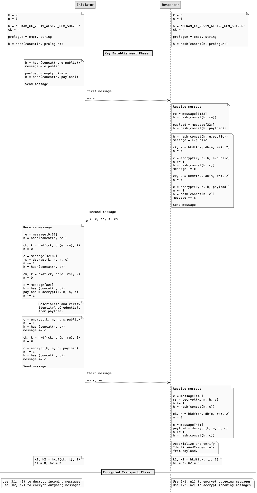
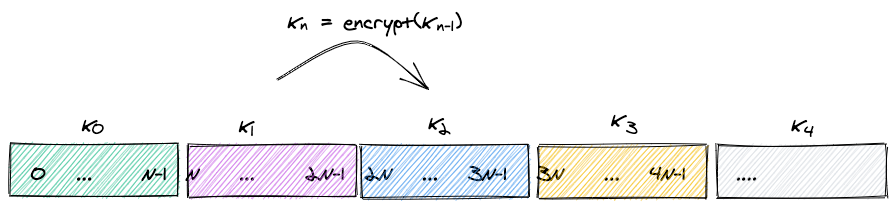
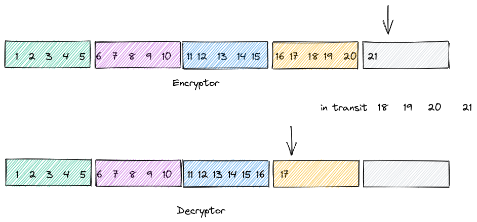
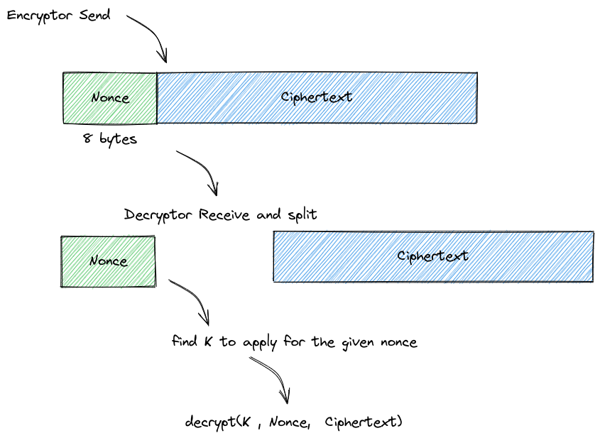
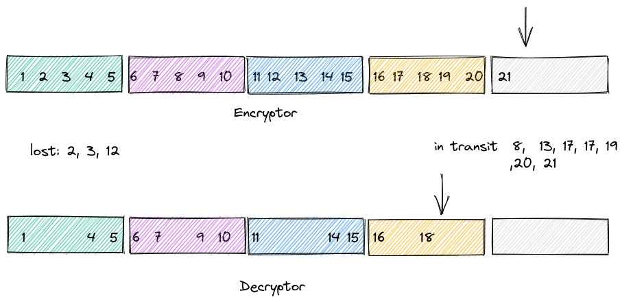
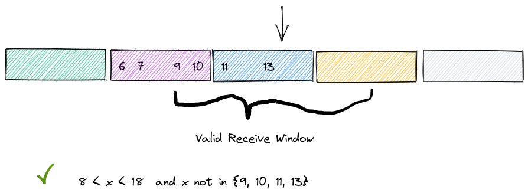
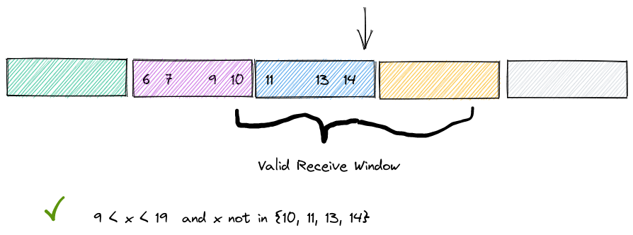
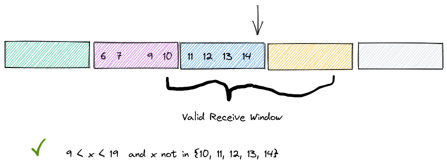

# Secure Channels

Ockam Routing and Transports, combined with the ability to model Bridges and Relays, make it possible to run end-to-end, application layer protocols in a variety of communication topologies - across many network connection hops and protocols boundaries.

Ockam Secure Channels is an end-to-end protocol built on top of Ockam Routing. This cryptographic protocol guarantees data authenticity, integrity, and confidentiality over any communication topology that can be traversed with Ockam Routing.


## Secure Channel

A secure channel has two participants (ends). A participant that starts a `Listener` and creates dedicated `Responder`s whenever a new protocol session is initiated. Another participant, called the `Initiator`, initiates the protocol with a Listener.

Running this protocol requires a stateful exchange of multiple messages and having a worker and routing system allows Ockam to hide the complexity of creating and maintaining a secure channel behind two simple functions:


```rust
/// Creates a secure channel listener and waits for messages from secure channel Initiator.
pub async fn create_secure_channel_listener(
    &self,
    identifier: &Identifier,
    address: impl Into<Address>,
    options: impl Into<SecureChannelListenerOptions>,
) -> Result<SecureChannelListener> { ... }

/// Initiates the protocol to create a secure channel with a secure channel Listener.
pub async fn create_secure_channel(
    &self,
    identifier: &Identifier,
    route_to_a_secure_channel_listener: impl Into<Route>,
    options: impl Into<SecureChannelOptions>,
) -> Result<SecureChannel> { ... }
```


Let's see this in action before we dive into the protocol. The following example is similar to the earlier multi hop routing example but this this time the `echoer` is accessed through and end-to-end secure channel.

#### Responder node


```rust
// examples/05-secure-channel-over-two-transport-hops-responder.rs
// This node starts a tcp listener, a secure channel listener, and an echoer worker.
// It then runs forever waiting for messages.

use hello_ockam::Echoer;
use ockam::identity::SecureChannelListenerOptions;
use ockam::{node, Context, Result, TcpListenerOptions, TcpTransportExtension};

#[ockam::node]
async fn main(ctx: Context) -> Result<()> {
    // Create a node with default implementations
    let node = node(ctx).await?;

    // Initialize the TCP Transport.
    let tcp = node.create_tcp_transport().await?;

    node.start_worker("echoer", Echoer).await?;

    let bob = node.create_identity().await?;

    // Create a TCP listener and wait for incoming connections.
    let listener = tcp.listen("127.0.0.1:4000", TcpListenerOptions::new()).await?;

    // Create a secure channel listener for Bob that will wait for requests to
    // initiate an Authenticated Key Exchange.
    let secure_channel_listener = node
        .create_secure_channel_listener(
            &bob,
            "bob_listener",
            SecureChannelListenerOptions::new().as_consumer(listener.flow_control_id()),
        )
        .await?;

    // Allow access to the Echoer via Secure Channels
    node.flow_controls()
        .add_consumer("echoer", secure_channel_listener.flow_control_id());

    // Don't call node.stop() here so this node runs forever.
    Ok(())
}

```


#### Middle node


```rust
// examples/05-secure-channel-over-two-transport-hops-middle.rs
// This node creates a tcp connection to a node at 127.0.0.1:4000
// Starts a relay worker to forward messages to 127.0.0.1:4000
// Starts a tcp listener at 127.0.0.1:3000
// It then runs forever waiting to route messages.

use hello_ockam::Relay;
use ockam::{node, Context, Result, TcpConnectionOptions, TcpListenerOptions, TcpTransportExtension};

#[ockam::node]
async fn main(ctx: Context) -> Result<()> {
    // Create a node with default implementations
    let node = node(ctx).await?;

    // Initialize the TCP Transport
    let tcp = node.create_tcp_transport().await?;

    // Create a TCP connection to Bob.
    let connection_to_bob = tcp.connect("127.0.0.1:4000", TcpConnectionOptions::new()).await?;

    // Start a Relay to forward messages to Bob using the TCP connection.
    node.start_worker("forward_to_bob", Relay(connection_to_bob.into()))
        .await?;

    // Create a TCP listener and wait for incoming connections.
    let listener = tcp.listen("127.0.0.1:3000", TcpListenerOptions::new()).await?;

    node.flow_controls()
        .add_consumer("forward_to_bob", listener.flow_control_id());

    // Don't call node.stop() here so this node runs forever.
    Ok(())
}

```


#### Initiator node


```rust
// examples/05-secure-channel-over-two-transport-hops-initiator.rs
// This node creates an end-to-end encrypted secure channel over two tcp transport hops.
// It then routes a message, to a worker on a different node, through this encrypted channel.

use ockam::identity::SecureChannelOptions;
use ockam::{node, route, Context, Result, TcpConnectionOptions, TcpTransportExtension};

#[ockam::node]
async fn main(ctx: Context) -> Result<()> {
    // Create a node with default implementations
    let mut node = node(ctx).await?;

    // Create an Identity to represent Alice.
    let alice = node.create_identity().await?;

    // Create a TCP connection to the middle node.
    let tcp = node.create_tcp_transport().await?;
    let connection_to_middle_node = tcp.connect("localhost:3000", TcpConnectionOptions::new()).await?;

    // Connect to a secure channel listener and perform a handshake.
    let r = route![connection_to_middle_node, "forward_to_bob", "bob_listener"];
    let channel = node
        .create_secure_channel(&alice, r, SecureChannelOptions::new())
        .await?;

    // Send a message to the echoer worker via the channel.
    // Wait to receive a reply and print it.
    let reply = node
        .send_and_receive::<String>(route![channel, "echoer"], "Hello Ockam!".to_string())
        .await?;
    println!("App Received: {}", reply); // should print "Hello Ockam!"

    // Stop all workers, stop the node, cleanup and return.
    node.stop().await
}

```


#### Run

Run the responder in a separate terminal tab and keep it running:

```
cargo run --example 05-secure-channel-over-two-transport-hops-responder
```

Run the middle node in a separate terminal tab and keep it running:

```
cargo run --example 05-secure-channel-over-two-transport-hops-middle
```

Run the initiator:

```
cargo run --example 05-secure-channel-over-two-transport-hops-initiator
```

### Initialization

Using `SecureChannelListenerOptions` and `SecureChannelOptions`, each participant is initialized with with the following initial state:

1. An Ockam Identifier that will be used as the Ockam Identity of this secure channel participant. Access to a Vault that contains the primary secret key for this Identifier is not required during the creation of the secure channel. We assume that a PurposeKeyAttestation for a SecureChannelStatic has already been created.
2. The SecureChannelStatic purpose key and access to its secret inside a Vault. This vault should be an implementation of the VaultForSecureChannels and VaultForVerifyingSignatures traits described earlier.
3. A Trust Context and Access Controls, that are used for authorization.
4. The following `IdentityAndCredentials` data structure that contains:
   1. The complete ChangeHistory of the Identity of this participant.
   2. A purpose key attestation, issued by the Identity of this participant, attesting to a SecureChannelStatic purpose key. This must be the same SecureChannelStatic that the participant can access the secret for inside a vault.
   3. Zero or more Credentials and corresponding PurposeKeyAttestations that can be used to verify the signature on the credential and tie a CredentialSigning verification key to the Ockam Identifier of the Credential Issuer.

The Listener runs on the specified Worker address and the Initiator knows a Route to reach the Listener. The Listener starts new Responder workers dedicated to each protocol session that is started by any Initiator.


```rust
#[derive(Encode, Decode)]
pub struct IdentityAndCredentials {
    #[n(0)] pub change_history: ChangeHistory,
    #[n(1)] pub purpose_key_attestation: PurposeKeyAttestation,
    #[n(2)] pub credentials: Vec<CredentialAndPurposeKeyAttestation>,
}

#[derive(Encode, Decode)]
pub struct CredentialAndPurposeKeyAttestation {
    #[n(0)] pub credential: Credential,
    #[n(1)] pub purpose_key_attestation: PurposeKeyAttestation,
}
```


### Authenticated Key Establishment

The Initiator uses the above described initial state to begin a handshake with the Listener. The Listener initializes and starts a Responder in response to the first message from an initiator.&#x20;

This handshake is based on the [XX pattern](https://noiseprotocol.org/noise.html) described in the [Noise Protocol Framework](https://noiseprotocol.org/noise.html). The security properties of the messages in the XX pattern and their payload have been studied and describe at the following locations - [1](https://noiseprotocol.org/noise.html#handshake-patterns#payload-security-properties), [2](https://noiseprotocol.org/noise.html#handshake-patterns#identity-hiding), [3](https://noiseexplorer.com/patterns/XX/), [4](https://eprint.iacr.org/2018/766).

Each participant maintains the following variables:

* **`s, e`**: The local participant's static and ephemeral key pairs.
* **`rs, re`**: The remote participant's static and ephemeral public keys (which may be empty).
* **`h`**: A **handshake transcript hash** that hashes all the data that's been sent and received.
* **`ck`**: A **chaining key** that hashes all previous DH outputs. Once the handshake completes, the chaining key will be used to derive the encryption keys for transport messages.
* **`k, n`**: An encryption key `k` (which may be empty) and a counter-based nonce `n`. Whenever a new DH output causes a new `ck` to be calculated, a new `k` is also calculated. The key `k` and nonce `n` are used to encrypt static public keys and handshake payloads. Encryption with `k` uses some **AEAD** cipher mode and uses the current `h` value as **associated data** which is covered by the AEAD authentication. Encryption of static public keys and payloads provides some confidentiality and key confirmation during the handshake phase.

As described in the section on `VaultForSecureChannels`, we rely on compile time feature flags to chose between three possible combinations of primitives:

* `OCKAM_XX_25519_AES256_GCM_SHA256` enables Ockam\_XX secure channel handshake with [AEAD\_AES\_256\_GCM](https://datatracker.ietf.org/doc/html/rfc5116#section-5.2) and SHA256. This is our current default.
* `OCKAM_XX_25519_AES128_GCM_SHA256` enables Ockam\_XX secure channel handshake with [AEAD\_AES\_128\_GCM](https://datatracker.ietf.org/doc/html/rfc5116#section-5.3) and SHA256.
* `OCKAM_XX_25519_ChaChaPolyBLAKE2s` enables Ockam\_XX secure channel handshake with [`AEAD_CHACHA20_POLY1305`](https://datatracker.ietf.org/doc/html/rfc7539#section-2.8) and [Blake2s](https://www.blake2.net/).

This is a completely compile time choice for the purpose of studying performance of the various options in different runtime environments. We intentionally have no negotiation of primitives in the handshake. All participants in a live systems are deployed with the same compile time choice of secure channels primitives.

The **s** variable is initialized with SecureChannelStatic of this participant and the functions described in VaultForSecureChannels and VaultForVerifyingSignatures are used to run the handshake as follows:


<div data-full-width="false">

<figure><figcaption></figcaption></figure>

</div>

At any point if there is error in decrypting the incoming data, the participant simply exits the protocols without signaling any failure to the other participant.

### Mutual Authentication

After the second message in the handshake is received by the Initiator, the initiator [is convinced](https://noiseexplorer.com/patterns/XX/B.html) that the Responder possesses the secret keys of **`rs`,** the remote SecureChannelStatic. The payload of the second message contains serialized `IdentityAndCredentials` data of the Responder. The Initiator deserializes and verifies the this data structure:

* It verifies the chain of signatures on the change history. It checks that the `expires_at` timestamp on the latest change is greater than `now`.
* It checks that the `public_key` in the PurposeKeyAttestation is the same as the **`rs`** that has been authenticated. It checks that the PurposeKeyAttestation subject is the Identifier whose change history was presented. It verifies that the primary public key in the latest change has correctly signed the PurposeKeyAttestation for the SecureChannelStatic. It checks that the `expires_at` timestamp on the PurposeKeyAttestation is greater than `now`.&#x20;
* For each included credential in verifies:
  * That subject of the credential is the Identifier whose change history was presented.
  * That the `expires_at` timestamp of the Credential is greater than `now`.&#x20;
  * That the credential is correctly signed by the purpose key in the PurposeKeyAttestation included with the Credential as part of the corresponding CredentialAndPurposeKeyAttestation.&#x20;
  * That `expires_at` timestamp of the PurposeKeyAttestation is greater than `now`.&#x20;

After the third message in the handshake is received by the Responder, the responder [is convinced](https://noiseexplorer.com/patterns/XX/C.html) that the Initiator possesses the secret keys of **`rs`,** the remote SecureChannelStatic.  The payload of the second message contains serialized `IdentityAndCredentials` data of the Initiator. The Responder, similar to the initiator, deserializes and verifies the this data structure.

At this point both sides have mutually authenticated the each other's **`rs`**, Ockam Identifier, and Credentials by one or more Issuers about this Identifier.

### Authorization

Each participant in a Secure Channel is initialized with a Trust Context and Access Controls.

The simple form of mutual authorization is achieved by defining an Access Control that only allows the SecureChannel handshake to complete if the remote participant authenticates with a specific Ockam Identifier. Both participants have pre-existing knowledge of each other's Ockam Identifier.

A more scalable form of mutual authorization is achieved by specifying a Trust Context where each participant must present a specific type of credential issued by a specific Credential Issuer. Both participants have pre-existing knowledge of Ockam Identifier of this Credential Issuer (Authority).

### Rekeying

After performing the the XX handshake, peers have agreed on a pair of symmetric encryption keys they will use to encrypt data on the channel, one for each direction.

Rekeying is the process of periodically updating the symmetric key in use (refer to the [Noise specification for a complete description and rationale](http://www.noiseprotocol.org/noise.html#rekey)).

With each direction of the secure channel, we associate a _nonce_ variable. It holds a 64 bit unsigned integer. That integer is prepended to each ciphertext and the nonce variable is increased by 1 when the message is sent.

This nonce allows us to count the number of sent messages and define a series of contiguous _buckets_ of messages where each bucket is of size **N**. **N** is a constant value known by both the initiator and the responder. We can then associate an encryption key to each bucket, and decide to create a new symmetric key once we need to send a message corresponding to the next bucket.

This approach implies that we don't need to communicate a "Rekey" operation between the secure channel parties. They both know that they need to perform rekeying every **N** messages.

<figure><figcaption></figcaption></figure>

In the previous figure:

* Messages 0 to N-1 are encrypted with _**k**0_ (the initial key agreed during the handshake).
* Messages N to 2N-1 with _**k**1_, etc.
* [Each _**k**n_ is derived from the previous _**k**n-1_](http://www.noiseprotocol.org/noise.html#cipher-functions).

In the most simple scenario, the encryptor keeps track of the last nonce it generated, and increments it by one each time it generates a new message. While the decryptor keeps track of the nonce it is expecting to receive next, and increments it every time it receives a valid message:

<figure><figcaption></figcaption></figure>

However this simple approach doesn't work at the level of Ockam Secure Channels, since there is no message delivery guarantees offered. For example, this can happen when using a transport protocol like UDP. This means that:

1. Packets can be completely lost.
2. Packets can be delayed/reordered.
3. Packets can be repeated.

This introduces a complication to the rekeying operation since the encryptor and the decryptor must agree on the nonce to use for every message on the channel.

In order to allow for out-of-order delivery each secure channel message _includes_ the nonce that was used to encrypt it. The encryptor side keeps incrementing the nonce by 1 each time it generates a new message and prepends this nonce to the message.

Then the decryptor extracts this nonce from the message and uses it as part of the decryption operation.

<figure><figcaption></figcaption></figure>

With the nonce being part of the transmitted message, the synchronization problem is solved. Even if messages are lost or arrive out-of-order, the decryptor can still process them.

<figure><figcaption></figcaption></figure>

But other _important_ difficulties arise:

* Since the nonce is part of the message and transmitted in plaintext, how can the decryptor protect itself against duplicate packets / replay attacks? Even if the decryptor keeps track of every nonce ever received (and accepted) during the channel's lifetime, this is a problem for long-lived channels since it would require a prohibitive amount of memory to keep track of all the nonces used.
* Even keeping track of all the nonces would be problematic since this would mean being able to decrypt old messages with old keys. This defeats Forward Secrecy, which is a protection against the possible decryption of previous messages, which is precisely what we are trying to achieve with the rekeying process.
* Moreover, since each K is derived from the previous one, let's say an attacker sends a forged message with a nonce far in the future (than the one the decryptor is currently expecting). This would force the decryptor to perform a time-consuming series of `rekey()` operations to reach to the `K` needed to _attempt to decrypt_ the message. This is an easy target for denial-of-service attacks.

Both of these problems are solved by the introduction of a sliding **valid window** of nonces that the decryptor will accept.

1. The decryptor keeps track of the largest _accepted_ nonce received so far on the channel.
2. It defines an interval around it for nonces that it will accept.
3. Messages with nonces outside of this window are discarded.

In the following example:

* The decryptor uses a **valid window** of size 10.
* Given that the largest nonce it has accepted so far is _13_, the decryptor can accept packets with nonces between 8 and 18.
* Nonces outside of that interval will be discarded without any further processing.

<figure><figcaption></figcaption></figure>

When the decryptor receives a message with `nonce = 14` (an allowed value), we try to decrypt the message. If the decryption succeeds, we accept the nonce and advance the window:

<figure><figcaption></figcaption></figure>

Note that the set of already-seen nonces is bounded in size. This size is (at most) half the valid window size.

Since the **valid window** is always centered on the highest received nonce, the nonces we track will always fall between the lower part of the window and that nonce. If we receive a nonce greater than the nonce at the window center, the whole window will have a new center and will move further along.

On the flip side, if at this point, the missing message with nonce _8_ was received, it will be _rejected_, even if it was the valid one that was emitted by the sender, but delayed in the network. That message is effectively lost, it is too out-of-order to be handled.

Now suppose the next message received has nonce _12_. It will be accepted, but the window won't move forward as it is less than the current maximum nonce accepted:

<figure><figcaption></figcaption></figure>

Here's another caveat. What happens if, let's say, messages 15 to 20 where _lost_? Then the channel is effectively stuck: no matter if it receives the next messages `(21, 22, ...)` , the decryptor will reject them all because they will also be out of the valid window. At this point, the secure channel will need to be re-established.

#### Implementation

The encryptor and decryptor implement both of the following in a similar manner:

1. Rekeying interval (which defines the key buckets).
2. Key deriving algorithm. The current rekeying interval size is 32.

However, the concept of _valid window_ is entirely up to the decryptor to implement. This only has to do with how tolerant to out-of-order packets the communication will be. The encryptor side is not aware nor affected by this choice.

In our Elixir implementation of secure channels, the valid window is tied to the choice of how often to rekey. If the current _k_ in use is _**k**n_ (the k that corresponds to the maximum nonce accepted so far) the valid window is defined as nonces falling into the _**k**n-1_ , _**k**n_ or _**k**n+1_ buckets.

Our Rust version is similar but defines a window of 32 positions around the expected nonce.
