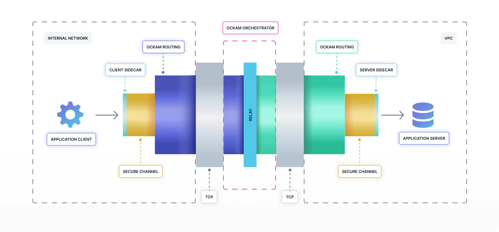

# Add end-to-end encryption to any client and server application, with no code change

Let's build a solution for a very common topology. An application service and an application client running in two private networks wish to communicate with each other without exposing ports on the Internet.

<figure><figcaption></figcaption></figure>

First install the Ockam command, if you haven't already.

```bash
brew install build-trust/ockam/ockam
```

If you're on linux, see how to install [precompiled binaries](../manuals/command/ockam-open-source.md#precompiled-binaries).

```bash
ockam node create relay

# -- APPLICATION SERVICE --

python3 -m http.server --bind 127.0.0.1 5000

ockam node create server_sidecar
ockam tcp-outlet create --at /node/server_sidecar --from /service/outlet --to 127.0.0.1:5000
ockam forwarder create server_sidecar --at /node/relay --to /node/server_sidecar

# -- APPLICATION CLIENT --

ockam node create client_sidecar
ockam secure-channel create --from /node/client_sidecar --to /node/relay/service/forward_to_server_sidecar/service/api \
    | ockam tcp-inlet create --at /node/client_sidecar --from 127.0.0.1:7000 --to -/service/outlet

curl --head 127.0.0.1:7000
```

A lot happened in the above demo.

We have an application http server in python and an application client in curl. Our goal is to create trustful communication between the application server and its clients that are running in different private networks. We want to achieve this without exposing the server to the Internet and without modifying existing client or server application code.

To make this happen, we create a relay node that runs a forwarding service exposed on the Internet. Ockam Orchestrator offers highly scalable, managed encrypted relays but for this first demo we create a local relay. We then create a sidecar node next to our application server and another sidecar node next to our application client. All three nodes generate unique cryptographic identities and file system vaults to store private keys. All three nodes are setup to trust each other’s public keys.

We ask the server\_sidecar to create a TCP outlet to the application server and then ask the relay node to setup a forwarder for the server\_sidecar. We then ask the client\_sidecar to create an end-to-end encrypted and mutually authenticated secure channel with the server\_sidecar via the relay. Finally we open a TCP inlet and tunnel client requests and responses through our end-to-end secure channel.

Ockam gives you the tools to create many such end-to-end secure topologies. In this example topology, the application sidecar nodes create outgoing TCP connections to the relay which allows them to communicate from behind private NATs. The relay node routes encrypted data and cannot see or tamper it.

In a few simple commands, without dealing with the cryptographic details, we added end-to-end data integrity, authenticity and privacy to applications that don’t have built in trust guarantees.
